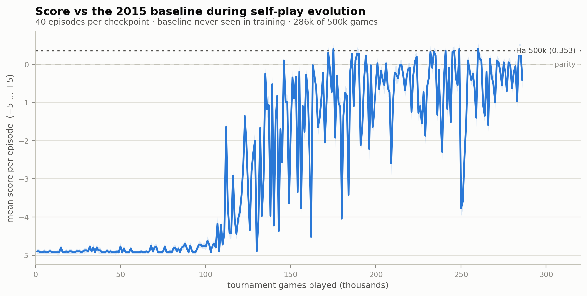
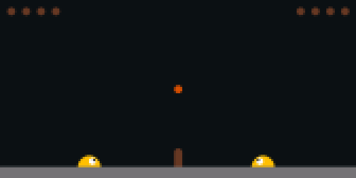
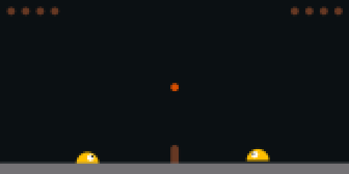

# Neural Slime Volleyball — Summer

Self-play neuroevolution for [David Ha's Slime Volleyball](https://otoro.net/slimevolley/), done right this time.

In February 2026 I tried to evolve Slime Volleyball agents with a custom NEAT
implementation and learned nothing from the runs — not why agents failed to
improve, not even what they were doing. This repository finishes that work the
honest way: a replication of **David Ha's self-play genetic algorithm** on the
real [slimevolleygym](https://github.com/hardmaru/slimevolleygym) environment,
a verified autopsy of the February failure, and the lineage connecting a 2015
browser demo to LLM-driven program evolution in 2025.

## Results

Trained by **self-play only** — the 2015 baseline policy was never seen during
training and serves purely as an external yardstick.

| Games played | Score vs 2015 baseline | Episodes | Won / drawn / lost |
|---|---|---|---|
| 5,000 | −4.93 ± 0.26 | 400 | 0 / 0 / 400 |
| 111,000 | −4.02 ± 1.16 | 50 | 0 / 0 / 50 |
| 145,000 | −2.58 ± 1.63 | 40 | 2 / 2 / 36 |
| **175,000** | **+0.19 ± 0.70** (SEM 0.04) | 300 | 76 / 192 / 32 |
| **249,000** | **+0.28 ± 0.81** (SEM 0.05) | 300 | 97 / 166 / 37 |
| *Ha's reference (500,000 games)* | *+0.353 ± 0.728* | *1000* | *—* |

Score is points won minus points lost per episode (range −5 … +5); ± is the
episode-level standard deviation, with the standard error of the mean given
separately. **Evolved policies beat the 2015 expert on points**, reaching Ha's
quality regime at roughly half his training budget, without ever having seen
that opponent during training.

The two headline rows were chosen by scanning all checkpoints against the
baseline — so they are *selected* maxima, not independent estimates. They were
therefore re-evaluated on a **fresh evaluation seed** (4242, disjoint from the
sweep's seed 721) over 300 episodes each; the numbers above are those
independent re-evaluations, and both remain above parity by more than four
standard errors.



**Three things this shows.**

*A phase change.* ~100,000 games of flat −4.9 floor, then a steep climb. The
population was improving against *itself* the whole time (winning streaks and
rally lengths grew steadily from the start), but the external yardstick only
registers it once those skills generalize beyond the family. Internal selection
pressure leads; external measurement lags — here by roughly 100,000 games. An
evaluation stopped at game 90,000 would have reported total failure.

*What "improved" means concretely.* The champion stopped getting crushed and
started going the distance: every one of its 400 evaluation episodes ran the
full 3,000 steps, and 88% ended drawn or won.

*Coevolution is unstable — but the instability is damping.* Champion quality
swings violently between neighbouring checkpoints, and **30 of 286 exported
champions score above parity**: competence is reached repeatedly and lost
repeatedly. What the long view adds is that the swings are shrinking while the
level rises:

| Games | Mean score | SD | Worst | Best | Above parity |
|---|---|---|---|---|---|
| 0–100k | −4.88 | 0.06 | −4.92 | −4.70 | 0 / 99 |
| 100–150k | −3.18 | 1.48 | −4.92 | +0.10 | 1 / 50 |
| 150–200k | −1.09 | 1.18 | −4.53 | +0.40 | 7 / 50 |
| 200–250k | −0.51 | 0.68 | −2.60 | +0.40 | 11 / 50 |
| 250–286k | −0.60 | 0.96 | −3.77 | +0.40 | 11 / 37 |

The mean climbs from −4.88 to about −0.55 and the spread narrows from 1.48 to
around 0.8, while the ceiling sits flat at +0.40. So the population is not
merely thrashing: it is converging on a band just below parity, from which it
repeatedly produces baseline-beating champions. This is a **single-seed
observation**, not a general claim about the algorithm.

Two mechanisms drive the residual instability, both textbook and both left in
deliberately by
replicating Ha exactly: (1) selection is relative, so a population can *forget*
skills that no current opponent punishes — the classic argument for a
hall-of-fame archive of past opponents ([Neuroevolution](https://neuroevolutionbook.com),
ch. 7.2), which this algorithm has none of; (2) the exported "champion" is the
individual with the longest winning lineage, a cheap proxy Ha adopted
explicitly "without actually computing who is best to save time" — and a noisy
one. The honest reading: **self-play produced baseline-beating play, but does
not hold it.** Stability is a separate problem from competence, and this
repository's data isolates it.

| After 5,000 games | After 249,000 games |
|---|---|
|  |  |
| loses 0–5 in 543 steps | holds the 2015 expert to 0–0 through 1,000 steps |

**Honest run notes.** This is a **single-seed exploratory run**, and it
replicates Ha's *simplified 2020* tournament-selection GA (feed-forward, no
crossover) — not the original 2015 training algorithm, which used recurrent
networks, generational selection against multiple opponents, top-20% retention
and crossover.

Training reached **286,700 of Ha's 500,000 tournament games** in a cloud
sandbox that reclaims its container once a session goes idle, so training
advanced only while a session was live. Each resumption
restarts from the latest population snapshot with the RNG reseeded
deterministically from `seed + resume point` — a documented chain of restarts,
not one exactly resumable trajectory. The learning-curve sweep used 40 episodes
per checkpoint at seed 721; the two headline rows were re-measured at seed 4242
over 300 episodes. The baseline policy was never used as a training signal.

The full population snapshot (`results/ga_selfplay/snapshot.npz`) is committed,
so `resume_to_500k.sh` continues *this* run rather than starting a new one
(~6 h single-core for the remaining 213,000 games).

Three open questions this run does **not** answer:

1. **Does the damping continue?** The spread narrows from 150k to 250k, then
   widens slightly in the last window. Whether that is the start of
   convergence or ordinary noise in a single seed needs the remaining 213,000
   games — and, for any general claim, more seeds.
2. **Forgetting or proxy noise?** `cross_generation.py` plays saved champions
   against *each other*: a transitive ranking (later beats earlier) would
   indicate the champion-selection proxy is noisy; cyclic results would
   indicate genuine intransitivity, which is the empirical argument for a
   hall-of-fame archive. This needs no further training.
3. **Would a hall of fame convert intermittent competence into stable
   competence?** The most interesting experiment, and this repository's
   checkpoint archive is the material for it.

## The method, in plain language

- The **genotype** is the flat weight vector (273 numbers) of a tiny fixed
  feed-forward network. Nothing else evolves — no topology change, no crossover.
- A **population** of 128 individuals plays tournaments: two are drawn at
  random and play one full game.
- **Selection**: the winner survives untouched; the loser is overwritten by a
  copy of the winner plus Gaussian noise — the mutation operator.
- **Fitness is implicit and relative**: win games, stay in the pool. No reward
  shaping, no curriculum, no expert opponent. Everyone starts equally terrible,
  so victories are always achievable — which is exactly why self-play works
  where February's "train a newborn against the 2015 expert" framing could not.

## Quickstart

```bash
python3 -m venv .venv
.venv/bin/pip install -r requirements.txt

# verify the repository works (~1 min) — nine checks, three of which
# are the exact failures that made February's runs uninterpretable
.venv/bin/python test_repo.py

# smoke test (~20 s)
.venv/bin/python train_ga_selfplay.py --tournaments 600 --save-freq 200 --outdir results/smoke

# train from scratch (Ha's full scale, ~10 h single core)
.venv/bin/python train_ga_selfplay.py

# continue this repository's run from its last snapshot
bash resume_to_500k.sh

# measure any champion against the 2015 baseline
.venv/bin/python eval_vs_baseline.py results/ga_selfplay/ga_00175000.json --episodes 1000

# watch a match
.venv/bin/python render_gif.py results/ga_selfplay/ga_00175000.json --out match.gif
```

## Repository layout

| Path | What it is |
|---|---|
| `train_ga_selfplay.py` | Faithful port of Ha's tournament-selection GA (deviations documented in the docstring) |
| `eval_vs_baseline.py` | External yardstick: champion vs the 2015 baseline policy |
| `render_gif.py` | Headless match rendering |
| `plot_curve.py` | The learning-curve figure |
| `watchdog.sh` / `resume_to_500k.sh` | Crash-safe continuation of a long run |
| `test_repo.py` | Self-test: nine checks, including the three February failures |
| `cross_generation.py` | Champion-vs-champion round robin: transitive skill, or cycling? |
| `docs/postmortem-february.md` | The autopsy: three verified mechanisms that made February's runs uninterpretable |
| `docs/trajectory.md` | The lineage: Ha 2015 → backprop NEAT 2016 → slimevolleygym 2020 → ShinkaEvolve 2025 |
| `archive/february/` | The February 2026 scripts, unmodified, as evidence |
| `results/` | 206 champion checkpoints, the population snapshot, learning curves, evaluation data, figures |

## Credits

- Environment, baseline policy and original GA: **David Ha (hardmaru)** —
  [slimevolleygym](https://github.com/hardmaru/slimevolleygym) (Apache-2.0),
  [Neural Slime Volleyball (2015)](https://blog.otoro.net/2015/03/28/neural-slime-volleyball/).
- This repository: MIT (see LICENSE).
