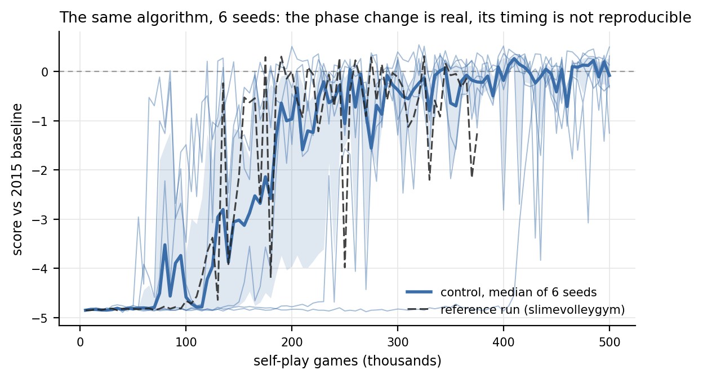
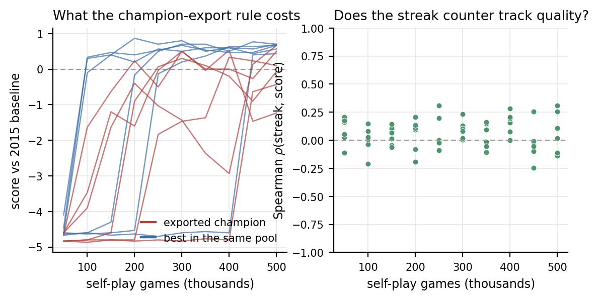

# Competitive coevolution of slimes

**What a population of self-playing agents learns, what it forgets, and which
of the two you actually measure.**

Self-play neuroevolution on [David Ha's Slime Volleyball](https://otoro.net/slimevolley/),
run as a designed experiment rather than a demo: several dozen independent runs
of 500,000 self-play games each, across conditions that isolate *where the
selection signal comes from* and *where the noise comes from*.

The headline finding is not the one we expected. Competence in this setting is
reached repeatedly and lost repeatedly — and most of that instability turns out
not to be coevolution at all. It is injected at the last step, by the rule that
decides which individual to call the champion.

---

## What this study found

**1. The internal signal leads the external one by tens of thousands of games.**
A population improves against *itself* long before any of that improvement
transfers to an opponent it has never met. In the reference run, the population's
own rallies pass 1,500 steps at 104,200 games; the first champion that beats the
2015 expert appears at 172,000. An evaluation stopped in between reports total
failure from a population that is already working.

**2. The phase change is real; its timing does not replicate.** Across control
seeds the internal transition happens anywhere from 55,000 to 415,000 games — a
spread of more than 7×. The single-run version of this repository reported a
transition "at roughly 100,000 games". That was one seed.

**3. The population is not cycling.** Playing every checkpoint of a run against
every other checkpoint, skill is essentially transitive: ρ(Elo, training time) =
+0.72, and under 1% of decided checkpoint triples are cyclic. The textbook
explanation for the swings — the population forgets skills no current opponent
punishes — does not fit this data.

**4. The champion-export rule is the noise source.** Ha selects the individual
with the longest winning lineage, "without actually computing who is best to save
time". That counter is inherited by the loser on every replacement, so it
measures the age of a lineage, not merit. Measured against the whole population:
the exported individual ranks around the *median* of its own 128, the correlation
between its streak counter and its actual skill is indistinguishable from zero,
and it scores about a point per episode worse than the best individual in the
same pool. At the end of a run the exported champion is below parity while dozens
of its own peers are above it.

**5. A hall of fame that is also a gene source abolishes learning.** Our first
archive implementation applied the replacement rule to archive games, so a
winning archived genome became the *parent* of the member it beat. At p = 0.25
that copies an older genotype back into the pool roughly one game in eight. Every
such run failed to reach long rallies and produced 0 above-parity checkpoints out
of 100, while every control run did both. The corrected version — archive as a
*test*, never a parent, as in Rosin & Belew (1997) — is reported alongside it.

<!-- table:r -->
| condition | runs | learned to rally | best champion (held out) | end-of-run champion | checkpoints above parity |
|---|---|---|---|---|---|
| control (Ha 2020 GA) | 6 | 6/6 | +0.32 ± 0.06 | -0.15 ± 0.27 | 26% |
| archive as test, full span | 6 | 6/6 | -0.44 ± 0.71 | -1.10 ± 0.78 | 8% |
| archive as parent, p=0.25 | 6 | 1/6 | -3.94 ± 0.90 | -4.10 ± 0.74 | 2% |
| archive as parent, p=0.50 | 1 | 0/1 | -4.84 ± — | -4.84 ± — | 0% |
| generational GA (Ha 2015) | 6 | 5/6 | -0.68 ± 0.83 | -2.00 ± 0.82 | 3% |
| self-play ES | 6 | 4/6 | -1.56 ± 0.99 | -2.08 ± 0.94 | 7% |
| *reference run, unmodified environment* | 1 | 1/1 | *+0.29 ± 0.03* | *-0.47 ± 0.04* | *12%* |
| *Ha (2020), same algorithm and budget* | 1 | — | *+0.35 ± 0.02* | — | — |

Points per episode against the 2015 champion policy, which is never seen during training. Held-out columns are 1,000 episodes on an evaluation seed disjoint from the one used to pick the checkpoint. 'Learned to rally' counts runs whose population ever held 1,500-step rallies against itself.
<!-- /table:r -->





---

## Why the numbers can be trusted

**The protocol was fixed before the runs.** `results/matrix/protocol.json`
records the checkpoint spacing, the sweep evaluation seed and episode count, and
a *disjoint* held-out seed used to re-score selected champions. Peak-checkpoint
scores are selected maxima and therefore biased, so every headline number is a
1,000-episode re-score on the held-out seed.

**Every decision made after launch is logged.** `results/matrix/decisions.md`
records each change to the design, what was known at the time, and why — including
the archive bug above, which was found after three runs had completed and is
reported rather than quietly fixed.

**The fast environment is the benchmark, not an approximation.** A 500,000-game
run costs about twelve core-hours on the reference `slimevolleygym`, which is why
the first version of this repository had exactly one run. `fastvolley.py` is a
numba-compiled transcription, and it is validated bit for bit: driven from an
identical stream of serve velocities, 200 paired games match on every ball
position, every agent position, every rally end, every score and every episode
length, across 265,797 environment steps — at 31× the throughput. Three
deviations (RNG family, pair-sampling call, BLAS vs libm in the forward pass) are
documented; the third cannot change a trajectory because the game only ever reads
`action[i] > 0`.

**Stability is only reported conditional on competence.** A run that never
learned anything has zero volatility and zero drawdown, and so scores perfectly
on every stability metric. The archive-as-parent runs are exactly that case, and
they are the reason every stability comparison is also reported over the subset of
runs that actually learned.

**Statistics match the sample size.** 3–12 runs per condition rules out anything
asymptotic, so comparisons use the exact Mann–Whitney U test with full
enumeration, Cliff's δ, and percentile bootstrap intervals — written out in
`stats_utils.py` rather than imported, so every number can be audited.

---

## The write-up

| | |
|---|---|
| [Overview](docs/paper/00-overview.md) | abstract and what the study contributes |
| [Methods](docs/paper/01-methods.md) | task, algorithms, interventions, the compiled environment, the protocol |
| [Results](docs/paper/02-results.md) | the reference run, seed variance, what competence means here |
| [Ablations and analysis](docs/paper/03-ablations-and-analysis.md) | transitivity, the export rule, archives, mutation scale, population size, algorithm families |
| [Appendix](docs/paper/04-appendix.md) | self-contained: every table, every run, reproduction commands |
| [February postmortem](docs/postmortem-february.md) | three verified mechanisms that made an earlier attempt uninterpretable |
| [Lineage](docs/trajectory.md) | Ha 2015 → Backprop NEAT 2016 → slimevolleygym 2020 → ShinkaEvolve 2025 |

Every table in the write-up and in this README is generated by `make_tables.py`
from the files in `results/analysis/`, and every figure by `make_figures.py`.
None is typed by hand, so `git diff docs/paper` shows exactly which numbers moved
when new results land.

---

## The algorithms compared

All share the identical policy — a fixed 12–10–10–3 tanh network, 273
parameters — and the identical environment. Only the machinery differs.

| family | how a population becomes the next population |
|---|---|
| **Ha 2020 GA** (control) | steady-state: draw two individuals, play one game, the loser is overwritten by a mutated copy of the winner. Champion = longest winning lineage. |
| **Ha 2015 GA** | generational: population 100, each agent plays ten random peers, top 20% retained, remainder refilled by uniform crossover + mutation. Champion = highest *computed* fitness. |
| **Self-play ES** | OpenAI-ES: one mean vector, 50 mirrored perturbations per iteration, fitness from games among the perturbations, rank-shaped gradient. Reports the distribution mean — so it has no champion-selection problem at all. |
| **Archive variants** | the control plus a hall of fame, tested both as a parent (wrong) and as a test (right). |
| **Knob sweeps** | mutation scale σ ∈ {0.05, 0.10, 0.20}; population ∈ {32, 128, 512}. |

Topology-evolving methods (NEAT) are deliberately out of scope; `docs/paper/04-appendix.md`
§A.8 specifies exactly what a later NEAT run would need and how it would stay
comparable to these results.

---

## Quickstart

```bash
python3 -m venv .venv
.venv/bin/pip install -r requirements.txt -r requirements-fast.txt

# the repository self-test: 12 checks, including the three February failures
# and a bit-level comparison of the compiled environment against slimevolleygym
.venv/bin/python test_repo.py

# the port is the benchmark: 200 paired games, step by step
.venv/bin/python validate_fastvolley.py --games 50

# the matrix (hours, not days: ~30 min per 500,000-game run per core)
.venv/bin/python run_experiments.py --workers 3

# metrics, held-out re-scoring, and the three coevolution-specific measurements
.venv/bin/python analyze_matrix.py --holdout
.venv/bin/python coevolution_analysis.py --within --across --proxy

# tables, figures, and the single-page HTML write-up
.venv/bin/python make_tables.py && .venv/bin/python make_figures.py
.venv/bin/python build_paper.py --md
```

The reference run on the unmodified environment is continued from its committed
population snapshot with
`.venv/bin/python train_ga_selfplay.py --resume --snapshot-freq 1000`.

---

## Repository layout

| Path | What it is |
|---|---|
| `fastvolley.py` | compiled port of the physics, the MLP policy and the 2015 baseline RNN, plus the control GA |
| `validate_fastvolley.py` | the bit-level comparison against `slimevolleygym` |
| `algorithms.py` | the generational GA, the self-play ES, and the corrected hall of fame |
| `run_experiments.py` | the matrix: conditions, seeds, and the pre-registered protocol |
| `analyze_matrix.py` / `stats_utils.py` | metrics, exact tests, bootstrap intervals |
| `coevolution_analysis.py` | within-run Elo and intransitivity, cross-run tournament, the champion-proxy check |
| `make_tables.py` / `make_figures.py` / `build_paper.py` | everything in the write-up, generated |
| `train_ga_selfplay.py` / `eval_vs_baseline.py` | the reference implementations, unmodified |
| `test_repo.py` | 12-check self-test |
| `results/matrix/` | one file per run: 100 champion genomes, streaks, rally lengths, evaluations |
| `results/ga_selfplay/` | the reference run: checkpoints, population snapshot, training history |
| `archive/february/` | the earlier failed attempt, unmodified, as evidence |

---

## Limitations

- **One environment.** Slime Volleyball is symmetric, zero-sum and fully
  observed — the friendliest possible setting for purely relative selection.
- **3–12 runs per condition.** Enough to separate a large effect from seed noise,
  not a small one.
- **Fixed topology.** Nothing here evolves structure; see §A.8 for what NEAT
  would need.
- **One archive design per reading.** A quality-diversity or curated archive is a
  different experiment.

## Credits

- Environment, baseline policy and the original GA: **David Ha (hardmaru)** —
  [slimevolleygym](https://github.com/hardmaru/slimevolleygym) (Apache-2.0),
  [Neural Slime Volleyball (2015)](https://blog.otoro.net/2015/03/28/neural-slime-volleyball/).
- Competitive coevolution background: Rosin & Belew (1997); Risi, Tang, Ha &
  Miikkulainen, [*Neuroevolution*](https://neuroevolutionbook.com) (MIT Press,
  2025), ch. 7.2.
- This repository: MIT (see LICENSE).
