# Competitive coevolution of slimes

**What a population of self-playing agents learns, what it forgets, and which
of the two you actually measure.**

**Paper (draft, not yet submitted):** [*What a self-playing population learns,
what it forgets, and which of the two you measure*](paper/main.pdf) — LaTeX
sources in [`paper/`](paper/); every number in it is generated from the run files.

Self-play neuroevolution on [David Ha's Slime Volleyball](https://otoro.net/slimevolley/),
run as a designed experiment rather than a demo: <!-- n:n_runs_total -->59<!-- /n --> independent runs of
<!-- n:budget -->500,000<!-- /n --> self-play games each, in a compiled environment that reproduces the
original bit for bit, with every agent scored against a frozen opponent it never
met in training, and the main follow-ups preregistered and run on fresh seeds. The
headline finding is not the one we expected. Competence is reached and lost
repeatedly, and most of that instability is not coevolution: it is injected at
the last step, by the rule that decides which individual to call the champion.
Ha's rule exports an individual that ranks on average <!-- n:proxy_rank_mean -->60<!-- /n --> of <!-- n:proxy_pop -->128<!-- /n --> in its own
population, its lineage counter is uncorrelated with its skill
(ρ = <!-- n:proxy_rho -->+0.06<!-- /n -->), and the population itself is not cycling. A better rule is cheap:
exporting the winner of a <!-- n:reexport_games_sixteen -->1,024<!-- /n -->-game tournament inside the population raised the
exported champion's score in a preregistered test on fresh runs (<!-- n:x_streak_level -->-2.33<!-- /n --> to <!-- n:x_tourney_level -->-2.16<!-- /n -->,
higher in <!-- n:x_improved -->9<!-- /n --> of <!-- n:x_runs -->12<!-- /n --> runs), though by less than a post hoc analysis had
suggested. Internal improvement precedes any external transfer by tens of
thousands of games; the phase change is robust but its timing varies <!-- n:ctrl_t_internal_ratio -->7.5<!-- /n -->-fold
across seeds; an archive of past champions abolishes learning when used as a
parent and does nothing detectable when used as a test. Those claims held in a
preregistered replication on <!-- n:rep_total -->36<!-- /n --> fresh runs (<!-- n:rep_verdicts -->6 of 6<!-- /n --> replicated), and the
export-rule failure persists in a second game whose skill can be made cyclic,
where the better rule helps less the more cyclic the game.

<table>
<tr>
<td align="center" width="20%"><a href="results/figures/fig6_champion_proxy.png">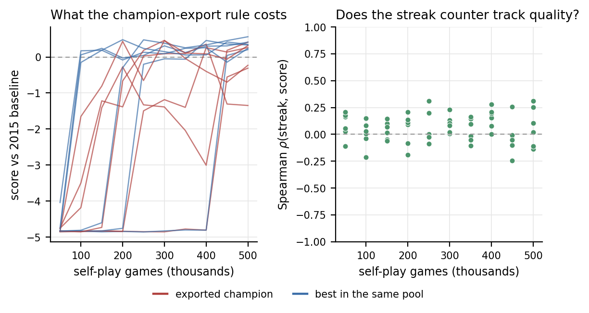</a><br><sub>The exported champion vs its own population</sub></td>
<td align="center" width="20%"><a href="results/figures/fig1_reference_trajectory.png">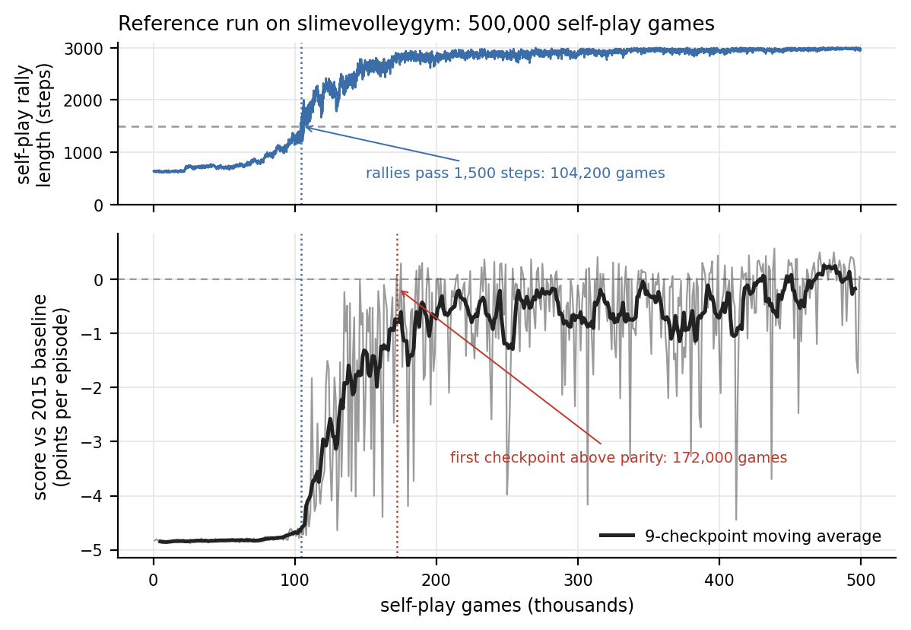</a><br><sub>Internal improvement before external transfer</sub></td>
<td align="center" width="20%"><a href="results/figures/fig2_control_seeds.png">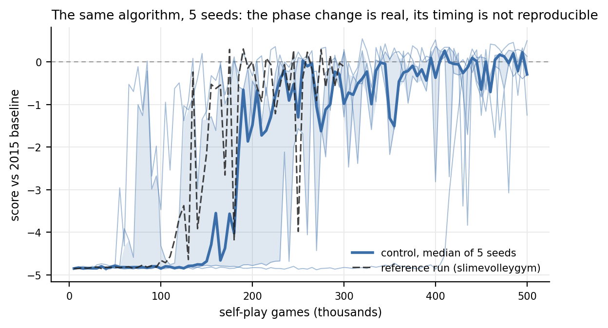</a><br><sub>One phase change, six timings</sub></td>
<td align="center" width="20%"><a href="results/figures/fig5_coevolution.png">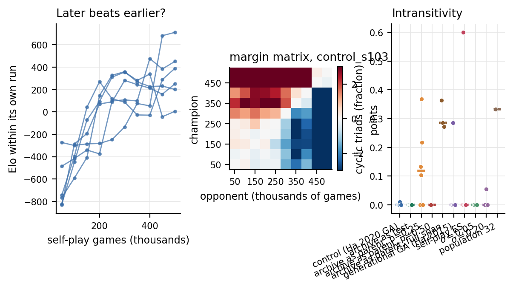</a><br><sub>No cycling: skill is transitive</sub></td>
<td align="center" width="20%"><a href="results/figures/fig3_hall_of_fame.png">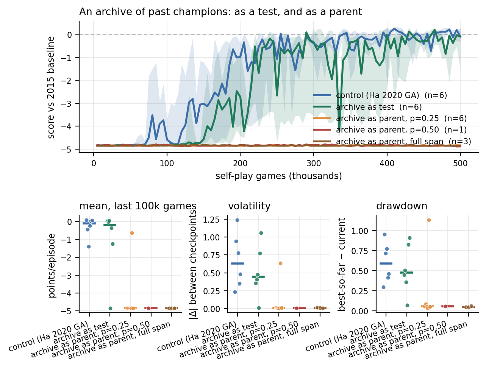</a><br><sub>Archives as parent and as test</sub></td>
</tr>
</table>

---

## How this README is organised

The findings form one argument. What the population learns (1–3); what gets
reported as its progress, and a better way to report it (4–5); what archives
and other algorithm families change (6–7); whether all of it holds, on fresh
seeds, against stronger opponents and when skill is cyclic; and one
exploratory block (8). Every number is generated from the run files.

---

## What the population learns

**1. The internal signal leads the external one by tens of thousands of games.**
A population improves against *itself* long before any of that improvement
transfers to an opponent it has never met. In the reference run, the population's
own rallies pass <!-- n:long_rally -->1,500<!-- /n --> steps at <!-- n:ref_t_internal -->104,200<!-- /n --> games; the first champion that beats the
2015 expert appears at <!-- n:ref_t_parity -->172,000<!-- /n -->. An evaluation stopped in between reports total
failure from a population that is already working.


*The reference run over <!-- n:budget -->500,000<!-- /n --> self-play games. Top: rally length when the
population plays itself. Bottom: score against the 2015 baseline, which is never
seen during training. The two curves rise tens of thousands of games apart.*

**2. The phase change is real; its timing does not replicate.** Across control
seeds the internal transition happens anywhere from <!-- n:ctrl_t_internal_min -->55,000<!-- /n --> to <!-- n:ctrl_t_internal_max -->415,000<!-- /n --> games — a
<!-- n:ctrl_t_internal_ratio -->7.5<!-- /n -->-fold spread. The single-run version of this repository reported a
single transition time. That was one seed.


*The same algorithm under six seeds. The phase change appears in all of them and
at a different time in each, from <!-- n:ctrl_t_internal_min -->55,000<!-- /n --> to <!-- n:ctrl_t_internal_max -->415,000<!-- /n --> games.*

**3. The population is not cycling.** Playing every checkpoint of a run against
every other checkpoint, skill is essentially transitive: ρ(Elo, training time) =
<!-- n:rho_within_ctrl -->+0.74<!-- /n --> in the control, and <!-- n:cyclic_ctrl_pct -->0.2<!-- /n -->% of its decided checkpoint triples are
cyclic (at most <!-- n:cyclic_learning_max_pct -->0.2<!-- /n -->% in any condition whose runs all learned). The textbook
explanation for the swings — the population forgets skills no current opponent
punishes — does not fit this data.


*Every checkpoint of a run played against every other. Left: the margin matrix,
later against earlier. Centre: Elo within the run against training time. Right:
the fraction of decided checkpoint triples that are cyclic.*

Those checkpoints are 50,000 games apart, so a cycle that opens and closes in
less time would be invisible. Every run stores all 100 of its champions, so the
control runs were also played at 5,000-game spacing (<!-- n:fine_games -->20<!-- /n --> games per pair, table
below). Under the rule above (a pair counts as decided when its mean margin
leaves ±0.25), <!-- n:fine_cyclic_deadband_pct -->1.0<!-- /n -->% of decided triads are now cyclic, and <!-- n:fine_short_deadband_pct -->4.5<!-- /n -->% of those spanning
at most 50,000 games. But at 20 games per pair that rule lets sampling noise
decide pairs between near-equal policies, and noise makes cycles: when a pair
counts as decided only if an exact sign test on its wins and losses says so,
<!-- n:fine_cyclic_sign -->35<!-- /n --> of <!-- n:fine_triads_sign -->273,376<!-- /n --> decided triads are cyclic (<!-- n:fine_cyclic_sign_pct -->0.01<!-- /n -->%). At the finer resolution the
population is still not cycling. What does move at that resolution is the
exported champion: where adjacent champions differ significantly, the later one
wins only <!-- n:fine_next_wins -->88/144<!-- /n --> times (<!-- n:fine_next_wins_pct -->61<!-- /n -->%), the export-rule noise of finding 4 seen
from the other side.

<!-- table:t -->
| run | ρ(Elo, time) | cyclic, ±0.25 rule | cyclic, sign test | within 50k games, sign test | next beats previous |
|---|---|---|---|---|---|
| control_s101 | +0.95 | 0.69% (774/112,190) | 0.00% (0/51,268) | 0.00% (0/272) | 10/14 |
| control_s102 | +0.76 | 0.55% (541/98,864) | 0.02% (11/51,840) | 0.23% (1/430) | 18/35 |
| control_s103 | +0.81 | 3.82% (3,675/96,104) | 0.00% (1/21,569) | 0.00% (0/198) | 7/13 |
| control_s104 | +0.68 | 0.50% (431/86,322) | 0.04% (16/43,215) | 0.23% (1/440) | 21/34 |
| control_s105 | +0.91 | 0.22% (241/108,654) | 0.00% (1/58,693) | 0.00% (0/454) | 16/24 |
| control_s106 | +0.85 | 0.30% (253/85,284) | 0.01% (6/46,791) | 0.86% (3/349) | 16/24 |
| *all control runs* | — | 1.01% (5,915/587,418) | 0.01% (35/273,376) | 0.23% (5/2,143) | 88/144 |

Every one of the 100 champions of each control run (one per 5,000 games) played every other, 20 games per pair. A triad counts when all three of its pairs are decided: by the paper's rule (mean margin outside ±0.25) or by an exact sign test on wins against losses (p < 0.05). 'Next beats previous': adjacent champions whose difference the sign test decides, and how often the later one wins.
<!-- /table:t -->

---

## What gets reported, and a better rule

**4. The champion-export rule is the noise source.** Ha selects the individual
with the longest winning lineage, "without actually computing who is best to save
time". That counter is inherited by the loser on every replacement, so it
measures the age of a lineage, not merit. Measured against the whole population
(every member scored on <!-- n:ph_episodes -->30<!-- /n --> episodes against the 2015 baseline, scores that agree
with an independent measurement at a median r = <!-- n:ph_retest_r -->0.94<!-- /n --> once skill varies within
the pool): the exported individual ranks, on
average, number <!-- n:proxy_rank_mean -->60<!-- /n --> of <!-- n:proxy_pop -->128<!-- /n --> in its own pool, and the correlation between its
streak counter and its actual skill is indistinguishable from zero
(ρ = <!-- n:proxy_rho -->+0.06<!-- /n -->). Re-scored on held-out episodes, the member that scored best in the
same pool is <!-- n:ph_gap -->0.63<!-- /n --> points per episode better than the exported one, and the
exported one is no better than the pool's median member (<!-- n:ph_level_exp -->-1.92<!-- /n --> against <!-- n:ph_level_med -->-1.78<!-- /n -->).
(On the <!-- n:ph_episodes -->30<!-- /n --> episodes that picked it, the best member looks <!-- n:ph_gap_selecting -->0.90<!-- /n --> better: the best of
<!-- n:proxy_pop -->128<!-- /n --> noisy scores is inflated, by <!-- n:ph_inflation -->0.27<!-- /n --> here, a winner's curse that an
earlier version of this analysis did not correct.) At the last snapshot the
exported champion averages <!-- n:proxy_end_exported -->-0.15<!-- /n --> while <!-- n:proxy_end_above -->67<!-- /n --> of its peers score above parity. The
losses of competence are the export rule's too: re-scored on held-out episodes
and summed over the control runs, the exported champion's score fell by <!-- n:ph_decl_exp -->7.8<!-- /n -->
points between consecutive population snapshots, the best member of the same
pools by <!-- n:ph_decl_best -->2.0<!-- /n --> and the median member by <!-- n:ph_decl_med -->1.9<!-- /n -->; the exported champion fell further in
<!-- n:ph_decl_runs -->6<!-- /n --> of <!-- n:ph_runs -->6<!-- /n --> runs. The population rarely gets worse; the individual we report does.


*Left: the exported champion against the best individual in the same population,
both re-scored on held-out episodes. Right: Spearman correlation between the
streak counter and actual skill, over training.*

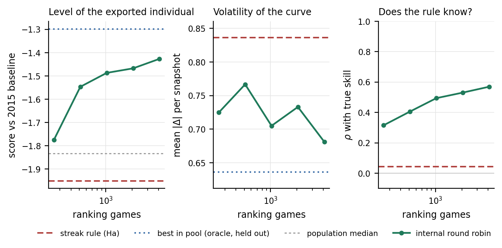

*Re-exporting the same runs under a ranking rule that spends games measuring who
is best (post hoc). Left to right: level of the exported individual, volatility of
the resulting curve, and correlation between rule and true skill, as a function
of the ranking budget; the oracle lines are the held-out re-scores of the pool's
best member.*

**5. A better export rule, tested prospectively.** The re-export analysis
above was post hoc: its budgets were chosen after seeing six runs. A
[preregistered experiment](results/export/PREREGISTRATION.md) tested its rule on
<!-- n:x_runs -->12<!-- /n --> fresh control runs: at each population snapshot, export the winner of
a tournament inside the population (each member against 16 random peers,
1,024 games, about a fifth of the games between checkpoints) instead of the
longest streak. The exported champion never feeds back into training, so
both rules choose from the same populations.

- **It exports better champions** (H10a holds): <!-- n:x_tourney_level -->-2.16<!-- /n --> against <!-- n:x_streak_level -->-2.33<!-- /n --> for the
  streak rule, higher in <!-- n:x_improved -->9<!-- /n --> of <!-- n:x_runs -->12<!-- /n --> runs (p = <!-- n:x_p -->0.010<!-- /n -->); the exported member's average
  rank in its population rises from <!-- n:x_rank_streak -->56<!-- /n --> to <!-- n:x_rank_tourney -->46<!-- /n --> of <!-- n:proxy_pop -->128<!-- /n -->. It closes <!-- n:x_recovered_pct -->43<!-- /n -->% of the gap to
  the population's best member (<!-- n:x_best_level -->-1.93<!-- /n -->, re-scored held out). The gain, <!-- n:x_gain -->+0.17<!-- /n -->, is
  smaller than the <!-- n:reexport_gain_sixteen -->+0.46<!-- /n --> the post hoc analysis found for the same budget.
- **It did not detectably reduce the losses of competence** (H10b does not
  hold): summed declines <!-- n:x_decl_tourney -->1.37<!-- /n --> against <!-- n:x_decl_streak -->1.98<!-- /n -->, fewer in <!-- n:x_decl_improved -->8<!-- /n --> of <!-- n:x_runs -->12<!-- /n --> runs (p = <!-- n:x_decl_p -->0.16<!-- /n -->).
  A larger budget went further (64 peers: <!-- n:x_recovered_big_pct -->77<!-- /n -->% of the gap, declines <!-- n:x_decl_big -->0.72<!-- /n -->), but only
  the 16-peer rule was tested, so that is a description.
- **Under cyclic skill it helps, but less** (H10c and H10d hold). In the
  lab's discmix game ([below](#when-skill-is-cyclic-the-lab)), judged against
  other runs' populations, the
  tournament's champions are stronger in <!-- n:xm_improved -->42<!-- /n --> of <!-- n:xm_n -->48<!-- /n --> runs, but the advantage falls
  from <!-- n:xm_adv_low -->+0.11<!-- /n --> at λ = 0 to <!-- n:xm_adv_high -->+0.03<!-- /n --> at the most cyclic setting (ρ = <!-- n:xm_rho -->-0.43<!-- /n -->, p = <!-- n:xm_trend_p -->0.001<!-- /n -->). A
  tournament inside a population measures strength against that population;
  the more cyclic the game, the weaker a guide that is to strength against
  anyone else.

<!-- table:x -->
| rule | games per export | level | declines | rank in population | final vs zoo GA |
|---|---|---|---|---|---|
| streak (Ha's rule) | 0 | -2.33 | 1.98 | 56 | -1.26 |
| tournament, 4 peers | 256 | -2.31 | 1.97 | 55 | — |
| **tournament, 16 peers** | 1,024 | -2.16 | 1.37 | 46 | -1.25 |
| tournament, 64 peers | 4,096 | -2.03 | 0.72 | 37 | — |
| random member | 0 | -2.50 | 2.12 | 61 | — |
| best member (oracle) | — | -1.93 | 0.61 | 2 | -1.05 |

Slime Volleyball, 12 fresh control runs, every rule applied to the same 10 population snapshots per run. Level: mean held-out score of the exported member against the 2015 baseline over the snapshots; declines: summed falls between consecutive snapshots; rank: by score among the population (1 = best); zoo GA: the final exported member against the slimevolleygym zoo GA. Preregistered tests, tournament-16 against streak: H10a level, 9/12 runs higher, one-sided exact sign-flip p = 0.010, **holds**; H10b declines, 8/12 runs fewer, p = 0.158, **does not hold** (Holm).
<!-- /table:x -->

<!-- table:xm -->
| λ | streak | tournament, 16 peers | best member (oracle) | tournament higher | rank: streak / tournament |
|---|---|---|---|---|---|
| 0.00 | +0.082 | +0.189 | +0.364 | 9/12 | 50 / 27 |
| 0.25 | +0.027 | +0.135 | +0.292 | 12/12 | 58 / 31 |
| 0.50 | +0.009 | +0.065 | +0.244 | 11/12 | 62 / 44 |
| 0.75 | +0.002 | +0.029 | +0.159 | 10/12 | 66 / 49 |

Discmix game, 12 fresh control runs per λ. Outsider strength: the exported member's exact mean expected score against every member of the other 11 runs' populations at the same λ and snapshot, averaged over the 10 snapshots; rank among its own population by the same measure. Preregistered tests: H10c, tournament-16 above streak over all 48 runs (42 higher), one-sided sign-flip p < 0.001, **holds**; H10d, the advantage shrinks with λ, ρ = -0.43, one-sided p = 0.001, **holds** (Holm).
<!-- /table:xm -->

---

## Archives and algorithm families

**6. An archive of past champions does not help when skill is transitive — and
as a parent it destroys learning.** We tested both readings of the archive. Used
as a *parent* (a winning archived genome becomes the parent of the member it
beat) it abolishes learning outright: <!-- n:hofparent_reached -->1/6<!-- /n --> runs ever got off the floor, against
<!-- n:ctrl_reached -->6/6<!-- /n --> for the control. Used as a *test* in the literature's sense (archive
supplies opponents, never genes) it is neither destructive nor helpful: at
<!-- n:seeds_main -->6<!-- /n --> seeds it is indistinguishable from the control on every outcome
(checkpoints above parity <!-- n:hoftest_above_pct -->18<!-- /n -->% against <!-- n:ctrl_above_pct -->26<!-- /n -->%, exact p = <!-- n:hoftest_vs_ctrl_above_p -->0.370<!-- /n -->;
best champion δ = <!-- n:hoftest_vs_ctrl_peak_delta -->+0.00<!-- /n -->), and <!-- n:hoftest_n_failed -->1<!-- /n --> of its seeds never learned. The
archive's win rate against the current population shows why it has little to
do. It starts near <!-- n:hoftest_win_early_max -->0.50<!-- /n --> and, in every run whose population learned, ends
at <!-- n:hoftest_win_late_learned_min -->0.11<!-- /n -->–<!-- n:hoftest_win_late_learned_max -->0.16<!-- /n -->: skill here is transitive, so a past champion is simply a
weaker player, and <!-- n:hoftest_skip_late_learned_min -->21<!-- /n -->–<!-- n:hoftest_skip_late_learned_max -->22<!-- /n -->% of late-training games produce no selection
event at all. In the run that never learned, the archive's win rate stayed at
<!-- n:hoftest_win_late_failed -->0.50<!-- /n -->. Logging an archive's win rate is a cheap way to see
whether it still has anything to teach; here it tracked progress, but that is a
description of <!-- n:seeds_main -->6<!-- /n --> runs, not a validated predictor, and in the
[preregistered replication](#a-preregistered-replication) it did not hold: one
run that never learned also ended at <!-- n:rep_arch_failed_min -->0.21<!-- /n -->. An earlier version of this
condition carried a streak-accounting bug that made it look measurably worse
than the control; the corrected rerun and the before/after comparison are in
`results/matrix/decisions.md`.


*The archive used as a test (opponents only) and as a parent (genes flow back).
As a parent it abolishes learning: <!-- n:hofparent_reached -->1/6<!-- /n --> runs left the floor.*

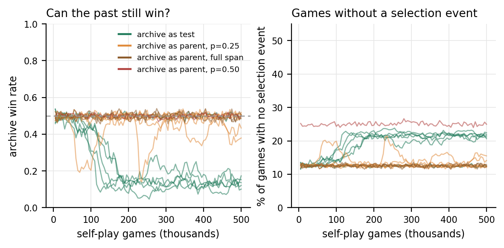

*Left: the archive's win rate against the current population, falling to
<!-- n:hoftest_win_late_learned_min -->0.11<!-- /n -->–<!-- n:hoftest_win_late_learned_max -->0.16<!-- /n --> in every archive-as-test run whose population learned, and staying
near <!-- n:hoftest_win_late_failed -->0.50<!-- /n --> in the one that did not. Right: the share of games that therefore
produce no selection event.*

### An archive organised by behaviour

Every archive above holds past champions in the order they were made. The
usual case for an archive is diversity: a population should be tested
against the variety of strategies it has met, not only against its recent
past. A [preregistered experiment](results/qd/PREREGISTRATION.md) kept the
archive's role (a test, never a parent, drawn in a quarter of the games as
in the archive-as-test condition) and changed only what it holds: one
champion per cell of an 8 × 8 grid over a behaviour descriptor (the
network's mean first two outputs on fixed probe inputs), in the manner of
MAP-Elites. <!-- n:qd_runs -->60<!-- /n --> runs in Slime Volleyball and the lab's discmix game
([below](#when-skill-is-cyclic-the-lab)):

- **In Slime Volleyball it neither harmed nor helped detectably** (H9a
  holds). Against the replication's control on the same seeds, all four
  outcomes have p ≥ <!-- n:qd_slime_pmin -->0.29<!-- /n -->; <!-- n:qd_slime_learned -->10<!-- /n --> of <!-- n:qd_slime_n -->12<!-- /n --> runs learned to rally, as did <!-- n:qd_ctrl_learned -->10<!-- /n --> controls.
  Against the time-ordered archive, every p ≥ <!-- n:qd_slime_fifo_pmin -->0.51<!-- /n -->. The archive did fill
  with variety (<!-- n:qd_cells_min -->37<!-- /n -->–<!-- n:qd_cells_max -->53<!-- /n --> of 64 cells occupied at the end), so the null result is
  not an empty archive. As for the archive as test in finding 6, twelve runs per arm rule out
  large effects only.
- **In discmix it did not help more as skill became cyclic** (H9b does not
  hold: trend p = <!-- n:qd_trend_p -->0.072<!-- /n -->, not significant under the preregistered Holm
  correction), **and where skill
  is most cyclic it did not beat the time-ordered archive** (H9c does not
  hold: p = <!-- n:qd_top_p -->0.34<!-- /n -->). Per λ, the effect against the control ranges from Cliff's
  δ <!-- n:qd_lab_delta_min -->-0.32<!-- /n --> to <!-- n:qd_lab_delta_max -->+0.28<!-- /n -->, no single comparison below p = <!-- n:qd_lab_pmin -->0.11<!-- /n -->.

What the archive holds, recent past or behavioural variety, made no
detectable difference in either game. With the time-ordered archive's result
in the cyclic game ([below](#when-skill-is-cyclic-the-lab)), neither archive
design, used as a test, helped in this study.

<!-- table:qd -->
| outcome | niche archive | control | δ (p) | time-ordered archive | δ (p) |
|---|---|---|---|---|---|
| final champion, held out | -1.21 | -0.79 | -0.11 (0.671) | -0.90 | -0.15 (0.551) |
| best champion, held out | -0.60 | -0.51 | -0.24 (0.347) | -0.49 | -0.06 (0.843) |
| checkpoints above parity | 0.14 | 0.18 | -0.23 (0.352) | 0.14 | +0.04 (0.875) |
| mean score, last 100,000 games | -1.41 | -1.01 | -0.26 (0.291) | -1.03 | -0.17 (0.514) |
| learned to rally | 10/12 | 10/12 | — | 10/12 | — |

12 runs per arm on the same seeds (the replication's control and archive-as-test runs). Scores: points per episode against the 2015 baseline; δ: Cliff's δ, niche archive minus the comparison, with the two-sided exact Mann–Whitney p. H9a (niche vs control, all four p ≥ 0.05): **holds**. Occupied cells at the end: 37–53 of 64. Late win rate against the archive: niche 0.16, time-ordered 0.15 (means over runs).
<!-- /table:qd -->

<!-- table:qdm -->
| λ | niche vs control, δ (p) | niche vs time-ordered archive, δ (p) | occupied cells (of 64) | cyclic triads: control / time-ordered / niche |
|---|---|---|---|---|
| 0.00 | -0.32 (0.198) | +0.07 (0.799) | 40 | 0.0% / 0.0% / 0.0% |
| 0.25 | +0.15 (0.551) | +0.39 (0.114) | 40 | 1.4% / 1.7% / 1.7% |
| 0.50 | -0.06 (0.843) | +0.38 (0.128) | 34 | 5.7% / 6.2% / 5.0% |
| 0.75 | +0.28 (0.266) | +0.11 (0.671) | 34 | 13.5% / 13.3% / 13.0% |

Discmix game, 12 runs per cell, all quantities exact. δ: Cliff's δ of the final champions' cross-run strength (mean expected score against the final champions of the other 35 runs at the same λ), niche archive minus the comparison, with the two-sided exact Mann–Whitney p; no decision rests on these per-λ values. H9b, the effect vs control grows with λ: one-sided permutation p = 0.072, **does not hold**. H9c, at λ = 0.75 the niche archive beats the time-ordered one: one-sided exact Mann–Whitney p = 0.335, **does not hold**. Both under Holm.
<!-- /table:qdm -->

**7. The families reach a similar ceiling; six seeds could not rank their
reliability.** Four families were run at <!-- n:budget -->500,000<!-- /n --> games each: the 2020 GA, a
generational GA in the style of Ha's 2015 experiment, a self-play evolution
strategy, and the corrected archive. They reach a *similar* ceiling — the single
highest endpoint in the matrix, <!-- n:best_endpoint -->+0.50<!-- /n -->, is a <!-- n:best_endpoint_label -->self-play ES<!-- /n --> seed, above every
control seed (best <!-- n:ctrl_best_endpoint -->+0.41<!-- /n -->). In their six seeds they seemed to differ in their
floor: only the plain 2020 GA learned to rally and beat the 2015 expert in every
seed (<!-- n:ctrl_reached -->6/6<!-- /n --> and <!-- n:ctrl_parity -->6/6<!-- /n -->; generational GA <!-- n:ga_reached -->5/6<!-- /n --> and <!-- n:ga_parity -->5/6<!-- /n -->, self-play ES <!-- n:es_reached -->4/6<!-- /n --> and <!-- n:es_parity -->2/6<!-- /n -->,
archive as test <!-- n:hoftest_reached -->5/6<!-- /n --> and <!-- n:hoftest_parity -->4/6<!-- /n -->), and the spread of end-of-run scores across seeds
was <!-- n:family_sd_ratio_min -->3.0<!-- /n -->–<!-- n:family_sd_ratio_max -->3.5<!-- /n --> times the control's for the other three. That difference did not
survive fresh seeds: in the [replication](#a-preregistered-replication), twelve
new control runs learned in <!-- n:rep_ctrl_learned -->10/12<!-- /n -->, exactly as often as the archive as test on the
same seeds (<!-- n:rep_test_learned_n -->10/12<!-- /n -->), and their end-of-run spread was <!-- n:rep_ctrl_final_sd -->1.92<!-- /n -->, as wide as the
other families' in the matrix (<!-- n:fam_final_sd_min -->2.00<!-- /n -->–<!-- n:fam_final_sd_max -->2.29<!-- /n -->; the control's own six seeds: <!-- n:ctrl_final_sd -->0.66<!-- /n -->). The
generational GA and the ES were not rerun, so their reliability is unknown
beyond six seeds. What survives is the methodological point, made twice over: a study running one seed
per family could easily have crowned the ES, and six seeds per family produced a
reliability ranking that twelve more control runs did not support.

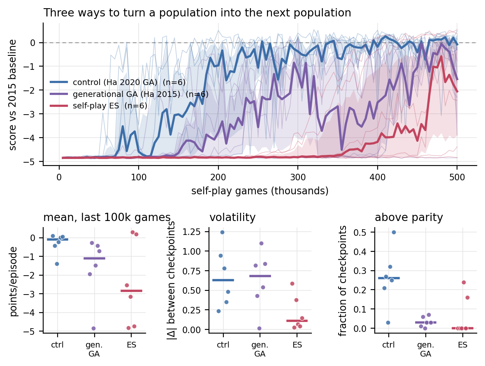

*Three of the four families at an identical budget of <!-- n:budget -->500,000<!-- /n --> games (the
archive variant is in the hall-of-fame figure above). The ceilings are close
together; the floors differ in these six seeds, a difference fresh control runs
did not reproduce.*

<!-- table:r -->
| condition | runs | learned to rally | best champion (held out) | end-of-run champion | checkpoints above parity |
|---|---|---|---|---|---|
| control (Ha 2020 GA) | 6 | 6/6 | +0.32 ± 0.06 | -0.15 ± 0.27 | 26% |
| archive as test, full span | 6 | 5/6 | -0.55 ± 0.86 | -1.01 ± 0.83 | 18% |
| archive as parent, p=0.25 | 6 | 1/6 | -3.94 ± 0.90 | -4.10 ± 0.74 | 2% |
| archive as parent, p=0.50 | 1 | 0/1 | -4.84 ± — | -4.84 ± — | 0% |
| archive as parent, full span | 3 | 0/3 | -4.83 ± 0.01 | -4.84 ± 0.00 | 0% |
| generational GA (Ha 2015) | 6 | 5/6 | -0.68 ± 0.83 | -2.00 ± 0.82 | 3% |
| self-play ES | 6 | 4/6 | -1.56 ± 0.99 | -2.08 ± 0.94 | 7% |
| sigma = 0.05 | 3 | 3/3 | +0.34 ± 0.07 | -0.17 ± 0.23 | 26% |
| sigma = 0.20 | 3 | 2/3 | -1.44 ± 1.70 | -1.66 ± 1.60 | 11% |
| population 32 | 1 | 0/1 | -4.84 ± — | -4.86 ± — | 0% |
| *reference run, unmodified environment* | 1 | 1/1 | *+0.50 ± 0.03* | *+0.04 ± 0.02* | *22%* |
| *Ha (2020), same algorithm and budget* | 1 | — | *+0.35 ± 0.02* | — | — |

Points per episode against the 2015 champion policy, which is never seen during training. Held-out columns are 1,000 episodes on an evaluation seed disjoint from the one used to pick the checkpoint. 'Learned to rally' counts runs whose population ever held 1,500-step rallies against itself.
<!-- /table:r -->

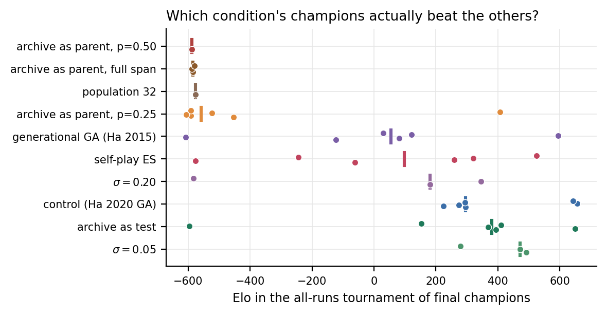

*Final champions from every run of every condition, played against each other in
one tournament and scored by Elo.*

### A fifth family: NEAT

Every family above evolves the weights of one fixed network. NEAT
(Stanley & Miikkulainen 2002) evolves the structure too: it starts from the
smallest network (every input wired to every output), adds nodes and
connections, and protects new structure in species. The [lab's
NEAT](docs/lab.md#neat) plays the study's compiled game (a NEAT genome that
encodes the study's network plays bit-identical games) under the generational
GA's self-play evaluation and the same budget. A [preregistered
experiment](results/neat/PREREGISTRATION.md) ran <!-- n:neat_runs -->12<!-- /n --> seeds:

- **NEAT never learned to rally**: <!-- n:neat_learned -->0<!-- /n --> of <!-- n:neat_runs -->12<!-- /n --> runs, and <!-- n:neat_parity -->0<!-- /n --> reached a checkpoint above
  parity. The final champions lose almost every point to the 2015 baseline
  (<!-- n:neat_final -->-4.84<!-- /n --> ± <!-- n:neat_final_sd -->0.01<!-- /n -->; the best run <!-- n:neat_best_final -->-4.82<!-- /n -->).
- **H9d finds a detectable difference, and it runs against NEAT.** Against
  the generational GA, which shares its selection scheme and evolves a fixed
  topology (<!-- n:neat_ga_final -->-2.00<!-- /n -->), Cliff's δ = <!-- n:neat_delta -->-0.92<!-- /n -->, p = <!-- n:neat_p -->0.0008<!-- /n -->. In the cross-run
  tournament its final champions rank last (median Elo <!-- n:neat_elo -->-406<!-- /n -->; the lowest
  other family <!-- n:neat_elo_next -->+143<!-- /n -->).
- **It grew structure without skill**: <!-- n:neat_hidden_min -->23<!-- /n -->–<!-- n:neat_hidden_max -->39<!-- /n --> hidden nodes and <!-- n:neat_conn_min -->144<!-- /n -->–<!-- n:neat_conn_max -->170<!-- /n --> enabled
  connections in the final champions, with <!-- n:neat_species -->8.3<!-- /n --> species on average.

**Why, as far as follow-up runs can tell (exploratory, not preregistered).**
A result this one-sided could be a bug. After it was known, the game path was
checked again (NEAT-vs-NEAT games equal the paper's MLP-vs-MLP games, game for
game, on both sides of the net), and three variants ran on <!-- n:nx_runs -->4<!-- /n --> seeds each
([`neat_explore.py`](neat_explore.py), [decision log](results/matrix/decisions.md)):

- every genome starting as the study's own network: <!-- n:nx_mlp_learned -->0<!-- /n --> learned;
- no mutated weight ever replaced by a fresh random value: <!-- n:nx_noreset_learned -->0<!-- /n --> learned. In
  neither variant did training rallies exceed <!-- n:nx_neat_meanlen_max -->766<!-- /n --> steps;
- NEAT's loop with what makes it NEAT taken out (the study's network, no
  structural mutation, one species, every offspring by crossover and
  mutation): <!-- n:nx_asga_learned -->1<!-- /n --> of <!-- n:nx_runs -->4<!-- /n --> learned and reached parity (rallies above 1,500 steps at
  <!-- n:nx_asga_t_internal -->245,000<!-- /n --> games, best final champion <!-- n:nx_asga_best_final -->+0.05<!-- /n -->).

The game and the loop can learn. What kept NEAT from learning here is its
reproduction machinery (speciation, offspring shared out by species, one
elite per species, structural mutation), not its minimal start and not its
weight resets alone. This is one configuration, with settings from NEAT's
papers where they give values and nothing tuned for this game. It says
nothing about a NEAT tuned for self-play.

<!-- table:neat -->
| family | runs | learned to rally | reached parity | final (held out) | spread vs 2020 GA | best final | checkpoints above parity | median cross-run Elo |
|---|---|---|---|---|---|---|---|---|
| control (Ha 2020 GA) | 6 | 6/6 | 6/6 | -0.15 ± 0.66 | 1.00× | +0.41 | 0.26 | +371 |
| generational GA (Ha 2015) | 6 | 5/6 | 5/6 | -2.00 ± 2.00 | 3.05× | -0.09 | 0.03 | +143 |
| self-play ES | 6 | 4/6 | 2/6 | -2.08 ± 2.29 | 3.49× | +0.50 | 0.07 | +206 |
| archive as test, full span | 6 | 5/6 | 4/6 | -1.01 ± 2.03 | 3.08× | +0.35 | 0.18 | +449 |
| NEAT | 12 | 0/12 | 0/12 | -4.84 ± 0.01 | 0.02× | -4.82 | 0.00 | -406 |

Final: end-of-run champion against the 2015 baseline, held-out seed, mean ± SD over runs; spread: that SD relative to the 2020 GA's. Elo: Bradley–Terry ratings of every run's final champion in one all-play-all tournament (NEAT finals and the final champion of every single-population run of the matrix), median per family. H9d, NEAT vs the generational GA on the final champion: Cliff's δ -0.92, two-sided exact Mann–Whitney p < 0.001, **a detectable difference**. NEAT's final champions have 23–39 hidden nodes and 144–170 enabled connections (the other families: a fixed 12-10-10-3 network, 273 weights and biases).
<!-- /table:neat -->

---

## Do the findings hold?

Three checks, each on data the findings were not drawn from: a preregistered
replication on fresh seeds, stronger opponents than the 2015 baseline, and a
second game in which skill can be made cyclic.

### A preregistered replication

The findings above rest on six seeds per condition, and the design changed
while it ran. So the claims about Ha's GA and the archive (findings 1–4 and 6) were
tested again on fresh seeds, with every test and decision rule committed
before the first run ([preregistration](results/replication/PREREGISTRATION.md)):
<!-- n:rep_runs -->12<!-- /n --> new runs each of the control, the archive as parent and the archive as test,
<!-- n:rep_total -->36<!-- /n --> in all, analysed once by [`replication.py`](replication.py). **<!-- n:rep_verdicts -->6 of 6<!-- /n --> claims
replicated.** The internal transition came first in <!-- n:rep_lag_first -->10/10<!-- /n --> runs; checkpoint skill
was transitive (ρ = <!-- n:rep_rho -->+0.79<!-- /n -->, <!-- n:rep_cyclic_pct -->0.5<!-- /n -->% cyclic triads); the exported individual ranked
on average <!-- n:rep_rank -->56<!-- /n --> of 128 in its pool, its streak was unrelated to its skill (ρ = <!-- n:rep_rho_streak -->+0.04<!-- /n -->),
and it lost <!-- n:rep_decl_exp -->21.2<!-- /n --> points between snapshots where the pool's best member lost <!-- n:rep_decl_best -->7.6<!-- /n -->; the
archive as parent learned in <!-- n:rep_parent_learned -->1/12<!-- /n --> runs; the archive as test was again
indistinguishable from the control (every p ≥ <!-- n:rep_archive_pmin -->0.44<!-- /n -->).

Three things came out weaker than six seeds suggested. Not every control run
learns to rally: <!-- n:rep_ctrl_learned -->10/12<!-- /n --> did, which meets the preregistered threshold but ends
"in every seed". A falling archive win rate is not by itself a sign of
learning: it fell to <!-- n:rep_arch_learned_min -->0.06<!-- /n -->–<!-- n:rep_arch_learned_max -->0.16<!-- /n --> in the archive-as-test runs that learned, but
also to <!-- n:rep_arch_failed_min -->0.21<!-- /n --> in one that never did. And the declines comparison, as preregistered,
scored the pool's best member on the episodes that chose it (finding 4); re-scored
on held-out episodes the exported champion still lost more, <!-- n:ph_rep_decl_exp -->19.5<!-- /n --> points against <!-- n:ph_rep_decl_best -->7.7<!-- /n -->,
but in <!-- n:ph_rep_decl_runs -->9<!-- /n --> of <!-- n:ph_rep_runs -->12<!-- /n --> runs (one-sided sign test p = <!-- n:ph_rep_decl_p -->0.073<!-- /n -->), short of the threshold that
the preregistered measure met. The verdict stands as preregistered; the
held-out version is the more conservative reading. Findings 7 and 8 (algorithm families,
unequal power) were not part of the replication; finding 5 was preregistered
on fresh runs of its own.

<!-- table:rep -->
Runs per condition: control 12, archive as parent 12, archive as test 12. Tests in the Holm family count as holding when rejected at family-wise α = 0.05.

| claim | criterion | result | holds |
|---|---|---|---|
| C1 | internal transition before parity (lag > 0) | 10/10 runs, p = 9.8e-04 | yes |
| C2 | control runs that learn to rally | 10/12 | yes |
| C2 | latest / earliest internal transition ≥ 3 | 5.8× | yes |
| C3 | ρ(Elo, time) > 0 within runs | 12/12 runs (mean +0.79), p = 2.4e-04 | yes |
| C3 | cyclic share of decided triads < 1% | 4/849 (0.5%) | yes |
| C4 | exported individual outside its pool's top quarter | 12/12 runs (mean rank 56), p = 2.4e-04 | yes |
| C4 | ρ(streak, skill) inside ±0.2 (90% CI) | +0.04 [+0.02, +0.06] | yes |
| C4 | exported declines more than the best member | 10/12 runs (21.2 vs 7.6), p = 0.019 | yes |
| C5a | archive as parent learns less often than control | 1/12 vs 10/12, p = 3.2e-04 | yes |
| C5b | archive as test vs control: all four p ≥ 0.05 | final δ +0.01 p 0.98, peak δ -0.19 p 0.44, above δ -0.15 p 0.56, late δ -0.08 p 0.76 | yes |

Verdicts: C1 replicated, C2 replicated, C3 replicated, C4 replicated, C5a replicated, C5b replicated.
Archive as test (description, no decision): late archive win rate 0.13, 0.16, 0.06, 0.10, 0.13, 0.12, 0.14, 0.14, 0.09, 0.10 in runs that learned; 0.40, 0.21 in runs that did not (10/12 learned).
<!-- /table:rep -->

### Against stronger opponents

The 2015 baseline never sees its opponent, so "above parity" against it is a low
bar. Ha's slimevolleygym also ships two trained policies: a self-play GA champion
of the same 273-parameter class, and a 743-parameter CMA-ES policy trained
against the baseline (<!-- n:zoo_ga_vs_base -->+0.35<!-- /n --> and <!-- n:zoo_cma_vs_base -->+1.15<!-- /n --> against it). Every final champion played
<!-- n:zoo_games -->200<!-- /n --> games against each, on the compiled environment, which reproduces
slimevolleygym bit for bit for these networks too (<!-- n:zoo_valid_games -->40<!-- /n --> games, <!-- n:zoo_valid_steps -->120,000<!-- /n --> steps compared).

The baseline ranks the champions much as the stronger opponents do (Spearman
ρ = <!-- n:zoo_rho_base_ga -->+0.87<!-- /n --> against the zoo GA and <!-- n:zoo_rho_base_cma -->+0.89<!-- /n --> against the zoo CMA-ES, over <!-- n:zoo_n -->41<!-- /n --> final
champions), so the comparisons above do not hinge on it. But it flatters them:
<!-- n:zoo_beat_ga -->0<!-- /n --> of the <!-- n:zoo_n -->41<!-- /n --> beat Ha's published GA champion (the best manages <!-- n:zoo_best_vs_ga -->-0.04<!-- /n -->, a draw
in all but name), and of the <!-- n:zoo_above_base -->10<!-- /n --> that beat the baseline, <!-- n:zoo_above_beat_cma -->5<!-- /n --> also beat the CMA-ES
policy. The zoo GA is one exported champion Ha chose to publish, not an
unselected endpoint like these. And the CMA-ES policy, trained only against the
baseline, is the stronger of the two by the baseline's measure yet loses to the
zoo GA head to head (<!-- n:zoo_ga_vs_cma -->+0.30<!-- /n --> for the GA): specialising against the yardstick,
in one line.

<!-- table:z -->
| condition | runs | vs 2015 baseline | vs zoo GA | vs zoo CMA-ES | beat zoo GA | beat zoo CMA-ES |
|---|---|---|---|---|---|---|
| control (Ha 2020 GA) | 6 | -0.15 | -0.98 | -0.10 | 0/6 | 2/6 |
| archive as test, full span | 6 | -1.01 | -1.72 | -1.25 | 0/6 | 1/6 |
| archive as parent, p=0.25 | 6 | -4.10 | -4.34 | -3.95 | 0/6 | 1/6 |
| archive as parent, p=0.50 | 1 | -4.84 | -4.99 | -4.87 | 0/1 | 0/1 |
| archive as parent, full span | 3 | -4.84 | -4.98 | -4.92 | 0/3 | 0/3 |
| generational GA (Ha 2015) | 6 | -2.00 | -3.83 | -1.47 | 0/6 | 1/6 |
| self-play ES | 6 | -2.08 | -3.34 | -2.41 | 0/6 | 1/6 |
| sigma = 0.05 | 3 | -0.17 | -0.62 | +0.10 | 0/3 | 2/3 |
| sigma = 0.20 | 3 | -1.66 | -2.79 | -2.08 | 0/3 | 0/3 |
| population 32 | 1 | -4.86 | -4.99 | -4.88 | 0/1 | 0/1 |

Final (t = 500,000) champion of every single-population run, mean points per episode. Baseline column: held out, 1,000 episodes; zoo columns: 200 games per champion, half on each side. 'Beat' counts runs whose champion scores above 0. For scale, against the 2015 baseline the zoo GA scores +0.35 and the zoo CMA-ES +1.15; head to head the zoo GA scores +0.30 against the zoo CMA-ES.
<!-- /table:z -->

### When skill is cyclic: the lab

Slime Volleyball turned out almost purely transitive, which is the setting in
which an archive should matter least and in which "the population is not
cycling" could be a property of the game rather than of the algorithm. The
[lab](docs/lab.md) runs the study's own GA (it reproduces the paper's kernels
bit for bit) on a synthetic game whose mix of transitive and cyclic skill is set
by one number, λ, and in which every expected score is known exactly. A
[preregistered experiment](results/lab/PREREGISTRATION.md) ran the control and
the archive as test at four values of λ, <!-- n:lab_runs -->96<!-- /n --> runs in all:

- **Cycling belongs to the game.** The share of cyclic triads among a run's
  champions rises from 0 at λ = 0 to <!-- n:lab_cyc_mid_pct -->5.7<!-- /n -->% at λ = 0.5 and <!-- n:lab_cyc_hi_pct -->13.5<!-- /n -->% at λ = <!-- n:lab_lambda_max -->0.75<!-- /n -->
  (ρ = <!-- n:lab_cycle_rho -->+0.97<!-- /n -->).
- **The export rule fails the same way whatever the skill structure.** The
  exported individual ranks on average <!-- n:lab_rank_min -->52<!-- /n -->–<!-- n:lab_rank_max -->63<!-- /n --> of 128 in its own pool at every λ,
  its streak barely related to its true strength (ρ = <!-- n:lab_rho_streak_min -->+0.07<!-- /n --> to <!-- n:lab_rho_streak_max -->+0.13<!-- /n -->). Finding 4
  is not an artefact of transitivity.
- **The better rule of finding 5 still helps, but less.** Judged against
  other runs' populations, the tournament's champions beat the streak rule's
  in <!-- n:xm_improved -->42<!-- /n --> of <!-- n:xm_n -->48<!-- /n --> fresh runs, by <!-- n:xm_adv_low -->+0.11<!-- /n --> at λ = 0 and <!-- n:xm_adv_high -->+0.03<!-- /n --> at the most cyclic setting
  (table under finding 5).
- **An archive used as a test did not help more as skill became cyclic**
  (trend p = <!-- n:lab_trend_p -->0.116<!-- /n -->), against the usual reason for having one. If anything it
  lowered the final champions' strength at λ ≤ 0.5 (Cliff's δ <!-- n:lab_delta_min -->-0.47<!-- /n --> to <!-- n:lab_delta_low_max -->-0.29<!-- /n -->,
  p = <!-- n:lab_p_low_min -->0.052<!-- /n -->–<!-- n:lab_p_low_max -->0.242<!-- /n -->; no decision was preregistered for single λ values).

One synthetic game, 12 runs per cell. The external panel the declines are
measured against saturates at λ ≤ 0.5, so the decline column says something
only at λ = 0.75, where the exported champion lost <!-- n:lab_decl_exp_hi -->1.78<!-- /n --> and the pool's best member
<!-- n:lab_decl_best_hi -->0.08<!-- /n -->.

<!-- table:lab -->
| λ | cyclic triads within runs (control / test) | exported rank in pool of 128 | ρ(streak, strength) | decline: exported / best | archive as test vs control, δ (p) |
|---|---|---|---|---|---|
| 0.00 | 0.0% / 0.0% | 52 | +0.13 | 0.00 / 0.00 | -0.44 (0.068) |
| 0.25 | 1.4% / 1.7% | 56 | +0.13 | 0.00 / 0.00 | -0.29 (0.242) |
| 0.50 | 5.7% / 6.2% | 61 | +0.08 | 0.00 / 0.00 | -0.47 (0.052) |
| 0.75 | 13.5% / 13.3% | 63 | +0.07 | 1.78 / 0.08 | +0.06 (0.843) |

Discmix game, 12 runs per cell, all quantities exact. Exported rank and ρ: control runs, mean over 10 population snapshots (rank 1 = strongest). Declines: summed falls between snapshots against a fixed external panel, control runs. Archive effect: Cliff's δ of the final champions' cross-run strength, archive as test minus control, with the two-sided exact Mann–Whitney p. Trend tests (one-sided permutation): cycling vs λ ρ = +0.97 (p < 0.001) in control and +0.97 (p < 0.001) with the archive; archive effect vs λ p = 0.116.
<!-- /table:lab -->

---

## Exploratory: unequal power

**8. Exploratory: a bilateral contest produces one winner and one collapsed
side.** Splitting one pool of agents into two populations of <!-- n:pop -->128<!-- /n --> that play only
each other changes the outcome qualitatively: of <!-- n:asym_runs -->18<!-- /n --> runs, exactly **<!-- n:asym_mutual -->1<!-- /n -->** ended
with both pools holding an individual above parity, and <!-- n:asym_runaway -->13<!-- /n --> ended with one side
winning more than <!-- n:runaway_pct -->90<!-- /n -->% of the cross-population games. <!-- n:asym_runaway_sym -->4<!-- /n --> of those runaways
occurred in the *symmetric* control, where the two sides differ only in their
random seed — so in this block runaway dominance looks like the default of the
structure, not a consequence of imbalance. Doubling one side's policy capacity
(<!-- n:asym_param_large -->531<!-- /n --> vs <!-- n:param_count -->273<!-- /n --> parameters) did **not** reliably decide the contest. Correcting the
mutation scale for genome size may have: at a common per-parameter σ the larger
side led in <!-- n:asym_cap_lead -->2/6<!-- /n --> runs, with the step norm matched in <!-- n:asym_norm_lead -->5/6<!-- /n --> (exact Mann–Whitney
p = <!-- n:asym_norm_vs_cap_p -->0.065<!-- /n --> on the final win rates, six seeds per arm). This block was designed after the main matrix had run and was
re-implemented twice (see `results/matrix/decisions.md`); it is reported as
exploratory and suggests hypotheses rather than confirming any.

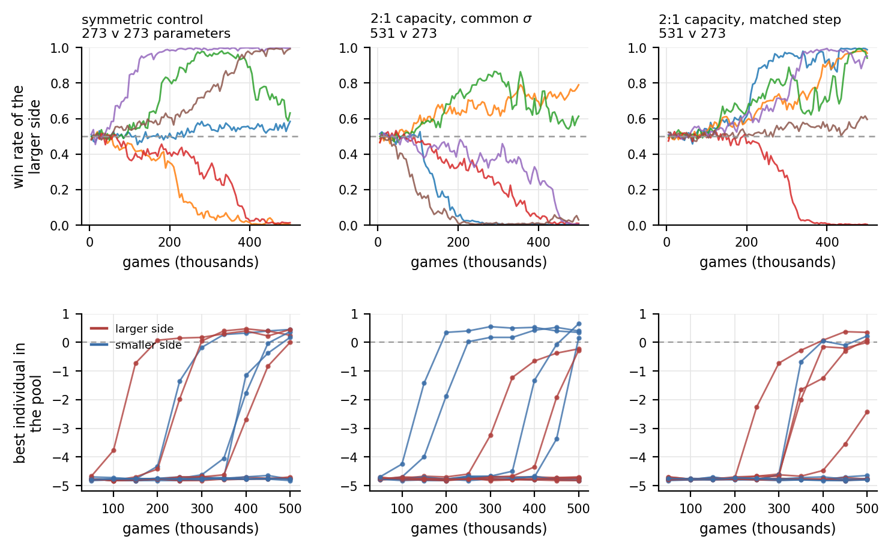

*Two populations of <!-- n:pop -->128<!-- /n --> with unequal policy capacity, selecting only against
each other. Top: the larger-network side's win rate in cross-population games.
Bottom: the best individual each pool contains, scored against the 2015
baseline — red the larger side, blue the smaller.*

---

## How the study was run

### The algorithms compared

All share the identical policy — a fixed <!-- n:obs_size -->12<!-- /n -->–<!-- n:hidden -->10<!-- /n -->–<!-- n:hidden -->10<!-- /n -->–<!-- n:n_act -->3<!-- /n --> tanh network, <!-- n:param_count -->273<!-- /n -->
parameters — and the identical environment. Only the machinery differs.

| family | how a population becomes the next population |
|---|---|
| **Ha 2020 GA** (control) | steady-state: draw two individuals, play one game, the loser is overwritten by a mutated copy of the winner. Champion = longest winning lineage. |
| **Ha 2015 GA** | generational: population <!-- n:ga_pop -->100<!-- /n -->, each agent plays <!-- n:ga_opponents -->10<!-- /n --> random peers, top <!-- n:ga_elite_pct -->20<!-- /n -->% retained, remainder refilled by uniform crossover + mutation. Champion = highest *computed* fitness. |
| **Self-play ES** | OpenAI-ES: one mean vector, <!-- n:es_candidates -->50<!-- /n --> mirrored perturbations per iteration, fitness from games among the perturbations, rank-shaped gradient. Reports the distribution mean — so it has no champion-selection problem at all. |
| **Archive variants** | the control plus a hall of fame, tested both as a parent (wrong) and as a test (right). |
| **Knob sweeps** | mutation scale σ ∈ {<!-- n:sigma_small -->0.05<!-- /n -->, <!-- n:sigma_ctrl -->0.10<!-- /n -->, <!-- n:sigma_big -->0.20<!-- /n -->}; population ∈ {<!-- n:pop_small -->32<!-- /n -->, <!-- n:pop -->128<!-- /n -->} (<!-- n:pop_big -->512<!-- /n --> was defined but never run). |

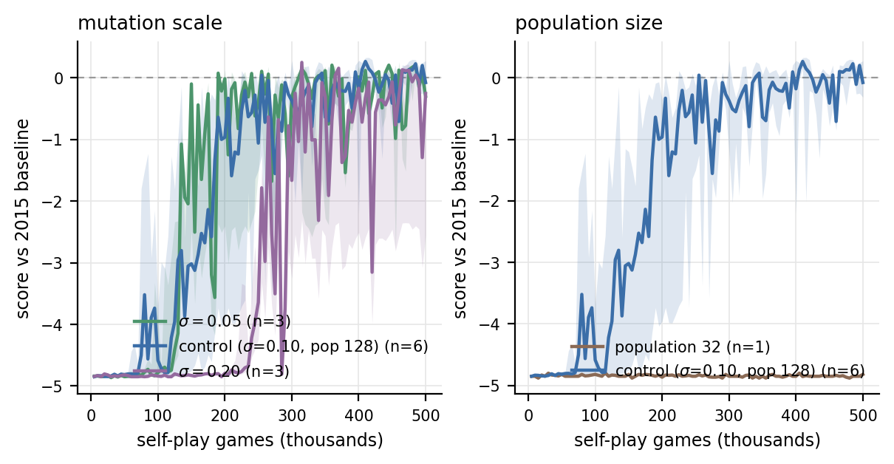

*The two knob sweeps against the control. Left: mutation scale. Right:
population size — only population <!-- n:pop_small -->32<!-- /n --> ran, with <!-- n:pop_small_runs -->1<!-- /n --> seed, before the sweep
was replaced by the unequal-power block.*

A topology-evolving method, NEAT, was added later as a fifth family in a
separate, preregistered experiment, in the same game under the same budget and
yardstick: see [A fifth family: NEAT](#a-fifth-family-neat).

### Why the numbers can be trusted

**The protocol was fixed before the runs.** `results/matrix/protocol.json`
records the checkpoint spacing, the sweep evaluation seed and episode count, and
a *disjoint* held-out seed used to re-score selected champions. Peak-checkpoint
scores are selected maxima and therefore biased, so every headline number is a
<!-- n:select_episodes -->1,000<!-- /n -->-episode re-score on the held-out seed.

**Every decision made after launch is logged.** `results/matrix/decisions.md`
records each change to the design, what was known at the time, and why — including
the archive bug above, which was found after three runs had completed and is
reported rather than quietly fixed, and a later streak-accounting bug in the
archive-as-test kernel, whose runs were rerun under a new name while the
originals stay on disk, marked superseded.

**The fast environment is the benchmark, not an approximation.** A <!-- n:budget -->500,000<!-- /n -->-game
run costs about <!-- n:val_ref_core_hours -->13<!-- /n --> core-hours on the reference `slimevolleygym`, which is why
the first version of this repository had exactly one run. `fastvolley.py` is a
numba-compiled transcription, and it is validated bit for bit: driven from an
identical stream of serve velocities, <!-- n:val_games -->200<!-- /n --> paired games match on every ball
position, every agent position, every rally end, every score and every episode
length, across <!-- n:val_steps -->304,812<!-- /n --> environment steps — at <!-- n:val_speedup -->26<!-- /n -->× the throughput. Three
deviations (RNG family, pair-sampling call, BLAS vs libm in the forward pass) are
documented; the third cannot change a trajectory because the game only ever reads
`action[i] > 0`.

**Stability is only reported conditional on competence.** A run that never
learned anything has zero volatility and zero drawdown, and so scores perfectly
on every stability metric. The archive-as-parent runs are exactly that case, and
they are the reason every stability comparison is also reported over the subset of
runs that actually learned.

**Statistics match the sample size.** <!-- n:runs_min -->1<!-- /n -->–<!-- n:runs_max -->6<!-- /n --> runs per condition rules out anything
asymptotic, so comparisons use the exact Mann–Whitney U test with full
enumeration, Cliff's δ, and percentile bootstrap intervals — written out in
`stats_utils.py` rather than imported, so every number can be audited.

---

## Limitations

- **One environment.** Slime Volleyball is symmetric, zero-sum and fully
  observed — the friendliest possible setting for purely relative selection.
  The lab's synthetic game with tunable cycles is a second setting, not a
  second physical game.
- **<!-- n:runs_min -->1<!-- /n -->–<!-- n:runs_max -->6<!-- /n --> runs per condition.** <!-- n:seeds_main -->6<!-- /n --> for every condition that carries a claim:
  enough to separate a large effect from seed noise, not a small one. Findings
  1–4 and 6 held in a [preregistered replication](#a-preregistered-replication) on
  <!-- n:rep_runs -->12<!-- /n --> fresh runs per condition, and finding 5 was preregistered on fresh runs.
  Findings 7 and 8 were not replicated, and six seeds were too few for one
  part of finding 7: the reliability ranking of the families that they
  suggested did not survive the replication's fresh control runs.
- **Topology.** Findings 1–8 come from families that evolve one fixed network.
  NEAT, which evolves structure, never learned to rally here (<!-- n:neat_learned -->0<!-- /n --> of <!-- n:neat_runs -->12<!-- /n --> runs,
  [preregistered](results/neat/PREREGISTRATION.md)); that is one configuration
  of NEAT with mostly published settings, not tuned for this game.
- **Archive designs.** The archive was tested as a parent in one design and
  as a test in two: time-ordered, and organised by behaviour
  ([preregistered](results/qd/PREREGISTRATION.md), no detectable effect
  either). A curated archive, or one that selects opponents by what they
  teach, is untested.

---

## Reproduce it

### Quickstart

```bash
python3 -m venv .venv          # Python 3.11
.venv/bin/pip install -r requirements.txt -r requirements-fast.txt
# or, for every transitive package pinned too:  pip install -r requirements-lock.txt

# the repository self-test: the three February failures, a bit-level
# comparison of the compiled environment against slimevolleygym, and the
# archive streak regression
.venv/bin/python test_repo.py

# the port is the benchmark: 200 paired games, step by step
.venv/bin/python validate_fastvolley.py --games 50

# the matrix (hours, not days: ~30 min per 500,000-game run per core)
.venv/bin/python run_experiments.py --workers 3

# metrics, held-out re-scoring, and the three coevolution-specific measurements
.venv/bin/python analyze_matrix.py --holdout
.venv/bin/python coevolution_analysis.py --within --across --proxy
.venv/bin/python reexport.py && .venv/bin/python proxy_heldout.py  # export rule, post hoc and held out
.venv/bin/python yardsticks.py && .venv/bin/python transitivity_fine.py

# the preregistered follow-ups: each runner skips runs that exist, each
# analysis is the one fixed in that experiment's PREREGISTRATION.md
.venv/bin/python replication.py                                    # runs: scripts/replicate.sh
.venv/bin/python run_lab.py && .venv/bin/python lab_analysis.py    # cyclic skill
.venv/bin/python run_export.py && .venv/bin/python export_analysis.py
.venv/bin/python run_qd.py && .venv/bin/python qd_analysis.py      # archive by behaviour
.venv/bin/python run_neat.py && .venv/bin/python neat_analysis.py  # NEAT

# tables, figures, the single-page HTML write-up and the paper
.venv/bin/python make_tables.py && .venv/bin/python make_figures.py
.venv/bin/pip install -r requirements-docs.txt && .venv/bin/python build_paper.py --md
paper/build.sh                 # needs a TeX distribution with latexmk
```

The reference run on the unmodified environment is continued from its committed
population snapshot with
`.venv/bin/python train_ga_selfplay.py --resume --snapshot-freq 1000`.

### Repository layout

| Path | What it is |
|---|---|
| `fastvolley.py` | compiled port of the physics, the MLP policy and the 2015 baseline RNN, plus the control GA |
| `validate_fastvolley.py` | the bit-level comparison against `slimevolleygym` |
| `algorithms.py` | the generational GA, the self-play ES, and the corrected hall of fame |
| `run_experiments.py` | the matrix: conditions, seeds, and the pre-registered protocol |
| `analyze_matrix.py` / `stats_utils.py` | metrics, exact tests, bootstrap intervals |
| `coevolution_analysis.py` | within-run Elo and intransitivity, cross-run tournament, the champion-proxy check |
| `make_tables.py` / `make_figures.py` / `build_paper.py` | everything in the write-up, generated |
| `train_ga_selfplay.py` / `eval_vs_baseline.py` | the reference implementations, unmodified |
| `test_repo.py` | the repository self-test |
| `scripts/` | the shell scripts that drove the runs in ephemeral containers (queueing, watchdog, autocommit) |
| `results/matrix/` | one file per run: <!-- n:n_ckpt -->100<!-- /n --> champion genomes, streaks, rally lengths, evaluations |
| `results/ga_selfplay/` | the reference run: checkpoints, population snapshot, training history |
| `lab/` | the lab: one GA kernel that reproduces the paper's three bit for bit, the discmix game with tunable cyclic skill, and NEAT ([docs/lab.md](docs/lab.md)) |
| `replication.py` | the preregistered replication's one analysis |
| `yardsticks.py` / `transitivity_fine.py` | stronger opponents (the slimevolleygym zoo) and transitivity at 5,000-game spacing |
| `run_lab.py` / `lab_analysis.py` | the cyclic-skill experiment |
| `run_export.py` / `export_analysis.py` | the export-rule experiment |
| `run_qd.py` / `qd_analysis.py` | the archive organised by behaviour |
| `run_neat.py` / `neat_analysis.py` / `neat_explore.py` | NEAT, and its exploratory follow-up |
| `results/replication/`, `results/export/`, `results/lab/`, `results/qd/`, `results/neat/` | the preregistered experiments, each with its preregistration, protocol record, run files and analysis |
| `results/zoo/` | the slimevolleygym zoo policies, with their license and source commit |
| `paper/` | the LaTeX paper, its generated numbers and tables, and the review notes |
| `archive/february/` | the earlier failed attempt, unmodified, as evidence |

### The write-up

| | |
|---|---|
| [Overview](docs/paper/00-overview.md) | abstract and what the study contributes |
| [Methods](docs/paper/01-methods.md) | task, algorithms, interventions, the compiled environment, the protocol |
| [Results](docs/paper/02-results.md) | the reference run, seed variance, what competence means here |
| [Ablations and analysis](docs/paper/03-ablations-and-analysis.md) | transitivity, the export rule, archives, mutation scale, population size, algorithm families |
| [Appendix](docs/paper/04-appendix.md) | self-contained: every table, every run, reproduction commands |
| [February postmortem](docs/postmortem-february.md) | three verified mechanisms that made an earlier attempt uninterpretable |
| [Lineage](docs/trajectory.md) | Ha 2015 → Backprop NEAT 2016 → slimevolleygym 2020 → ShinkaEvolve 2025 |

Every table in the write-up and in this README is generated by `make_tables.py`
from the files in `results/analysis/`, every number in the prose by
`prose_numbers.py`, and every figure by `make_figures.py`. Each analysis file
records a hash of every raw file it was computed from, and
`make_tables.py --check`, run on every push, fails if a table or a number no
longer follows from the files on disk. None is typed by hand, so
`git diff docs/paper` shows exactly which numbers moved
when new results land.

---

## Credits

- Environment, baseline policy and the original GA: **David Ha (hardmaru)** —
  [slimevolleygym](https://github.com/hardmaru/slimevolleygym) (Apache-2.0),
  [Neural Slime Volleyball (2015)](https://blog.otoro.net/2015/03/28/neural-slime-volleyball/).
- Competitive coevolution background: Rosin & Belew (1997); Risi, Tang, Ha &
  Miikkulainen, [*Neuroevolution*](https://neuroevolutionbook.com) (MIT Press,
  2025), ch. 7.2.
- This repository: MIT (see LICENSE).
