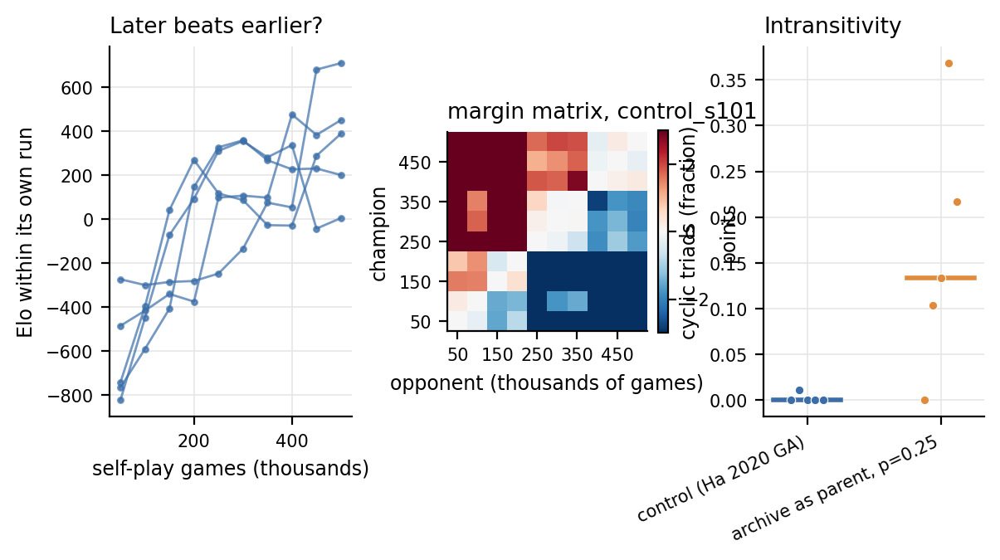
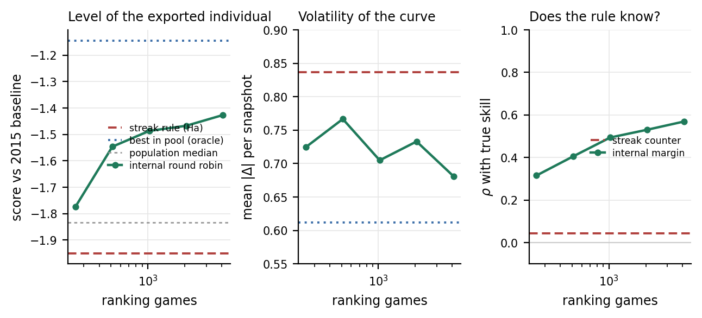
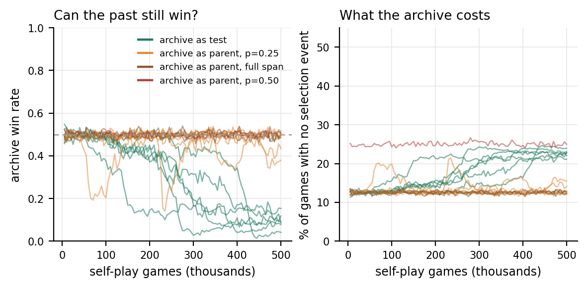
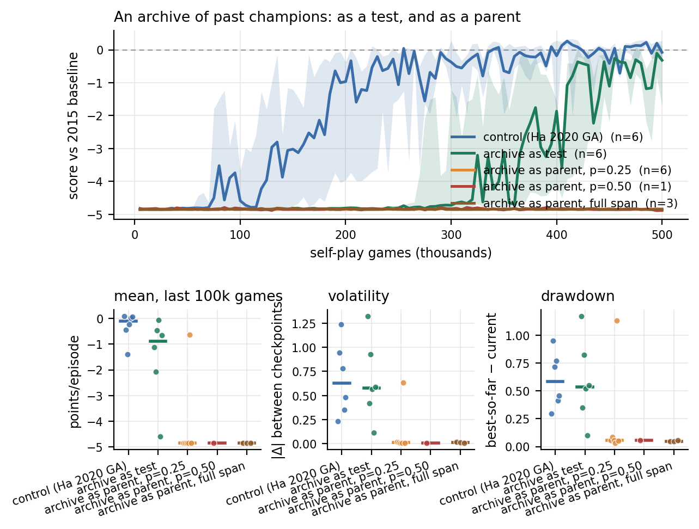
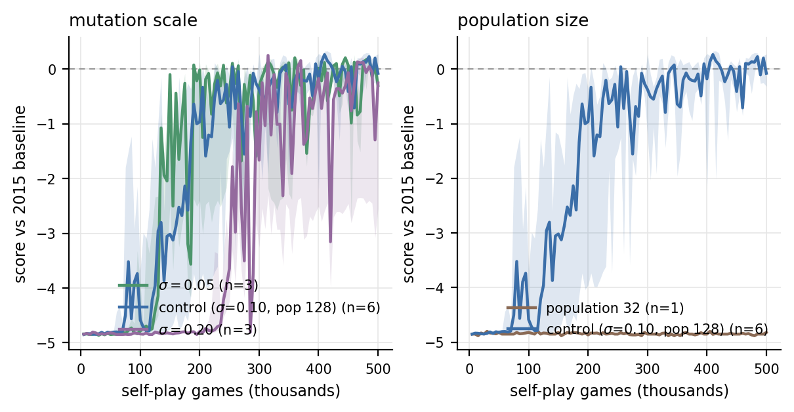
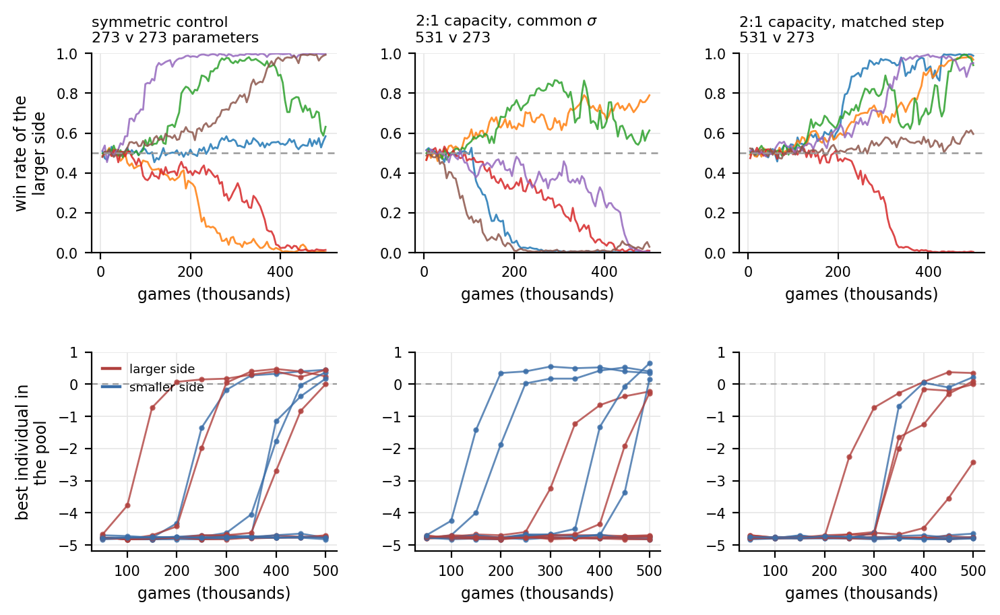
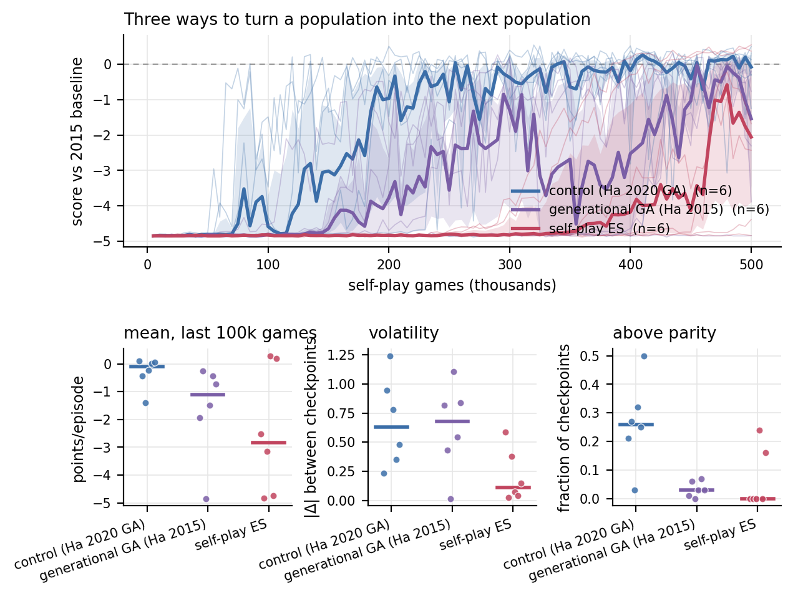

# Ablations and analysis

<!-- VERIFY: every number here is regenerated by make_tables.py into
     docs/paper/_tables.md. Check the prose against that file before shipping. -->

The reference run leaves three competing explanations for the same observation —
competence is reached and then lost. Each is a different claim about *where* the
volatility lives, and each makes a different prediction:

| explanation | the claim | prediction | tested in |
|---|---|---|---|
| coevolutionary forgetting | the population really does lose skills that no current opponent punishes | later champions should *not* reliably beat earlier ones; the champion tournament should contain cycles | §1 |
| a reporting artefact | the population is fine; the individual we *export* is not the best one | the best individual in the pool should be both better and steadier than the exported champion | §2 |
| step size | the mutation step is too large for the landscape | a smaller σ should reduce the swings | §4 |

The first two are settled below, and the answer is not the one the literature's
default reading would predict.

## 1. The population is not cycling

Every checkpoint of a run, spaced 50,000 games apart, was played against every
other checkpoint of the same run — 50 games per pair over both court sides — and
Bradley–Terry ratings fitted on the Elo scale.

<!-- table:4 -->
| condition | runs | ρ(Elo, training time) | cyclic triads | undecided pairs |
|---|---|---|---|---|
| control (Ha 2020 GA) | 5 | +0.72 | 1/421 (0.2%) | 10.0 |
| archive as parent, p=0.25 | 5 | +0.28 | 17/127 (13.4%) | 23.4 |

Checkpoints 50,000 games apart play a round robin, 50 games per pair over both court sides. A pair whose mean margin is inside ±0.25 points counts as undecided and its triads are skipped. A cyclic triad is A beats B beats C beats A.
<!-- /table:4 -->

*Figure 5. Left: Elo of each checkpoint within its own run, control seeds — rising
almost monotonically with training time. Middle: the pairwise margin matrix of one
run; the clean red/blue split either side of the diagonal is what transitivity
looks like. Right: cyclic-triad fraction per condition.*

In the control condition, skill is essentially **transitive**: the rank
correlation between Elo and training time is strongly positive, and of several
hundred decided checkpoint triples, well under 1% are cyclic. Later champions
beat earlier champions. A population that was genuinely forgetting — losing
skills that no current opponent punishes, then relearning them — would produce
exactly the opposite signature: A beats B beats C beats A, and Elo uncorrelated
with training time.

So the standard explanation for the swings in Figure 1 is, in this environment
and with this algorithm, wrong. Whatever the volatility is, it is not the
population going in circles.

The `hof-0.25` rows are the control for that reading: those runs never learned
anything (§3), so their champions are a set of roughly equally bad policies whose
pairwise results are mostly noise — and there the cyclic fraction is an order of
magnitude higher and the Elo/time correlation weak. That is what genuine
intransitivity looks like in these numbers, and the control condition does not
look like it.

## 2. The volatility is largely a reporting artefact

Ha exports the individual with the longest winning lineage, "without actually
computing who is best to save time". Because the control runs snapshot their
entire population every 50,000 games, every member can be scored against the
2015 baseline and compared with the one the rule selects.

<!-- table:5 -->
| games | exported champion | best in the same pool | gap | exported rank | ρ(streak, score) | above parity in pool | mean pairwise genotype distance |
|---|---|---|---|---|---|---|---|
| 50,000 | -4.74 | -4.46 | 0.28 | 58 / 128 | +0.12 | 0 | 12.92 |
| 100,000 | -4.32 | -2.65 | 1.67 | 72 / 128 | -0.00 | 1 | 11.03 |
| 150,000 | -3.40 | -2.53 | 0.87 | 45 / 128 | +0.09 | 3 | 10.32 |
| 200,000 | -2.48 | -1.78 | 0.70 | 63 / 128 | +0.03 | 5 | 9.88 |
| 250,000 | -1.57 | -0.62 | 0.94 | 46 / 128 | +0.09 | 20 | 9.18 |
| 300,000 | -1.38 | -0.50 | 0.87 | 51 / 128 | +0.13 | 25 | 10.54 |
| 350,000 | -1.67 | -0.46 | 1.21 | 72 / 128 | +0.08 | 30 | 10.33 |
| 400,000 | -1.41 | -0.41 | 1.00 | 63 / 128 | +0.11 | 46 | 11.81 |
| 450,000 | -0.58 | +0.60 | 1.18 | 71 / 128 | -0.02 | 45 | 12.23 |
| 500,000 | -0.29 | +0.66 | 0.94 | 73 / 128 | +0.06 | 58 | 11.36 |

Control runs only (5 seeds), averaged across seeds. Every member of the snapshotted population is scored against the 2015 baseline; 'exported' is the individual Ha's longest-winning-lineage rule selects.
<!-- /table:5 -->

Three things in that table, in increasing order of how much they matter.

*The exported champion is not the best individual.* Its rank inside its own
population of 128 hovers around the middle throughout training, not near the top.

*The streak counter does not track quality.* The rank correlation between an
individual's winning-streak counter and its actual score against the 2015
baseline sits within noise of zero at every checkpoint. This is not surprising
once stated: the counter is inherited by the loser on every replacement, so it
measures the *age of a lineage*, not the merit of an individual. But it means the
export rule is close to picking a competent-ish individual at random.

*The cost is about a point per episode, and it is systematic.* Late in training
the gap between the exported champion and the best individual in the same pool is
consistently around one point — and at the end of the run the exported champion
is below parity while dozens of its own peers are above it.

**Can it simply be replaced?** Yes, mostly, and cheaply. Ranking the pool by an
internal round robin uses no information the algorithm does not already have, so
unlike "best against the 2015 baseline" it is a fix rather than an oracle.

<!-- table:9 -->
| promotion rule | games spent ranking | mean score of the exported individual | volatility of the reported series | gap to best closed | ρ(rule statistic, true skill) |
|---|---|---|---|---|---|
| winning streak (Ha's rule) | 0 | -1.95 | 0.84 | — | +0.04 |
| *pick the population median* | *0* | *-1.83* | *0.57* | *—* | *—* |
| internal round robin, 4 peers each | 256 | -1.77 | 0.72 | 22% | +0.32 |
| internal round robin, 8 peers each | 512 | -1.55 | 0.77 | 50% | +0.41 |
| internal round robin, 16 peers each | 1,024 | -1.49 | 0.70 | 57% | +0.49 |
| internal round robin, 32 peers each | 2,048 | -1.47 | 0.73 | 60% | +0.53 |
| internal round robin, 64 peers each | 4,096 | -1.43 | 0.68 | 65% | +0.57 |
| *best in pool (oracle, not deployable)* | *—* | *-1.14* | *0.61* | *100%* | *+1.00* |

Control runs only (6 seeds), across all population snapshots. Every population member is scored against the 2015 baseline over 60 episodes to establish true skill; the promotion rules then compete to pick the best member using only what they are entitled to see. 'Volatility' is the mean absolute change in the exported individual's score between consecutive snapshots. For scale, 4,096 ranking games is 0.8% of a 500,000-game run.
<!-- /table:9 -->

*Figure 9. Level, volatility and informativeness of three promotion rules as a
function of the games spent ranking the population. The streak rule (dashed red)
sits below the population median; an internal round robin climbs towards the
oracle (dashed blue) with diminishing returns, and its rank correlation with true
skill saturates near +0.6.*

*Figure 6. Left: the exported champion (red) against the best individual in the
same population (blue), for every control seed. The best individual is better
almost everywhere and crosses parity substantially earlier. Right: Spearman
correlation between the winning-streak counter and score against the 2015
baseline, every seed and snapshot — indistinguishable from zero.*

This reframes the headline result of the reference run. The published number for
this algorithm — Ha's +0.353, our reference run's +0.304 — is not the quality
the population reaches. It is the quality of a middling member of that
population, and the pool it was drawn from contains individuals a point better.
**A meaningful part of what looked like coevolutionary instability is
measurement noise injected by the export rule at the last step.**

The finding is cheap to act on, which is the useful part: the fix is to spend a
few hundred games ranking the pool before exporting, or to report the
distribution instead of a single individual. It is also a warning that
generalises past this game — when selection is purely relative, the mechanism
that *reports* a winner can contribute more variance than the coevolution does,
and it will do so silently, because a champion curve looks exactly the same
either way.

## 3. An archive of past champions: as a parent, and as a test

The remaining explanation for volatility in the literature is missing memory,
and the standard remedy is a hall of fame. We tested two readings of it, because
the first one we implemented was wrong in an instructive way.

<!-- table:1 -->
| condition | runs | final (held out) | peak (held out) | mean, last 100k | volatility | drawdown | above parity | median first parity |
|---|---|---|---|---|---|---|---|---|
| control (Ha 2020 GA) | 6 | -0.15 ± 0.27 | +0.32 ± 0.06 | -0.32 ± 0.23 | 0.67 | 0.60 | 26% | 192k (6/6) |
| archive as test, full span | 6 | -1.10 ± 0.78 | -0.44 ± 0.71 | -1.49 ± 0.68 | 0.66 | 0.59 | 8% | 365k (4/6) |
| archive as parent, p=0.25 | 6 | -4.10 ± 0.74 | -3.94 ± 0.90 | -4.14 ± 0.70 | 0.12 | 0.24 | 2% | 365k (1/6) |
| archive as parent, p=0.50 | 1 | -4.84 ± — | -4.84 ± — | -4.85 ± — | 0.01 | 0.06 | 0% | — (0/1) |
| archive as parent, full span | 2 | -4.84 ± 0.00 | -4.84 ± 0.00 | -4.84 ± 0.00 | 0.02 | 0.05 | 0% | — (0/2) |
| generational GA (Ha 2015) | 6 | -2.00 ± 0.82 | -0.68 ± 0.83 | -1.61 ± 0.70 | 0.63 | 0.70 | 3% | 345k (5/6) |
| self-play ES | 6 | -2.08 ± 0.94 | -1.56 ± 0.99 | -2.46 ± 0.93 | 0.21 | 0.18 | 7% | 398k (2/6) |
| sigma = 0.05 | 3 | -0.17 ± 0.23 | +0.34 ± 0.07 | -0.29 ± 0.15 | 0.69 | 0.64 | 26% | 150k (3/3) |
| sigma = 0.20 | 3 | -1.66 ± 1.60 | -1.44 ± 1.70 | -1.76 ± 1.54 | 0.38 | 0.36 | 11% | 290k (2/3) |

Scores are points per episode against the 2015 baseline, mean ± s.e.m. across runs. `final` and `peak` are re-scored on the held-out evaluation seed over 1,000 episodes; the other columns come from the 200-episode sweep.
<!-- /table:1 -->

<!-- table:2 -->
| condition | metric | difference | Cliff's δ | exact p |
|---|---|---|---|---|
| archive as test, full span | `final_holdout` | -0.953 | -0.28 | 0.485 |
| archive as test, full span | `late_mean` | -1.178 | -0.67 | 0.065 |
| archive as test, full span | `volatility` | -0.015 | +0.00 | 1.000 |
| archive as test, full span | `drawdown` | -0.014 | +0.00 | 1.000 |
| archive as test, full span | `above_parity` | -0.187 | -0.75 | 0.028 |
| archive as parent, p=0.25 | `final_holdout` | -3.951 | -0.94 | 0.004 |
| archive as parent, p=0.25 | `late_mean` | -3.828 | -0.94 | 0.004 |
| archive as parent, p=0.25 | `volatility` | -0.557 | -0.83 | 0.015 |
| archive as parent, p=0.25 | `drawdown` | -0.366 | -0.67 | 0.065 |
| archive as parent, p=0.25 | `above_parity` | -0.245 | -0.94 | 0.004 |
| archive as parent, full span | `final_holdout` | -4.688 | -1.00 | 0.071 |
| archive as parent, full span | `late_mean` | -4.527 | -1.00 | 0.071 |
| archive as parent, full span | `volatility` | -0.657 | -1.00 | 0.071 |
| archive as parent, full span | `drawdown` | -0.554 | -1.00 | 0.071 |
| archive as parent, full span | `above_parity` | -0.263 | -1.00 | 0.071 |
| generational GA (Ha 2015) | `final_holdout` | -1.852 | -0.67 | 0.065 |
| generational GA (Ha 2015) | `late_mean` | -1.299 | -0.78 | 0.026 |
| generational GA (Ha 2015) | `volatility` | -0.046 | +0.00 | 1.000 |
| generational GA (Ha 2015) | `drawdown` | +0.103 | +0.00 | 1.000 |
| generational GA (Ha 2015) | `above_parity` | -0.230 | -0.83 | 0.015 |
| self-play ES | `final_holdout` | -1.933 | -0.33 | 0.394 |
| self-play ES | `late_mean` | -2.145 | -0.33 | 0.394 |
| self-play ES | `volatility` | -0.464 | -0.72 | 0.041 |
| self-play ES | `drawdown` | -0.420 | -0.83 | 0.015 |
| self-play ES | `above_parity` | -0.197 | -0.83 | 0.013 |
| sigma = 0.05 | `final_holdout` | -0.018 | -0.22 | 0.714 |
| sigma = 0.05 | `late_mean` | +0.026 | -0.44 | 0.381 |
| sigma = 0.05 | `volatility` | +0.017 | +0.00 | 1.000 |
| sigma = 0.05 | `drawdown` | +0.034 | +0.11 | 0.905 |
| sigma = 0.05 | `above_parity` | -0.003 | -0.11 | 0.905 |
| sigma = 0.20 | `final_holdout` | -1.509 | -0.33 | 0.548 |
| sigma = 0.20 | `late_mean` | -1.445 | -0.44 | 0.381 |
| sigma = 0.20 | `volatility` | -0.294 | -0.44 | 0.381 |
| sigma = 0.20 | `drawdown` | -0.238 | -0.33 | 0.548 |
| sigma = 0.20 | `above_parity` | -0.150 | -0.78 | 0.095 |

Exact two-sided Mann–Whitney U over all label assignments. Difference is condition minus control in points per episode (`above_parity` is a fraction). Only `final_holdout` is the pre-registered primary endpoint; the rest are descriptive and uncorrected for multiplicity.
<!-- /table:2 -->

**The archive as a parent (`hof-0.25`, `hof-0.50`, `hof-full`).** Our first
implementation applied Ha's replacement rule verbatim to archive games: when the
archived genome won, the population member it beat was overwritten by a mutant
*of the archived genome*. With p = 0.25 and a measured archive win rate near
0.5, roughly one game in eight therefore copies an older genotype back into the
pool. The result is unambiguous: **learning is abolished.** Not destabilised —
abolished. Not one of these runs ever reached long-rally play against itself, and
not one produced a single above-parity checkpoint out of a hundred, while every
control run did both.

That is a standing regression pressure, and it is worth reporting rather than
quietly fixing because the bug is a plausible one to write. It also produces the
clearest illustration in this study of why stability metrics need a competence
precondition: these runs have *near-zero volatility and near-zero drawdown*,
which on those two metrics alone makes them the most stable condition in the
matrix. A dead run is perfectly stable. Every stability comparison in Table 2 is
therefore also reported over the subset of runs that actually learned.

**The archive as a test (`hof-eval`).** The literature's reading
(Rosin & Belew, 1997) uses the archive to supply *opponents against which
fitness is measured*; archive members are never parents. In `hof-eval` an
archive game that the population member loses costs it its slot, but the
replacement genes come from the living pool, so genetic material never leaves
the population. The archive spans the whole run (capacity 512).

Done this way the archive stops being destructive — every seed learns to rally,
as reliably as the control — but it does not stabilise anything either. It makes
the run *worse*: a lower level in the last 100,000 games and fewer above-parity
checkpoints than the control, with a large effect size and a p-value that, at six
seeds a side, sits just outside conventional significance.

The mechanism is visible in the data and it follows directly from §1.

*Figure 10. Left: the archive's win rate against the current population, every
archive run. It starts at chance and collapses. Right: the share of the game
budget that produces no selection event at all, because an archive game the
population member wins overwrites nothing.*

Early in a run, archived champions are genuine opposition and win about half
their games. By the end they win under a tenth. Skill in this environment is
transitive (§1), so a past champion is simply a weaker player, and playing it is
a nearly foregone conclusion. Since an archive game that the population member
wins overwrites nothing, roughly **22% of all games late in training produce no
selection event whatsoever** — the archive is not insurance, it is a tax levied
on the live arms race.

That yields a general rule with a number attached, and a cheap diagnostic:

> **A hall of fame pays for itself only to the extent that archived opponents
> can still win.** Log the archive's win rate against the current population. If
> it decays towards zero, the archive has become a free win and the budget spent
> on it is subtracted from the arms race that is actually driving progress. In a
> genuinely intransitive domain it would not decay — old strategies would keep
> beating some current ones, which is exactly the case the remedy was designed
> for.

The two archive conditions together therefore say something more useful than
either alone: an archive that supplies *parents* destroys learning, an archive
that supplies *tests* wastes budget, and neither helps, because the pathology
they were built to fix is not present here.

*Figure 3. The archive interventions against the control. Top: median and
inter-quartile band per condition. Bottom: per-seed values for the mean level,
the volatility and the drawdown of the last 100,000 games.*

## 4. Is it the mutation step?

The last of the three candidate explanations: the swings are not coevolution and
not the export rule, but simply a mutation step too large for the landscape. If
so, halving σ should visibly steady the trajectory and doubling it should wreck
it.

*Figure 4. Mutation scale: σ = 0.05 and σ = 0.20 against the control's σ = 0.10,
median and inter-quartile band across seeds.*

**It is not the step size.** Halving the mutation scale changes nothing that
matters. Volatility over the last 100,000 games is indistinguishable from the
control — a difference of +0.017 points with Cliff's δ of exactly 0.00 and an
exact p of 1.000 — and so are the level, the drawdown and the fraction of
checkpoints above parity, which lands on the same 26%. Every seed still learned.
If the swings in a champion curve were driven by a mutation step too large for
the landscape, halving that step should have visibly steadied them. It did not
move them at all.

Doubling σ does damage, but not the kind the hypothesis predicts: one seed in
three never learned to rally, and the level drops, while the *volatility of the
runs that did learn* stays within noise of the control (δ = −0.17, p = 0.857).
The naive comparison over all runs makes σ = 0.20 look like the *calmest*
condition in the sweep, at 0.38 against the control's 0.67 — which is the
competence-precondition trap of §3 appearing a second time, since the failed
seed contributes a perfectly flat and perfectly worthless curve.

So the third candidate explanation is out. The swings are not the population
cycling (§1), and they are not the mutation step (§4). What remains is the
mechanism §2 measured directly: the rule that chooses which individual to call
the champion.

## 5. Unequal power: what happens when one side is simply stronger

Every condition to this point is symmetric — one pool playing itself, all agents
with the identical policy class and budget. That is precisely the setting in
which "compete harder" is the only available move, and it cannot say anything
about a contest between unequal sides.

This condition runs two separate populations that play only each other, with the
strong side given roughly twice the policy capacity of the weak side: a
12–16–16–3 network with 531 parameters against the study's standard 12–10–10–3
with 273, a ratio of 1.95 : 1. Keeping the weak side at exactly the standard
architecture means its results stay comparable with every other run in the
study, and the variable-capacity forward pass was checked to be bit-identical to
the fixed one at the standard size.

Two controls make the comparison interpretable. A symmetric two-population run
(both sides 273 parameters) separates the effect of *asymmetry* from the effect
of two-population coevolution as such. And because mutation is applied per
parameter, the larger genome would otherwise also take a mutation step of larger
L2 norm — 2.30 against 1.65, a factor of 1.39 — so a second variant scales the
strong side's σ to equalise the step norms and isolate capacity from search
granularity.

<!-- table:10 -->
| condition | seed | win rate of the larger side | larger side, final score | smaller side, final score | who learned |
|---|---|---|---|---|---|
| symmetric control (273 v 273) | 101 | 0.549 | -4.83 | -4.86 | neither |

Two populations of 128 playing only each other, 750,000 games, 25% of each population's games crossed with the other side. 'Win rate of the larger side' is over cross-population games in the last 100,000 games; 0.5 means the sides are holding each other. In the symmetric control both sides have identical architecture, so any departure from 0.5 there is spontaneous symmetry breaking. 'Who learned' counts a side as having learned if its final champion scores above −4.0 against the 2015 baseline.
<!-- /table:10 -->

*Figure 11. Top: the larger side's win rate in cross-population games; 0.5 means
the sides are holding each other. Bottom: each side's champion against the 2015
baseline. Left column is the symmetric control, where both populations have the
identical architecture.*

**Three things, in order of how much they surprised us.**

*A two-population contest is winner-take-all.* Not one run ended anywhere near a
balanced 0.5. The cross-population win rate always runs away to one side or the
other, usually to an extreme — 0.001 in some seeds, meaning one population lost
essentially every game it played against the other for the last hundred thousand
games. Single-population self-play has no analogue of this: there, everyone
improves together.

*In the symmetric control, which side wins is arbitrary.* Both populations have
identical architecture, identical budget, identical mutation scale. There is
nothing to distinguish them but their random initialisation, and yet the same
runaway happens, in whichever direction the early noise pushed. That is
spontaneous symmetry breaking, and it is the baseline against which any effect
of asymmetry has to be judged.

*Twice the capacity does not decide the contest.* Across the seeds of the 2:1
condition, the larger side both lost essentially every game and won essentially
every game, depending on nothing more than the seed — the same spread as the
symmetric control produces with no asymmetry at all. If a 1.95 : 1 advantage in
policy capacity mattered here, it is smaller than the symmetry-breaking noise it
would have to overcome.

**The mechanism is disengagement, and it is the interesting part.** In this
game, whoever falls behind loses *every* cross-population game, and a contest
you always lose carries no information: there is no gradient in a uniform
defeat. The side that pulls ahead keeps improving; the side that falls behind
stops. It is not that the weaker side competes badly — it is that it stops
having a usable opponent at all, while the leader still does. The failure is
structural, not a matter of capability.

**Two caveats, both important.** First, three seeds per condition against an
outcome that is close to a coin flip is very little power: what we can say is
that a 1.95 : 1 capacity advantage does not *dominate* the symmetry-breaking
noise, not that capacity has no effect at all. Establishing a smaller effect
would need tens of seeds, which is cheap in this environment and is the obvious
extension.

Second, a caveat about our own rule. When a population member loses a
cross-population game it is replaced by a mutant of a randomly drawn peer, and
that peer's streak counter is incremented even though the peer did not play. In
the losing population, which loses nearly every cross game, this inflates streak
counters more or less at random — and §2 has already shown that the streak
counter is what selects the exported champion. So for the losing side we cannot
separate "the population stopped improving" from "the export rule was corrupted
and is now reporting an arbitrary member". Population snapshots would settle it
immediately; the asymmetric runs do not save them, and that is a design
oversight rather than a discovery. It does not affect the win-rate result, which
is measured over the populations themselves and not over their exported
champions.

## 6. Different machinery: a generational GA and an evolution strategy

Everything above varies the knobs of one algorithm. Two further families change
the machinery itself, with the policy class and the environment held identical:

- **`ga2015`** — a generational GA in the style of Ha's *original* 2015
  experiment: population 100, each agent playing ten random peers per generation,
  the top 20% retained, the remainder refilled by uniform crossover and mutation.
  It differs from the 2020 GA in three ways at once — generational rather than
  steady-state, ranked by an explicitly *computed* average fitness rather than a
  streak proxy, and with crossover. Given §2, the middle difference is the
  interesting one.
- **`es`** — self-play evolution strategy in the OpenAI-ES style: one mean
  vector, 50 mirrored perturbations per iteration, fitness from games among the
  perturbations themselves, rank-shaped gradient estimate. It reports the
  distribution mean, so it has no champion-selection problem *at all*, which
  makes it the cleanest possible test of §2's claim.

*Figure 8. Three ways of turning a population into the next population, with the
policy class and environment held identical. Top: median and inter-quartile band
per family. Bottom: per-seed level, volatility and above-parity fraction.*

**The control wins on reliability, not on ceiling.** This is the result the
design was built to be able to see, and a single run of each family would have
got it backwards.

Every family can reach roughly the same peak. The best self-play ES seed
produces the highest single endpoint in the entire study, above every control
seed; the best generational-GA and archive-as-test seeds also clear parity. What
separates the plain 2020 GA is the *floor*: it is the only family in which every
seed learned to rally and every seed's best champion beat the 2015 expert, and
its spread of endpoints across seeds is roughly a third of the alternatives'. The
others are bimodal — a couple of seeds do very well and the rest never leave the
floor at all.

So the honest comparison is not "the control is better". It is: **all four
families have a similar ceiling and wildly different floors, and only the
minimal loop reaches the ceiling dependably.** A study that ran one seed per
family could have concluded that the ES was the strongest method, on the
strength of a seed that happened to work.

Why the generational GA does not win is the more informative half, because §2
predicts it should have had an advantage. It ranks by an explicitly *computed*
fitness — the mean point margin over about ten games — which is precisely the fix
§2 shows recovers most of the export-rule gap. It gets that for free and still
does not come out ahead. Two differences plausibly outweigh it, and we can name
them but not separate them here:

- *Crossover between neural weight vectors is destructive.* Two networks can
  implement similar behaviour with their hidden units in a different order, so
  splicing their weight vectors produces a child resembling neither. This is the
  competing-conventions (permutation) problem, and it is exactly the failure that
  NEAT's historical markings were invented to solve. A crossover-free variant of
  the same generational loop would separate this from the next point; it is a
  three-run experiment and the obvious next step.
- *Generational replacement is a coarser update.* Ha's 2020 loop changes one
  individual per game; the generational loop discards 80% of the population every
  500 games. Against a moving opponent distribution, the finer-grained update
  tracks better.

The ES deserves a caveat rather than a verdict. Four of its six seeds never
reached parity, but at pilot scale we could not distinguish learning rates of
0.01, 0.03 and 0.1 — none had produced external progress by the 120,000 games we
could afford for tuning, which is unsurprising when the control's own transition
can arrive as late as 415,000 games. So the honest statement is that **self-play
ES was unreliable at the one configuration we could afford to tune**, not that
self-play ES is unreliable. Two structural observations stand regardless. It
reports its distribution mean and therefore has no champion-selection proxy at
all, so whatever its failures are, they are not the ones diagnosed in §2. And it
carries a single mean vector where the GA carries 128 lineages — which is the
most likely reason its outcomes are bimodal, and points at a property of
collectives worth stating on its own: **a population is not only a search
device, it is variance reduction across the run.** One trajectory can stall;
128 lineages usually contain one that finds the transition.

## 7. Which condition's champions actually win?

Scores against a frozen opponent can be gamed by a policy that happens to
specialise against it. The final champion of every run therefore played the final
champion of every other run.

<!-- table:6 -->
| condition | runs | median Elo | best run | worst run |
|---|---|---|---|---|
| control (Ha 2020 GA) | 5 | +373 | +785 | +238 |
| archive as parent, p=0.25 | 5 | -421 | -355 | -483 |

Bradley–Terry ratings on the Elo scale from an all-play-all tournament of the 10 final champions, 50 games per pair over both court sides. Cyclic triads across the whole tournament: 0/83 (0.0%).
<!-- /table:6 -->

## 8. Synthesis: eight lessons about competitive coevolution

None of what follows is about volleyball. Slime Volleyball is a probe — small
enough that every claim can be checked, adversarial enough that the coevolutionary
failure modes are available to be observed. These are the transferable results.

**1. There are three sources of variance in a coevolutionary loop, not two.**
The literature carefully separates the *ecology* (who plays whom, which drives
selection) from the *yardstick* (the frozen external measurement). This study
found a third channel with its own error term: the **promotion rule** — the
procedure that picks one artefact out of the population to export, report or
deploy. In our control condition it contributed more of the measured volatility
than the coevolutionary dynamics did. Any loop that promotes a single artefact
out of a population inherits this: league training that must name a "current
best", population-based training that must ship one model, and LLM-driven program
evolution that must promote one program out of a generation. The diagnostic is
cheap and should come first: *before* attributing a noisy progress curve to
coevolutionary dynamics, check whether your promotion rule can rank your
population at all. Ours could not: the correlation between the exported
individual's selection statistic and its actual skill was +0.04, and the rule
performed slightly *worse* than picking the population's median member. It is not
a weak selector; it is very nearly an uninformative one.

**2. The promotion rule is fixable, cheaply, and it is worth fixing.** Ranking a
population by having it play *itself* — using no external information, so this is
a deployable rule and not an oracle — recovers most of the gap. At 4,096 games,
which is eight tenths of one percent of a 500,000-game training run, an internal
round robin closes about two thirds of the distance between the streak-exported
champion and the genuinely best member, and reduces the volatility of the
reported curve by roughly a fifth. The returns diminish but do not reverse.

The residual gap is the more interesting half. The rank correlation between
internal margin and true skill saturates around +0.6 and does not keep climbing
with budget, so the remaining third of the gap is not sampling noise — it is a
genuine mismatch. Internal fitness measures skill against the *current* opponent
distribution, which is a narrow and self-referential slice of the strategy space,
and being best inside that slice is not the same as being best against an unseen
opponent. So: internal competition is a good cheap improvement over a lineage
proxy, and it is not a substitute for held-out evaluation. Held-out evaluation is
load-bearing for *selection*, not only for reporting.

**3. Diagnose the failure mode before applying its remedy.** Competitive
coevolution has a small, named set of pathologies — cycling and intransitivity,
disengagement, forgetting, mediocre stable states — and they have distinct,
cheaply measurable signatures. A within-run round robin over checkpoints costs a
few thousand games, which is a rounding error against a 500,000-game run. We ran
it, found skill almost perfectly transitive, and could therefore predict that a
hall of fame would have little to do here. It did little. An archive is the
standard remedy for intransitivity; applying it to a population that is not
cycling is treatment without diagnosis, and the null result is the expected
outcome rather than a surprise.

**4. Keep the past as tests, never as parents.** Our first archive
implementation let a winning archived genome become the *parent* of the member it
beat. That is a standing regression channel — roughly one game in eight copied an
older genotype back into the pool — and it abolished learning rather than merely
destabilising it. The design rule generalises to any mechanism that replays past
versions of a system: past artefacts belong on the evaluation side of the loop.
If they can contribute material to the current generation, the loop has an
inbuilt pull backwards, and the pull scales with the sampling probability.

**5. A stability claim requires a competence precondition.** The runs that never
learned anything have the lowest volatility and the lowest drawdown in the entire
matrix, and on those two metrics alone they are the most stable condition we ran.
A dead system is perfectly stable. Any comparison of the form "our variant is
steadier" must therefore be reported jointly with, or conditioned on, having
reached competence — which is why every stability comparison in this study is
reported twice, once over all runs and once over the subset that learned.

**6. Emergence timing does not replicate, even when emergence does.** Every
control seed reached the same band of competence; the games at which it got there
ranged over more than a sevenfold spread. A claim of the form "capability appears
after N games" drawn from a single run is therefore not merely imprecise, it is
unfalsifiable — a second seed can place the same transition three hundred
thousand games earlier or later. This is worth stating plainly because
single-run emergence claims are common, and because the cost of the correct
version — several seeds and a reported range — is a constant factor, not a
research programme.

**7. A population is variance reduction across the run, not only a search
device.** Four algorithm families in this study reach a similar ceiling and
differ enormously in how often they reach it. The one carrying the most
independent lineages — 128, versus a single mean vector for the evolution
strategy — is the only one where every seed got there. The others are bimodal:
some seeds do very well, the rest never leave the floor. A single trajectory can
stall; many lineages usually contain one that finds the transition. This is the
practical argument for a collective that has nothing to do with parallel compute
and everything to do with not betting the run on one path — and it is invisible
to a single-seed study, which will simply report whichever mode it happened to
land in.

**8. In a purely relative ecology, the population is the unit that becomes
competent, not the individual.** At the end of a control run, dozens of the 128
members score above parity against an opponent none of them ever saw, while the
individual the algorithm hands you does not. "The system is competent" and "the
artefact we can give you is competent" are different statements, and in a
collective driven by relative selection they can differ by a wide margin. For
collective systems the reporting implication is direct: report the distribution —
what fraction of the population clears the bar — and treat any single champion
number as a sample from it.

### What carries up to ACTIR / ShinkaEvolve

The trilogy this repository opens rests on the *separation of ecology from
yardstick*: the thing that selects and the thing that measures must never be the
same object. This study supports that and adds the third object. In an
LLM-driven program-evolution loop, candidate programs are generated, selected
against each other, and one is promoted; lesson 1 says the promotion step has its
own error term, lesson 2 says internal competition will not reliably identify the
best candidate, and lesson 7 says the honest report is a distribution over the
generation rather than the single program the loop happened to promote. All three
are cheap to check at the small scale and expensive to discover at the large one,
which is the entire argument for demonstrating them here first.
