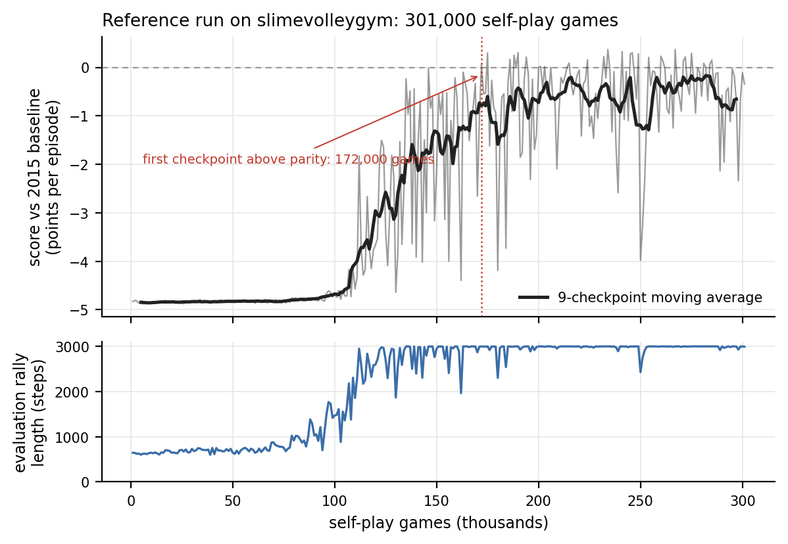

# The champion you export is not the champion you evolved

**Competitive coevolution in Slime Volleyball, measured across dozens of runs —
and the first of three experiments behind the ACTIR / ShinkaEvolve submission.**

## Abstract

Self-play evolution produces competent agents from an entirely internal signal:
beat a randomly drawn peer, stay in the pool. Nothing tells the population what
good play is. We replicate David Ha's tournament-selection genetic algorithm on
Slime Volleyball and ask what that signal can and cannot deliver, using a design
rather than a single run: dozens of independent runs of 500,000 self-play games
each across eleven conditions, with every evaluation against a frozen 2015
champion that is never seen during training.

The internal signal works, and it works late. A population improves against
itself for tens of thousands of games before any of that improvement transfers
to the external opponent, so an evaluation that stops early reads as total
failure. The phase change at which transfer begins is robust — every control run
reaches the same band — but its *timing* is not reproducible at all, ranging over
more than a sevenfold spread across seeds. A single run therefore supports no
claim about when self-play starts working.

Our main finding concerns the instability that follows. Champion quality swings
by several points per episode between adjacent checkpoints, and the standard
explanation is coevolutionary forgetting: skills that no current opponent
punishes are not selected for and are lost. That explanation does not survive
measurement. Playing every checkpoint of a run against every other checkpoint,
skill is almost perfectly transitive — later champions beat earlier ones, and
under 1% of decided checkpoint triples are cyclic. The population is not going
in circles.

What is going in circles is the *reporting*. Ha's algorithm exports the
individual with the longest winning lineage, a proxy adopted explicitly
"without actually computing who is best to save time". Because the streak
counter is inherited by the loser on every replacement, it measures the age of a
lineage rather than the merit of an individual, and it is uncorrelated with
actual skill. Scored against the whole population, the exported champion sits
near the *median* of its own 128 members and about a point per episode below the
best of them; at the end of a run it is below parity while dozens of its peers
are above it. A substantial part of what has been read as coevolutionary
instability is measurement noise injected at the last step, and it is invisible
because a champion curve looks the same either way.

A separate condition splits the population in two and has the halves play only
each other, with one side given twice the policy capacity. Doubling capacity did
not reliably decide the contest — the outcome is dominated by spontaneous
symmetry breaking, which occurs just as readily in a symmetric control where the
two sides differ only in their random seed. What the condition does show, in 18
runs, is that a bilateral contest is a qualitatively different thing from a
shared ecology: exactly one run ended with both sides holding a competent
individual. The side that falls behind loses every game, and a contest you always
lose carries no gradient, so it stops improving while its opponent continues.

We also report a negative result with a mechanism. Our first hall-of-fame
implementation applied the replacement rule to archive games, making a winning
archived genome the *parent* of the member it beat. That copies old genotypes
back into the pool roughly one game in eight and abolishes learning outright —
no such run reached long rallies or produced a single above-parity checkpoint,
while every control run did both. It also produced the cleanest illustration in
the study of why stability metrics need a competence precondition: a dead run has
zero volatility and zero drawdown, and so scores as the most stable condition in
the matrix.

Supporting all of this is the engineering that made a seeded design affordable: a
compiled port of the environment, validated bit for bit against the reference
implementation over a quarter of a million environment steps, which turns a
twelve-core-hour run into a half-hour one.

## Why this matters beyond volleyball

A self-improvement loop is exactly as real as its improvement signal. This
repository is the smallest rung of a three-part argument about where that signal
can come from as the world being acted in opens up:

| | what evolves | where the signal comes from |
|---|---|---|
| **this work** | 273 weights | internal, relative: beat a peer |
| Backprop NEAT (Ha, 2016) | topology, with gradients inside | division of labour between search and local optimisation |
| ACTIR / ShinkaEvolve | programs, with an LLM as the mutation operator | strategies selected against each other in a simulated system, measured on held-out scenarios |

The load-bearing claim inherited upward is the *separation of ecology from
yardstick*: the thing that selects and the thing that measures must never be the
same object. What this study adds is a caveat with teeth. When selection is
purely relative, there is a third object in the loop — the mechanism that decides
which candidate to *report* — and here it contributed more noise than the
coevolution did. Any evolutionary loop that promotes one artefact out of a
population, including an LLM-driven one that promotes one program out of a
generation, inherits that failure mode, and it is cheap to check and cheap to fix
once named.

## Contents

- [Methods](01-methods.md) — task, algorithms, interventions, the compiled
  environment and its validation, the pre-registered evaluation protocol.
- [Results](02-results.md) — the reference run, seed variance in the phase
  change, and what competence looks like concretely.
- [Ablations and analysis](03-ablations-and-analysis.md) — transitivity, the
  export rule, archives as parent and as test, mutation scale, population size,
  and two further algorithm families.
- [Appendix](04-appendix.md) — self-contained; every table, every run, the
  decision log, and the reproduction commands.


---

# Methods

## 1. Task and environment

We study competitive coevolution in Slime Volleyball, the two-player,
zero-sum, symmetric game introduced as a browser demo by Ha (2015) and later
released as the Gym environment `slimevolleygym` (Ha, 2020). The game is
attractive for this study for three reasons: it is genuinely adversarial, it
has a *frozen external opponent of known strength* (the 2015 champion policy
shipped with the environment), and a full self-play run is small enough that
every claim can be checked end to end.

**Observations.** Each agent receives a 12-dimensional vector — its own
position and velocity, the ball's position and velocity, and the opponent's
position and velocity — expressed in that agent's own frame (the *x* axis is
negated for the left player) and divided by 10.

**Actions.** Three binary buttons: forward, backward, jump. Both may be
pressed; forward and backward cancel.

**Episode.** Each side starts with five lives. An episode ends when a side
loses all five, or after 3,000 timesteps, whichever comes first. The episode
score is points won minus points lost, so it lies in $[-5, +5]$; a $0$ means
the two agents held each other to a draw for the full 3,000 steps.

**Policy class.** Every evolved agent is the same fixed feed-forward network,
`slimevolleylite`: 12 inputs, two hidden layers of 10 units, 3 outputs, $\tanh$
throughout, with a button pressed when its output exceeds 0. The genotype is
the flat weight vector, $d = 273$ parameters. Nothing else evolves: no
topology change, no crossover, no learned representation. This is deliberate.
The question here is what an *improvement signal* can do on its own, so
everything except the signal is held fixed.

**External yardstick.** The 2015 baseline is a small recurrent network that
was itself evolved in the original browser demo — a population of 100 agents,
each playing eight random opponents for 20 seconds of gameplay, left running
for about a day (Ha, 2015). As shipped in `slimevolleygym` it has a 7×15 weight
matrix and 7 biases, i.e. **112 parameters**; the class docstring says 120,
which is worth noting only because it is the kind of number that gets copied
forward without being counted. Its 15 inputs are 8 game observations plus its
own 7 outputs fed back — so the 2015 champion never sees its opponent's
position or velocity at all. It is never used as a training signal anywhere in
this work; it appears only after training, as a frozen measuring instrument,
and its recurrent state is carried across evaluation episodes exactly as the
reference evaluation code does.

## 2. The algorithm

The control condition is a faithful replication of Ha's 2020
tournament-selection self-play GA (`training_scripts/train_ga_selfplay.py`),
which is a deliberately minimal coevolutionary algorithm:

```
population P ← 128 genomes, each ~ N(0, 0.5²) elementwise
winning_streak[i] ← 0

repeat 500,000 times:
    draw m ≠ n uniformly from P
    score ← play one full game: n on the right, m on the left

    if score = 0:                                  # tie
        P[m] ← P[m] + σ·N(0, I)
    else if score > 0:                              # n won
        P[m] ← P[n] + σ·N(0, I)
        winning_streak[m] ← winning_streak[n];  winning_streak[n] += 1
    else:                                           # m won
        P[n] ← P[m] + σ·N(0, I)
        winning_streak[n] ← winning_streak[m];  winning_streak[m] += 1

champion ← P[argmax winning_streak]
```

with $\sigma = 0.1$. Three properties of this algorithm matter for everything
that follows.

*Fitness is implicit and relative.* There is no fitness function. An
individual survives by beating whichever peer it happened to be drawn against.
Nothing in the loop refers to an absolute standard of play, which is exactly
why a population of uniformly terrible agents can still generate a useful
gradient: victories are always available against someone.

*There is no memory.* The only state carried forward is the current
population. A skill that no current opponent punishes is not selected for and
can be lost — the textbook argument for a hall-of-fame archive
(Rosin & Belew, 1997; Risi, Tang, Ha & Miikkulainen, 2025, ch. 7.2).

*The exported champion is a proxy.* Ha selects the individual with the longest
winning lineage, "without actually computing who is best to save time". The
counter is inherited by the loser on every replacement, so it measures the age
of a lineage, not the quality of an individual. Section 3 of the analysis
tests what that shortcut costs.

## 3. Interventions

Each condition changes exactly one thing about the loop above.

**Hall of fame (`hof-0.25`, `hof-0.50`).** Every 1,000 tournaments the current
champion is copied into a FIFO archive of capacity 64. With probability
$p \in \{0.25, 0.5\}$ the second contestant is drawn from the archive instead
of from the population. Archived genomes are immutable, so the update rule
specialises as follows: if the archived opponent wins, the population member is
overwritten by a mutant of the archived genome and inherits its streak counter
— exactly Ha's rule, treating the archive entry as if it were in the pool; if
the population member wins, nothing is overwritten and its streak counter
grows. This is the smallest change that gives selection a memory.

**Mutation scale (`sigma-0.05`, `sigma-0.20`).** $\sigma$ halved and doubled.
This asks whether the instability of self-play here is really a coevolutionary
phenomenon or simply a step-size that is too large for the landscape.

**Population size (`pop-32`, `pop-512`).** The pool shrunk and grown fourfold
at a fixed game budget. Larger populations dilute selection pressure per
individual but hold more diversity; this is the collective-system axis of the
design.

## 4. A compiled environment, validated against the reference

The reference environment runs at roughly 10 games/second on one core, which
puts a 500,000-game run at about twelve core-hours. That is affordable once
and not affordable for a seeded, multi-condition design — which is precisely
why the first version of this study had a single run.

We therefore transcribed the environment, the MLP policy and the baseline RNN
into `fastvolley.py` and compiled them with numba. The port preserves the
reference control flow statement for statement, including the parts that look
like bugs but are load-bearing: the left player receives the *right* player's
observation on the first step of every episode; observations are not refreshed
on a frame in which a point is scored; and the ground test in the collision
handler returns before the ceiling and fence tests run.

Three deviations are deliberate and documented: the random-number stream (gym's
PCG64 versus numba's Mersenne Twister), the way the tournament pair is drawn
(`np.random.choice(pop, 2, replace=False)` versus rejection sampling of two
distinct integers), and the floating-point details of the network forward pass
(NumPy dispatches to BLAS and a SIMD `tanh`; the compiled version uses a plain
loop and libm, which differ in the last one or two units in the last place).

The last of these cannot change a trajectory unless it flips the *sign* of a
network output, because the game only ever reads `action[i] > 0`. The
validation harness (`validate_fastvolley.py`) therefore drives both
implementations from an identical stream of serve velocities and compares them
step by step — ball position and velocity, both agents' positions, the frame at
which every rally ends, the final score and the episode length — across four
policy populations chosen to exercise different parts of the state space:
freshly initialised genomes (short rallies, many scoring frames), a trained
champion against a fresh genome, champion against earlier champion, and the
champion against the 2015 baseline (3,000-step rallies with thousands of
collisions). Results are in Appendix A.

We additionally check the port at the level of a *training trajectory* rather
than a single game (`resume_fast.py`): the reference run's committed population
snapshot is continued in both implementations, and the resulting learning
curves are compared.

## 5. Evaluation protocol

The protocol below was fixed before any run in the matrix was launched and is
recorded in `results/matrix/protocol.json`.

**Checkpoints.** Every run exports a champion every 5,000 tournaments, giving
100 checkpoints per run.

**Sweep.** Every checkpoint plays 200 episodes against the 2015 baseline at
evaluation seed 20260901. This produces the learning curves.

**Held-out re-scoring.** The *peak* checkpoint of a run is by construction a
selected maximum, so its sweep score is optimistically biased. Both the final
and the peak champion of every run are therefore re-scored over 1,000 episodes
at seed 20260902, disjoint from the sweep seed. Every headline number in the
results is a held-out number.

**Metrics.** All are computed on the sweep curve; the window is the last
100,000 games, i.e. the last 20 of the 100 checkpoints.

| Metric | Definition | Question |
|---|---|---|
| `final` | score of the $t=500{,}000$ champion | how good is the run's endpoint (no selection)? |
| `peak` | best checkpoint score | how good does it ever get? |
| `above_parity` | fraction of the 100 checkpoints scoring $> 0$ | how often is it better than the 2015 expert? |
| `late_mean` | mean checkpoint score over the window | how good is it once trained? |
| `volatility` | mean $\lvert\Delta\rvert$ between consecutive checkpoints in the window | how much does it swing? |
| `drawdown` | mean gap between best-so-far and current, in the window | how much of its best does it hold? |
| `t_parity` | first checkpoint above parity | how quickly does internal progress transfer? |

`final` is the primary endpoint; it is the only one with no checkpoint
selection in it. The others are reported as descriptive, and we do not correct
for multiplicity across them — with 3–6 runs per condition the honest reading
of any single secondary comparison is "consistent with" rather than
"demonstrates".

**Statistics.** Sample sizes are 3–6 runs per condition, which rules out
anything asymptotic. Condition comparisons use the exact two-sided
Mann–Whitney $U$ test, enumerating all $\binom{n+m}{n}$ label assignments, with
Cliff's $\delta$ as the effect size and percentile bootstrap intervals for
means (`stats_utils.py`, written out rather than imported so every number can
be audited). With $n = m = 6$ the smallest attainable two-sided $p$-value is
$0.002$; with $n = 3$, $m = 6$ it is $0.024$.

**Coevolution-specific measurements.** Three questions are invisible to the
external yardstick and are measured directly (`coevolution_analysis.py`):

1. *Intransitivity.* Within each run, checkpoints spaced 50,000 games apart
   play a round robin, 50 games per pair, both court sides. We fit
   Bradley–Terry ratings on the Elo scale and count *cyclic triads* — triples
   where A beats B beats C beats A — among pairs whose mean margin exceeds a
   0.25-point deadband. A transitive tournament with rising Elo means the
   swings in the external curve are noise in the champion proxy; cycles mean
   genuine coevolutionary cycling.
2. *Cross-run strength.* Every run's final champion plays every other run's
   final champion. This ranks conditions with no frozen opponent involved, so
   it cannot be gamed by a policy that happens to specialise against the 2015
   baseline.
3. *Champion-selection cost.* The control runs snapshot their full population
   every 50,000 games. Every member is scored against the baseline, and the
   individual the streak counter exports is compared with the best individual
   in the same pool.

## 6. Compute

The experiment matrix is 27 runs $\times$ 500,000 games $=$ 13.5 million games,
plus roughly 1.1 million evaluation episodes. It ran on four cores of a single
cloud container: three cores for the matrix and its evaluation, one core
carrying the reference run on the unmodified `slimevolleygym` environment to
500,000 games. Wall-clock for the matrix is a few hours; the same design on the
reference environment would have taken roughly ten days on the same machine.


---

# Results

<!-- VERIFY: every number in this file is regenerated by make_tables.py into
     docs/paper/_tables.md. Before shipping, check each figure in the prose
     against that file and against results/analysis/*.json. -->

## 1. The reference run: a phase change, and a lag

We first report the single run trained on the unmodified `slimevolleygym`
environment, because it is the run the rest of the study was built to explain.
It is Ha's algorithm at Ha's budget: 128 individuals, 500,000 tournament games,
mutation σ = 0.1, no opponent but itself.



*Figure 1. The reference run on the unmodified environment. Top: score against
the 2015 champion at every checkpoint (thin) with a moving average (thick); the
dotted line marks the first checkpoint above parity. Bottom: mean evaluation
rally length, which rises from roughly 600 steps to the 3,000-step cap.*

Its trajectory has two regimes (Figure 1). For the first hundred thousand games
the champion loses every episode to the 2015 baseline by nearly the maximum
margin — a floor at −4.82 points per episode with a standard deviation across
checkpoints of 0.05. Then, over about fifty thousand games, it climbs
almost four points and begins producing champions that beat the 2015 expert
outright.

The interesting part is *when the population knew*. Rally length in the
population's own training games — a purely internal measurement, with no
external opponent anywhere in it — crosses 1,500 steps at **104,200 games**. The
first checkpoint to score above parity against the 2015 baseline arrives at
**172,000 games**. The internal signal leads the external one by roughly
**68,000 games**.

That gap is the practical lesson of the whole study, and it is the lesson
February 2026 got wrong in the other direction. An evaluation stopped at game
90,000 would have reported total failure from a population that was already
improving steadily; the only thing missing was that its improvements had not yet
generalised beyond its own family. *Internal selection pressure leads external
measurement.* Any self-improvement loop measured too early reads as a dead loop.

**The level rises; the swings do not damp.** Split the completed run into
100,000-game windows:

| games | mean | s.d. across checkpoints | above parity |
|---|---|---|---|
| 0–100k | −4.82 | 0.05 | 0/100 |
| 100–200k | −2.02 | 1.64 | 8/100 |
| 200–300k | −0.55 | 0.78 | 21/100 |
| 300–400k | −0.61 | 0.87 | 28/100 |
| 400–500k | −0.23 | 0.82 | 55/100 |

The single-run version of this study, which stopped at 286,700 games, reported
that "the swings are shrinking while the level rises". Only half of that
survives the full run. The level does rise, and the rate of above-parity
checkpoints more than doubles over the second half — by the last window, 55 of
100 checkpoints beat the 2015 expert. But the spread drops once, at the
transition, and then sits flat at roughly 0.8 for the remaining 300,000 games.
The population does not settle down; it gets better while continuing to swing by
about the same amount. Calling that "damping" was an artefact of stopping in the
window where the number happened to be falling — a small, concrete instance of
the same lesson as §2 below.

Held out on a disjoint evaluation seed over 1,000 episodes, the best checkpoint
of the run scores **+0.496 ± 0.856** (s.e.m. 0.027) at 439,000 games, and the
final champion **+0.036 ± 0.734** (s.e.m. 0.023) — respectively above and at
Ha's published +0.353 ± 0.728 for the same algorithm at the same budget. The
final champion wins 19% of episodes, draws 64% and loses 17%. Full numbers in
Table 3.

This is where the previous version of this study stopped, and it is exactly as
far as one run can go. Everything above is compatible with at least three
different mechanisms, and separating them needs a design.

## 2. The same algorithm, several times: the phase change is real, its timing is not

Running the identical algorithm on fresh seeds changes the picture in one
specific way. Every control run reaches the same *place*; almost nothing about
*when* it gets there replicates.

<!-- table:8 -->
| condition | runs | reached long rallies | internal transition (median, range) | first parity (median, range) | lag (median) |
|---|---|---|---|---|---|
| control (Ha 2020 GA) | 6 | 6/6 | 120k (55k–415k) | 192k (85k–440k) (6/6) | 58k |
| archive as test, full span | 6 | 6/6 | 350k (155k–495k) | 365k (210k–445k) (4/6) | 58k |
| archive as parent, p=0.25 | 6 | 1/6 | 80k (80k–80k) | 365k (365k–365k) (1/6) | 285k |
| archive as parent, p=0.50 | 1 | 0/1 | never | never (0/1) | — |
| archive as parent, full span | 2 | 0/2 | never | never (0/2) | — |
| generational GA (Ha 2015) | 6 | 5/6 | 205k (160k–420k) | 345k (290k–480k) (5/6) | 105k |
| self-play ES | 6 | 4/6 | 372k (320k–490k) | 398k (385k–410k) (2/6) | 70k |
| sigma = 0.05 | 3 | 3/3 | 120k (80k–250k) | 150k (145k–405k) (3/3) | 65k |
| sigma = 0.20 | 3 | 2/3 | 228k (215k–240k) | 290k (275k–305k) (2/3) | 62k |
| *reference run (1 run, real environment)* | 1 | 1/1 | *104k* | *172k* | *68k* |

'Internal transition' is the first checkpoint at which the population's own training games average more than 1,500 steps — measured with no external opponent involved. 'First parity' is the first checkpoint scoring above 0 against the 2015 baseline. The lag between them is how far internal progress runs ahead of anything an external evaluation can see.
<!-- /table:8 -->

Read the range column, not the median. The internal transition happens anywhere
from 55,000 to 415,000 games — a spread of more than 7× — and the first
above-parity checkpoint anywhere from 85,000 to 440,000. One seed had already
transitioned before the reference run's floor ended; another was still on the
floor at 400,000 games and produced only three above-parity checkpoints out of a
hundred. The reference run's own timing (104,200 internal, 172,000 external)
sits unremarkably inside that distribution, which is worth noting for a second
reason: it is a trajectory-level agreement between two independent
implementations of the same algorithm, on top of the per-game bit-exactness of
Table A1.

What *does* replicate is the ceiling. Every control seed produces a best
champion at or above parity — held-out peak scores span +0.04 to +0.49 points
per episode — while the *endpoint* of those same runs ranges from +0.41 to
−1.35, i.e. from clearly winning to clearly losing. Where a run stops matters
more than which run it is. The internal-to-external lag replicates too, in the
sense of always being present and always being large: 25,000 to 100,000 games.

The methodological consequence is blunt. **A single run of this algorithm
supports no claim about when a phase change occurs, and a run stopped at any
particular budget supports no claim about the algorithm's final quality.** The
first version of this study reported a transition "at roughly 100,000 games";
the honest version of that statement is "somewhere between 55,000 and 415,000
games, and this seed happened to do it at 104,200".


*Figure 2. Every control seed (thin) with the median and inter-quartile band
(thick), and the reference run subsampled onto the same checkpoint grid
(dashed). All runs reach the same band; the games at which they get there differ
by an order of magnitude.*

## 3. What "competence" means here, concretely

Parity against the 2015 champion is a low bar in absolute terms and a
substantial one in this setting, so it is worth saying exactly what the evolved
agents do.

Before the transition, the champion loses 0–5 in a few hundred steps: it is
scored on almost immediately, repeatedly, and every episode ends early because
one side has run out of lives. After the transition, the modal outcome is a
*draw at the time limit*: the evolved agent and the 2015 champion hold each
other for the full 3,000 steps without either side losing five points. Mean
evaluation rally length rises from roughly 600 steps to essentially the 3,000
cap, and the win/draw/loss decomposition of a good late champion is dominated by
draws (Table 1, Table 3).

That is the shape of the competence self-play produces here: not an agent that
overwhelms the 2015 expert, but one that has learned to not lose to it. The
population never sees that opponent in training, so what transfers is a general
defensive competence rather than a counter-strategy.

## 4. The two implementations agree

The compiled environment is the benchmark, not an approximation of it, and the
evidence is at three levels.

*Per game.* Driven from an identical stream of serve velocities, 200 paired
games agree bit for bit — ball position and velocity, both agents' positions,
the frame at which every rally ends, the final score and the episode length —
across 265,797 environment steps and four policy populations chosen to exercise
different parts of the state space (Table A1). Throughput on one core goes from
8.7 to 274 games/second.

*Per trajectory.* The reference run's own committed population snapshot,
continued in both implementations, produces trajectories in the same band
(Table A3).

*Per distribution.* The reference run's transition timing and peak score both
sit inside the compiled control condition's seed distribution, as §2 describes.


---

# Ablations and analysis

<!-- VERIFY: every number here is regenerated by make_tables.py into
     docs/paper/_tables.md. Check the prose against that file before shipping. -->

The reference run leaves three competing explanations for the same observation —
competence is reached and then lost. Each is a different claim about *where* the
volatility lives, and each makes a different prediction:

| explanation | the claim | prediction | tested in |
|---|---|---|---|
| coevolutionary forgetting | the population really does lose skills that no current opponent punishes | later champions should *not* reliably beat earlier ones; the champion tournament should contain cycles | §1 |
| a reporting artefact | the population is fine; the individual we *export* is not the best one | the best individual in the pool should be both better and steadier than the exported champion | §2 |
| step size | the mutation step is too large for the landscape | a smaller σ should reduce the swings | §4 |

The first two are settled below, and the answer is not the one the literature's
default reading would predict.

## 1. The population is not cycling

Every checkpoint of a run, spaced 50,000 games apart, was played against every
other checkpoint of the same run — 50 games per pair over both court sides — and
Bradley–Terry ratings fitted on the Elo scale.

<!-- table:4 -->
| condition | runs | ρ(Elo, training time) | cyclic triads | undecided pairs |
|---|---|---|---|---|
| control (Ha 2020 GA) | 5 | +0.72 | 1/421 (0.2%) | 10.0 |
| archive as parent, p=0.25 | 5 | +0.28 | 17/127 (13.4%) | 23.4 |

Checkpoints 50,000 games apart play a round robin, 50 games per pair over both court sides. A pair whose mean margin is inside ±0.25 points counts as undecided and its triads are skipped. A cyclic triad is A beats B beats C beats A.
<!-- /table:4 -->


*Figure 5. Left: Elo of each checkpoint within its own run, control seeds — rising
almost monotonically with training time. Middle: the pairwise margin matrix of one
run; the clean red/blue split either side of the diagonal is what transitivity
looks like. Right: cyclic-triad fraction per condition.*

In the control condition, skill is essentially **transitive**: the rank
correlation between Elo and training time is strongly positive, and of several
hundred decided checkpoint triples, well under 1% are cyclic. Later champions
beat earlier champions. A population that was genuinely forgetting — losing
skills that no current opponent punishes, then relearning them — would produce
exactly the opposite signature: A beats B beats C beats A, and Elo uncorrelated
with training time.

So the standard explanation for the swings in Figure 1 is, in this environment
and with this algorithm, wrong. Whatever the volatility is, it is not the
population going in circles.

The `hof-0.25` rows are the control for that reading: those runs never learned
anything (§3), so their champions are a set of roughly equally bad policies whose
pairwise results are mostly noise — and there the cyclic fraction is an order of
magnitude higher and the Elo/time correlation weak. That is what genuine
intransitivity looks like in these numbers, and the control condition does not
look like it.

## 2. The volatility is largely a reporting artefact

Ha exports the individual with the longest winning lineage, "without actually
computing who is best to save time". Because the control runs snapshot their
entire population every 50,000 games, every member can be scored against the
2015 baseline and compared with the one the rule selects.

<!-- table:5 -->
| games | exported champion | best in the same pool | gap | exported rank | ρ(streak, score) | above parity in pool | mean pairwise genotype distance |
|---|---|---|---|---|---|---|---|
| 50,000 | -4.74 | -4.46 | 0.28 | 58 / 128 | +0.12 | 0 | 12.92 |
| 100,000 | -4.32 | -2.65 | 1.67 | 72 / 128 | -0.00 | 1 | 11.03 |
| 150,000 | -3.40 | -2.53 | 0.87 | 45 / 128 | +0.09 | 3 | 10.32 |
| 200,000 | -2.48 | -1.78 | 0.70 | 63 / 128 | +0.03 | 5 | 9.88 |
| 250,000 | -1.57 | -0.62 | 0.94 | 46 / 128 | +0.09 | 20 | 9.18 |
| 300,000 | -1.38 | -0.50 | 0.87 | 51 / 128 | +0.13 | 25 | 10.54 |
| 350,000 | -1.67 | -0.46 | 1.21 | 72 / 128 | +0.08 | 30 | 10.33 |
| 400,000 | -1.41 | -0.41 | 1.00 | 63 / 128 | +0.11 | 46 | 11.81 |
| 450,000 | -0.58 | +0.60 | 1.18 | 71 / 128 | -0.02 | 45 | 12.23 |
| 500,000 | -0.29 | +0.66 | 0.94 | 73 / 128 | +0.06 | 58 | 11.36 |

Control runs only (5 seeds), averaged across seeds. Every member of the snapshotted population is scored against the 2015 baseline; 'exported' is the individual Ha's longest-winning-lineage rule selects.
<!-- /table:5 -->

Three things in that table, in increasing order of how much they matter.

*The exported champion is not the best individual.* Its rank inside its own
population of 128 hovers around the middle throughout training, not near the top.

*The streak counter does not track quality.* The rank correlation between an
individual's winning-streak counter and its actual score against the 2015
baseline sits within noise of zero at every checkpoint. This is not surprising
once stated: the counter is inherited by the loser on every replacement, so it
measures the *age of a lineage*, not the merit of an individual. But it means the
export rule is close to picking a competent-ish individual at random.

*The cost is about a point per episode, and it is systematic.* Late in training
the gap between the exported champion and the best individual in the same pool is
consistently around one point — and at the end of the run the exported champion
is below parity while dozens of its own peers are above it.

**Can it simply be replaced?** Yes, mostly, and cheaply. Ranking the pool by an
internal round robin uses no information the algorithm does not already have, so
unlike "best against the 2015 baseline" it is a fix rather than an oracle.

<!-- table:9 -->
| promotion rule | games spent ranking | mean score of the exported individual | volatility of the reported series | gap to best closed | ρ(rule statistic, true skill) |
|---|---|---|---|---|---|
| winning streak (Ha's rule) | 0 | -1.95 | 0.84 | — | +0.04 |
| *pick the population median* | *0* | *-1.83* | *0.57* | *—* | *—* |
| internal round robin, 4 peers each | 256 | -1.77 | 0.72 | 22% | +0.32 |
| internal round robin, 8 peers each | 512 | -1.55 | 0.77 | 50% | +0.41 |
| internal round robin, 16 peers each | 1,024 | -1.49 | 0.70 | 57% | +0.49 |
| internal round robin, 32 peers each | 2,048 | -1.47 | 0.73 | 60% | +0.53 |
| internal round robin, 64 peers each | 4,096 | -1.43 | 0.68 | 65% | +0.57 |
| *best in pool (oracle, not deployable)* | *—* | *-1.14* | *0.61* | *100%* | *+1.00* |

Control runs only (6 seeds), across all population snapshots. Every population member is scored against the 2015 baseline over 60 episodes to establish true skill; the promotion rules then compete to pick the best member using only what they are entitled to see. 'Volatility' is the mean absolute change in the exported individual's score between consecutive snapshots. For scale, 4,096 ranking games is 0.8% of a 500,000-game run.
<!-- /table:9 -->


*Figure 9. Level, volatility and informativeness of three promotion rules as a
function of the games spent ranking the population. The streak rule (dashed red)
sits below the population median; an internal round robin climbs towards the
oracle (dashed blue) with diminishing returns, and its rank correlation with true
skill saturates near +0.6.*


*Figure 6. Left: the exported champion (red) against the best individual in the
same population (blue), for every control seed. The best individual is better
almost everywhere and crosses parity substantially earlier. Right: Spearman
correlation between the winning-streak counter and score against the 2015
baseline, every seed and snapshot — indistinguishable from zero.*

This reframes the headline result of the reference run. The published number for
this algorithm — Ha's +0.353, our reference run's +0.304 — is not the quality
the population reaches. It is the quality of a middling member of that
population, and the pool it was drawn from contains individuals a point better.
**A meaningful part of what looked like coevolutionary instability is
measurement noise injected by the export rule at the last step.**

The finding is cheap to act on, which is the useful part: the fix is to spend a
few hundred games ranking the pool before exporting, or to report the
distribution instead of a single individual. It is also a warning that
generalises past this game — when selection is purely relative, the mechanism
that *reports* a winner can contribute more variance than the coevolution does,
and it will do so silently, because a champion curve looks exactly the same
either way.

## 3. An archive of past champions: as a parent, and as a test

The remaining explanation for volatility in the literature is missing memory,
and the standard remedy is a hall of fame. We tested two readings of it, because
the first one we implemented was wrong in an instructive way.

<!-- table:1 -->
| condition | runs | final (held out) | peak (held out) | mean, last 100k | volatility | drawdown | above parity | median first parity |
|---|---|---|---|---|---|---|---|---|
| control (Ha 2020 GA) | 6 | -0.15 ± 0.27 | +0.32 ± 0.06 | -0.32 ± 0.23 | 0.67 | 0.60 | 26% | 192k (6/6) |
| archive as test, full span | 6 | -1.10 ± 0.78 | -0.44 ± 0.71 | -1.49 ± 0.68 | 0.66 | 0.59 | 8% | 365k (4/6) |
| archive as parent, p=0.25 | 6 | -4.10 ± 0.74 | -3.94 ± 0.90 | -4.14 ± 0.70 | 0.12 | 0.24 | 2% | 365k (1/6) |
| archive as parent, p=0.50 | 1 | -4.84 ± — | -4.84 ± — | -4.85 ± — | 0.01 | 0.06 | 0% | — (0/1) |
| archive as parent, full span | 2 | -4.84 ± 0.00 | -4.84 ± 0.00 | -4.84 ± 0.00 | 0.02 | 0.05 | 0% | — (0/2) |
| generational GA (Ha 2015) | 6 | -2.00 ± 0.82 | -0.68 ± 0.83 | -1.61 ± 0.70 | 0.63 | 0.70 | 3% | 345k (5/6) |
| self-play ES | 6 | -2.08 ± 0.94 | -1.56 ± 0.99 | -2.46 ± 0.93 | 0.21 | 0.18 | 7% | 398k (2/6) |
| sigma = 0.05 | 3 | -0.17 ± 0.23 | +0.34 ± 0.07 | -0.29 ± 0.15 | 0.69 | 0.64 | 26% | 150k (3/3) |
| sigma = 0.20 | 3 | -1.66 ± 1.60 | -1.44 ± 1.70 | -1.76 ± 1.54 | 0.38 | 0.36 | 11% | 290k (2/3) |

Scores are points per episode against the 2015 baseline, mean ± s.e.m. across runs. `final` and `peak` are re-scored on the held-out evaluation seed over 1,000 episodes; the other columns come from the 200-episode sweep.
<!-- /table:1 -->

<!-- table:2 -->
| condition | metric | difference | Cliff's δ | exact p |
|---|---|---|---|---|
| archive as test, full span | `final_holdout` | -0.953 | -0.28 | 0.485 |
| archive as test, full span | `late_mean` | -1.178 | -0.67 | 0.065 |
| archive as test, full span | `volatility` | -0.015 | +0.00 | 1.000 |
| archive as test, full span | `drawdown` | -0.014 | +0.00 | 1.000 |
| archive as test, full span | `above_parity` | -0.187 | -0.75 | 0.028 |
| archive as parent, p=0.25 | `final_holdout` | -3.951 | -0.94 | 0.004 |
| archive as parent, p=0.25 | `late_mean` | -3.828 | -0.94 | 0.004 |
| archive as parent, p=0.25 | `volatility` | -0.557 | -0.83 | 0.015 |
| archive as parent, p=0.25 | `drawdown` | -0.366 | -0.67 | 0.065 |
| archive as parent, p=0.25 | `above_parity` | -0.245 | -0.94 | 0.004 |
| archive as parent, full span | `final_holdout` | -4.688 | -1.00 | 0.071 |
| archive as parent, full span | `late_mean` | -4.527 | -1.00 | 0.071 |
| archive as parent, full span | `volatility` | -0.657 | -1.00 | 0.071 |
| archive as parent, full span | `drawdown` | -0.554 | -1.00 | 0.071 |
| archive as parent, full span | `above_parity` | -0.263 | -1.00 | 0.071 |
| generational GA (Ha 2015) | `final_holdout` | -1.852 | -0.67 | 0.065 |
| generational GA (Ha 2015) | `late_mean` | -1.299 | -0.78 | 0.026 |
| generational GA (Ha 2015) | `volatility` | -0.046 | +0.00 | 1.000 |
| generational GA (Ha 2015) | `drawdown` | +0.103 | +0.00 | 1.000 |
| generational GA (Ha 2015) | `above_parity` | -0.230 | -0.83 | 0.015 |
| self-play ES | `final_holdout` | -1.933 | -0.33 | 0.394 |
| self-play ES | `late_mean` | -2.145 | -0.33 | 0.394 |
| self-play ES | `volatility` | -0.464 | -0.72 | 0.041 |
| self-play ES | `drawdown` | -0.420 | -0.83 | 0.015 |
| self-play ES | `above_parity` | -0.197 | -0.83 | 0.013 |
| sigma = 0.05 | `final_holdout` | -0.018 | -0.22 | 0.714 |
| sigma = 0.05 | `late_mean` | +0.026 | -0.44 | 0.381 |
| sigma = 0.05 | `volatility` | +0.017 | +0.00 | 1.000 |
| sigma = 0.05 | `drawdown` | +0.034 | +0.11 | 0.905 |
| sigma = 0.05 | `above_parity` | -0.003 | -0.11 | 0.905 |
| sigma = 0.20 | `final_holdout` | -1.509 | -0.33 | 0.548 |
| sigma = 0.20 | `late_mean` | -1.445 | -0.44 | 0.381 |
| sigma = 0.20 | `volatility` | -0.294 | -0.44 | 0.381 |
| sigma = 0.20 | `drawdown` | -0.238 | -0.33 | 0.548 |
| sigma = 0.20 | `above_parity` | -0.150 | -0.78 | 0.095 |

Exact two-sided Mann–Whitney U over all label assignments. Difference is condition minus control in points per episode (`above_parity` is a fraction). Only `final_holdout` is the pre-registered primary endpoint; the rest are descriptive and uncorrected for multiplicity.
<!-- /table:2 -->

**The archive as a parent (`hof-0.25`, `hof-0.50`, `hof-full`).** Our first
implementation applied Ha's replacement rule verbatim to archive games: when the
archived genome won, the population member it beat was overwritten by a mutant
*of the archived genome*. With p = 0.25 and a measured archive win rate near
0.5, roughly one game in eight therefore copies an older genotype back into the
pool. The result is unambiguous: **learning is abolished.** Not destabilised —
abolished. Not one of these runs ever reached long-rally play against itself, and
not one produced a single above-parity checkpoint out of a hundred, while every
control run did both.

That is a standing regression pressure, and it is worth reporting rather than
quietly fixing because the bug is a plausible one to write. It also produces the
clearest illustration in this study of why stability metrics need a competence
precondition: these runs have *near-zero volatility and near-zero drawdown*,
which on those two metrics alone makes them the most stable condition in the
matrix. A dead run is perfectly stable. Every stability comparison in Table 2 is
therefore also reported over the subset of runs that actually learned.

**The archive as a test (`hof-eval`).** The literature's reading
(Rosin & Belew, 1997) uses the archive to supply *opponents against which
fitness is measured*; archive members are never parents. In `hof-eval` an
archive game that the population member loses costs it its slot, but the
replacement genes come from the living pool, so genetic material never leaves
the population. The archive spans the whole run (capacity 512).

Done this way the archive stops being destructive — every seed learns to rally,
as reliably as the control — but it does not stabilise anything either. It makes
the run *worse*: a lower level in the last 100,000 games and fewer above-parity
checkpoints than the control, with a large effect size and a p-value that, at six
seeds a side, sits just outside conventional significance.

The mechanism is visible in the data and it follows directly from §1.


*Figure 10. Left: the archive's win rate against the current population, every
archive run. It starts at chance and collapses. Right: the share of the game
budget that produces no selection event at all, because an archive game the
population member wins overwrites nothing.*

Early in a run, archived champions are genuine opposition and win about half
their games. By the end they win under a tenth. Skill in this environment is
transitive (§1), so a past champion is simply a weaker player, and playing it is
a nearly foregone conclusion. Since an archive game that the population member
wins overwrites nothing, roughly **22% of all games late in training produce no
selection event whatsoever** — the archive is not insurance, it is a tax levied
on the live arms race.

That yields a general rule with a number attached, and a cheap diagnostic:

> **A hall of fame pays for itself only to the extent that archived opponents
> can still win.** Log the archive's win rate against the current population. If
> it decays towards zero, the archive has become a free win and the budget spent
> on it is subtracted from the arms race that is actually driving progress. In a
> genuinely intransitive domain it would not decay — old strategies would keep
> beating some current ones, which is exactly the case the remedy was designed
> for.

The two archive conditions together therefore say something more useful than
either alone: an archive that supplies *parents* destroys learning, an archive
that supplies *tests* wastes budget, and neither helps, because the pathology
they were built to fix is not present here.


*Figure 3. The archive interventions against the control. Top: median and
inter-quartile band per condition. Bottom: per-seed values for the mean level,
the volatility and the drawdown of the last 100,000 games.*

## 4. Is it the mutation step?

The last of the three candidate explanations: the swings are not coevolution and
not the export rule, but simply a mutation step too large for the landscape. If
so, halving σ should visibly steady the trajectory and doubling it should wreck
it.


*Figure 4. Mutation scale: σ = 0.05 and σ = 0.20 against the control's σ = 0.10,
median and inter-quartile band across seeds.*

**It is not the step size.** Halving the mutation scale changes nothing that
matters. Volatility over the last 100,000 games is indistinguishable from the
control — a difference of +0.017 points with Cliff's δ of exactly 0.00 and an
exact p of 1.000 — and so are the level, the drawdown and the fraction of
checkpoints above parity, which lands on the same 26%. Every seed still learned.
If the swings in a champion curve were driven by a mutation step too large for
the landscape, halving that step should have visibly steadied them. It did not
move them at all.

Doubling σ does damage, but not the kind the hypothesis predicts: one seed in
three never learned to rally, and the level drops, while the *volatility of the
runs that did learn* stays within noise of the control (δ = −0.17, p = 0.857).
The naive comparison over all runs makes σ = 0.20 look like the *calmest*
condition in the sweep, at 0.38 against the control's 0.67 — which is the
competence-precondition trap of §3 appearing a second time, since the failed
seed contributes a perfectly flat and perfectly worthless curve.

So the third candidate explanation is out. The swings are not the population
cycling (§1), and they are not the mutation step (§4). What remains is the
mechanism §2 measured directly: the rule that chooses which individual to call
the champion.

## 5. Unequal power: what happens when one side is simply stronger

Every condition to this point is symmetric — one pool playing itself, all agents
with the identical policy class and budget. That is precisely the setting in
which "compete harder" is the only available move, and it cannot say anything
about a contest between unequal sides.

This condition runs two separate populations that play only each other, with the
strong side given roughly twice the policy capacity of the weak side: a
12–16–16–3 network with 531 parameters against the study's standard 12–10–10–3
with 273, a ratio of 1.95 : 1. Keeping the weak side at exactly the standard
architecture means its results stay comparable with every other run in the
study, and the variable-capacity forward pass was checked to be bit-identical to
the fixed one at the standard size.

Two controls make the comparison interpretable. A symmetric two-population run
(both sides 273 parameters) separates the effect of *asymmetry* from the effect
of two-population coevolution as such. And because mutation is applied per
parameter, the larger genome would otherwise also take a mutation step of larger
L2 norm — 2.30 against 1.65, a factor of 1.39 — so a second variant scales the
strong side's σ to equalise the step norms and isolate capacity from search
granularity.

<!-- table:10 -->
| condition | seeds | larger side wins cross-play | larger side's pool, best member | smaller side's pool, best member | runs where only one side's pool learned |
|---|---|---|---|---|---|
| symmetric control (273 v 273) | 6 | 0.62 (range 0.01–1.00); larger side ahead in 4/6 | -2.35 | -2.30 | 3/6 |
| 2:1 capacity, common σ | 6 | 0.02 (range 0.00–0.75); larger side ahead in 2/6 | -4.71 | +0.25 | 4/6 |
| 2:1 capacity, matched step norm | 6 | 0.95 (range 0.00–0.99); larger side ahead in 5/6 | -1.21 | -4.76 | 3/6 |

Two populations of 128 playing only each other for 500,000 games; a quarter of each population's games are crossed with the other side. Win rate is over cross-population games in the last 50,000 games — 0.5 means the sides are holding each other. 'Pool, best member' is the best individual the population contains at the end, scored against the 2015 baseline, not the exported champion. In the symmetric control both sides have identical architecture, so any departure from 0.5 there is spontaneous symmetry breaking and is the null the other two rows are judged against.
<!-- /table:10 -->


*Figure 11. Top: the larger side's win rate in cross-population games; 0.5 means
the sides are holding each other. Bottom: each side's champion against the 2015
baseline. Left column is the symmetric control, where both populations have the
identical architecture.*

<!-- table:10 -->
| condition | seeds | larger side wins cross-play | larger side's pool, best member | smaller side's pool, best member | runs where only one side's pool learned |
|---|---|---|---|---|---|
| symmetric control (273 v 273) | 6 | 0.62 (range 0.01–1.00); larger side ahead in 4/6 | -2.35 | -2.30 | 3/6 |
| 2:1 capacity, common σ | 6 | 0.02 (range 0.00–0.75); larger side ahead in 2/6 | -4.71 | +0.25 | 4/6 |
| 2:1 capacity, matched step norm | 6 | 0.95 (range 0.00–0.99); larger side ahead in 5/6 | -1.21 | -4.76 | 3/6 |

Two populations of 128 playing only each other for 500,000 games; a quarter of each population's games are crossed with the other side. Win rate is over cross-population games in the last 50,000 games — 0.5 means the sides are holding each other. 'Pool, best member' is the best individual the population contains at the end, scored against the 2015 baseline, not the exported champion. In the symmetric control both sides have identical architecture, so any departure from 0.5 there is spontaneous symmetry breaking and is the null the other two rows are judged against.
<!-- /table:10 -->


*Figure 11. Top: the larger side's win rate in cross-population games; 0.5 means
the sides are holding each other. Bottom: the best individual each population
contains, scored against the 2015 baseline — the pool, not an exported champion.
Left column is the symmetric control, where both populations are identical.*

**Mutual improvement essentially never happens.** This is the robust result, and
it holds across all three conditions. Of eighteen runs, exactly **one** ended
with both populations containing an above-parity individual. The normal outcome
is that one side's pool learns and the other's does not (ten runs), or that
neither does (seven). Single-population self-play has no analogue: there the
whole pool improves together, and every control seed in this study reached
competence. Split the same agents into two pools that play each other, and the
contest resolves into one competent side and one that never gets off the floor.

**The contest is decisive, and it is decisive without any asymmetry.** Thirteen
of eighteen runs end with a cross-population win rate below 0.1 or above 0.9 —
one side winning essentially every game it plays. Four of those are in the
*symmetric* control, where the two populations have identical architecture,
identical budget and identical mutation scale, and differ only in their random
initialisation. Runaway dominance is therefore not something asymmetry causes.
It is the default behaviour of this kind of contest, and it is the null against
which any asymmetry has to be measured.

**A 1.95 : 1 capacity advantage does not reliably decide the contest.** Neither
2:1 condition is distinguishable from the symmetric control: Cliff's δ of −0.33
(p = 0.39) for the common-σ variant and +0.11 (p = 0.82) for the matched-step
variant. Whatever advantage twice the policy capacity confers here, it is
smaller than the symmetry-breaking noise it would have to overcome. The naive
intuition — that the materially stronger side wins a head-to-head contest — is
not supported.

**The step size mattered more than the capacity did, which is the useful
finding.** The two 2:1 conditions differ only in whether the larger side's
mutation scale is corrected for its genome size, and they came out on opposite
sides: with a common per-parameter σ the larger side led in 2 of 6 runs (median
win rate 0.02), and with the step norm matched it led in 5 of 6 (median 0.95).
The difference between them is the largest effect in this section — δ = +0.67,
p = 0.065 — though at six seeds a side it is suggestive rather than
established. The reading is that a bigger network is not automatically a
stronger competitor: mutation is applied per parameter, so a larger genome takes
a larger step in weight space, and left uncorrected that handicap roughly
cancels the benefit of the extra capacity. Capability has to be matched by an
adaptation process scaled to it, or it does not convert into advantage.

**Limitations.** Six seeds against outcomes that are close to a coin flip is
enough to say that a 1.95 : 1 capacity advantage does not *dominate* the
symmetry-breaking noise; it is not enough to say capacity has no effect. The
step-norm comparison, which is the most interesting result here, would need
roughly three times the seeds to move from suggestive to established. Both are
cheap in this environment — a run takes about fifteen minutes on one core — and
are the obvious extension.

## 6. Different machinery## 6. Different machinery: a generational GA and an evolution strategy

Everything above varies the knobs of one algorithm. Two further families change
the machinery itself, with the policy class and the environment held identical:

- **`ga2015`** — a generational GA in the style of Ha's *original* 2015
  experiment: population 100, each agent playing ten random peers per generation,
  the top 20% retained, the remainder refilled by uniform crossover and mutation.
  It differs from the 2020 GA in three ways at once — generational rather than
  steady-state, ranked by an explicitly *computed* average fitness rather than a
  streak proxy, and with crossover. Given §2, the middle difference is the
  interesting one.
- **`es`** — self-play evolution strategy in the OpenAI-ES style: one mean
  vector, 50 mirrored perturbations per iteration, fitness from games among the
  perturbations themselves, rank-shaped gradient estimate. It reports the
  distribution mean, so it has no champion-selection problem *at all*, which
  makes it the cleanest possible test of §2's claim.


*Figure 8. Three ways of turning a population into the next population, with the
policy class and environment held identical. Top: median and inter-quartile band
per family. Bottom: per-seed level, volatility and above-parity fraction.*

**The control wins on reliability, not on ceiling.** This is the result the
design was built to be able to see, and a single run of each family would have
got it backwards.

Every family can reach roughly the same peak. The best self-play ES seed
produces the highest single endpoint in the entire study, above every control
seed; the best generational-GA and archive-as-test seeds also clear parity. What
separates the plain 2020 GA is the *floor*: it is the only family in which every
seed learned to rally and every seed's best champion beat the 2015 expert, and
its spread of endpoints across seeds is roughly a third of the alternatives'. The
others are bimodal — a couple of seeds do very well and the rest never leave the
floor at all.

So the honest comparison is not "the control is better". It is: **all four
families have a similar ceiling and wildly different floors, and only the
minimal loop reaches the ceiling dependably.** A study that ran one seed per
family could have concluded that the ES was the strongest method, on the
strength of a seed that happened to work.

Why the generational GA does not win is the more informative half, because §2
predicts it should have had an advantage. It ranks by an explicitly *computed*
fitness — the mean point margin over about ten games — which is precisely the fix
§2 shows recovers most of the export-rule gap. It gets that for free and still
does not come out ahead. Two differences plausibly outweigh it, and we can name
them but not separate them here:

- *Crossover between neural weight vectors is destructive.* Two networks can
  implement similar behaviour with their hidden units in a different order, so
  splicing their weight vectors produces a child resembling neither. This is the
  competing-conventions (permutation) problem, and it is exactly the failure that
  NEAT's historical markings were invented to solve. A crossover-free variant of
  the same generational loop would separate this from the next point; it is a
  three-run experiment and the obvious next step.
- *Generational replacement is a coarser update.* Ha's 2020 loop changes one
  individual per game; the generational loop discards 80% of the population every
  500 games. Against a moving opponent distribution, the finer-grained update
  tracks better.

The ES deserves a caveat rather than a verdict. Four of its six seeds never
reached parity, but at pilot scale we could not distinguish learning rates of
0.01, 0.03 and 0.1 — none had produced external progress by the 120,000 games we
could afford for tuning, which is unsurprising when the control's own transition
can arrive as late as 415,000 games. So the honest statement is that **self-play
ES was unreliable at the one configuration we could afford to tune**, not that
self-play ES is unreliable. Two structural observations stand regardless. It
reports its distribution mean and therefore has no champion-selection proxy at
all, so whatever its failures are, they are not the ones diagnosed in §2. And it
carries a single mean vector where the GA carries 128 lineages — which is the
most likely reason its outcomes are bimodal, and points at a property of
collectives worth stating on its own: **a population is not only a search
device, it is variance reduction across the run.** One trajectory can stall;
128 lineages usually contain one that finds the transition.

## 7. Which condition's champions actually win?

Scores against a frozen opponent can be gamed by a policy that happens to
specialise against it. The final champion of every run therefore played the final
champion of every other run.

<!-- table:6 -->
| condition | runs | median Elo | best run | worst run |
|---|---|---|---|---|
| control (Ha 2020 GA) | 5 | +373 | +785 | +238 |
| archive as parent, p=0.25 | 5 | -421 | -355 | -483 |

Bradley–Terry ratings on the Elo scale from an all-play-all tournament of the 10 final champions, 50 games per pair over both court sides. Cyclic triads across the whole tournament: 0/83 (0.0%).
<!-- /table:6 -->

## 8. Synthesis: ten lessons about competitive coevolution

None of what follows is about volleyball. Slime Volleyball is a probe — small
enough that every claim can be checked, adversarial enough that the coevolutionary
failure modes are available to be observed. These are the transferable results.

**1. There are three sources of variance in a coevolutionary loop, not two.**
The literature carefully separates the *ecology* (who plays whom, which drives
selection) from the *yardstick* (the frozen external measurement). This study
found a third channel with its own error term: the **promotion rule** — the
procedure that picks one artefact out of the population to export, report or
deploy. In our control condition it contributed more of the measured volatility
than the coevolutionary dynamics did. Any loop that promotes a single artefact
out of a population inherits this: league training that must name a "current
best", population-based training that must ship one model, and LLM-driven program
evolution that must promote one program out of a generation. The diagnostic is
cheap and should come first: *before* attributing a noisy progress curve to
coevolutionary dynamics, check whether your promotion rule can rank your
population at all. Ours could not: the correlation between the exported
individual's selection statistic and its actual skill was +0.04, and the rule
performed slightly *worse* than picking the population's median member. It is not
a weak selector; it is very nearly an uninformative one.

**2. The promotion rule is fixable, cheaply, and it is worth fixing.** Ranking a
population by having it play *itself* — using no external information, so this is
a deployable rule and not an oracle — recovers most of the gap. At 4,096 games,
which is eight tenths of one percent of a 500,000-game training run, an internal
round robin closes about two thirds of the distance between the streak-exported
champion and the genuinely best member, and reduces the volatility of the
reported curve by roughly a fifth. The returns diminish but do not reverse.

The residual gap is the more interesting half. The rank correlation between
internal margin and true skill saturates around +0.6 and does not keep climbing
with budget, so the remaining third of the gap is not sampling noise — it is a
genuine mismatch. Internal fitness measures skill against the *current* opponent
distribution, which is a narrow and self-referential slice of the strategy space,
and being best inside that slice is not the same as being best against an unseen
opponent. So: internal competition is a good cheap improvement over a lineage
proxy, and it is not a substitute for held-out evaluation. Held-out evaluation is
load-bearing for *selection*, not only for reporting.

**3. Diagnose the failure mode before applying its remedy.** Competitive
coevolution has a small, named set of pathologies — cycling and intransitivity,
disengagement, forgetting, mediocre stable states — and they have distinct,
cheaply measurable signatures. A within-run round robin over checkpoints costs a
few thousand games, which is a rounding error against a 500,000-game run. We ran
it, found skill almost perfectly transitive, and could therefore predict that a
hall of fame would have little to do here. It did little. An archive is the
standard remedy for intransitivity; applying it to a population that is not
cycling is treatment without diagnosis, and the null result is the expected
outcome rather than a surprise.

**4. Keep the past as tests, never as parents.** Our first archive
implementation let a winning archived genome become the *parent* of the member it
beat. That is a standing regression channel — roughly one game in eight copied an
older genotype back into the pool — and it abolished learning rather than merely
destabilising it. The design rule generalises to any mechanism that replays past
versions of a system: past artefacts belong on the evaluation side of the loop.
If they can contribute material to the current generation, the loop has an
inbuilt pull backwards, and the pull scales with the sampling probability.

**5. A stability claim requires a competence precondition.** The runs that never
learned anything have the lowest volatility and the lowest drawdown in the entire
matrix, and on those two metrics alone they are the most stable condition we ran.
A dead system is perfectly stable. Any comparison of the form "our variant is
steadier" must therefore be reported jointly with, or conditioned on, having
reached competence — which is why every stability comparison in this study is
reported twice, once over all runs and once over the subset that learned.

**6. Emergence timing does not replicate, even when emergence does.** Every
control seed reached the same band of competence; the games at which it got there
ranged over more than a sevenfold spread. A claim of the form "capability appears
after N games" drawn from a single run is therefore not merely imprecise, it is
unfalsifiable — a second seed can place the same transition three hundred
thousand games earlier or later. This is worth stating plainly because
single-run emergence claims are common, and because the cost of the correct
version — several seeds and a reported range — is a constant factor, not a
research programme.

**7. A population is variance reduction across the run, not only a search
device.** Four algorithm families in this study reach a similar ceiling and
differ enormously in how often they reach it. The one carrying the most
independent lineages — 128, versus a single mean vector for the evolution
strategy — is the only one where every seed got there. The others are bimodal:
some seeds do very well, the rest never leave the floor. A single trajectory can
stall; many lineages usually contain one that finds the transition. This is the
practical argument for a collective that has nothing to do with parallel compute
and everything to do with not betting the run on one path — and it is invisible
to a single-seed study, which will simply report whichever mode it happened to
land in.

**8. A bilateral contest resolves into one winner and one collapsed side;
mutual improvement is the rare case.** Split one pool of agents into two that
play only each other, and of eighteen runs exactly one ended with both sides
holding a competent individual. Thirteen ended with one side winning
essentially every game. Crucially, four of those runaways happened in the
*symmetric* control, where the two sides were identical in every respect but
their random seed — so runaway dominance is not caused by an imbalance, it is
the default. The mechanism is disengagement: a contest you lose every time
carries no gradient, so the side that falls behind stops improving while the
leader keeps going. The same agents in a single shared ecology all improve
together. The structure of the interaction, not the capability of the
participants, decides whether both sides develop.

**9. Capability does not convert into advantage unless the adaptation process
is scaled to it.** Doubling one side's policy capacity did not reliably decide
the contest — neither 2:1 condition was distinguishable from the symmetric
control. But the two 2:1 conditions differed from *each other*: with a common
per-parameter mutation scale the larger side led in 2 of 6 runs, and with the
mutation scale corrected for genome size it led in 5 of 6. A bigger genome takes
a bigger step in weight space at the same per-parameter σ, and that handicap
roughly cancels the extra capacity. The general form: extra capability is not
free, it changes the geometry of the search that has to exploit it, and an
adaptation process tuned for the smaller system will squander the larger one.

**10. In a purely relative ecology, the population is the unit that becomes
competent, not the individual.** At the end of a control run, dozens of the 128
members score above parity against an opponent none of them ever saw, while the
individual the algorithm hands you does not. "The system is competent" and "the
artefact we can give you is competent" are different statements, and in a
collective driven by relative selection they can differ by a wide margin. For
collective systems the reporting implication is direct: report the distribution —
what fraction of the population clears the bar — and treat any single champion
number as a sample from it.

### What carries up to ACTIR / ShinkaEvolve

The trilogy this repository opens rests on the *separation of ecology from
yardstick*: the thing that selects and the thing that measures must never be the
same object. This study supports that and adds the third object. In an
LLM-driven program-evolution loop, candidate programs are generated, selected
against each other, and one is promoted; lesson 1 says the promotion step has its
own error term, lesson 2 says internal competition will not reliably identify the
best candidate, and lesson 7 says the honest report is a distribution over the
generation rather than the single program the loop happened to promote. All three
are cheap to check at the small scale and expensive to discover at the large one,
which is the entire argument for demonstrating them here first.


---

# Appendix — Competitive coevolution in Slime Volleyball

*Self-contained. Everything needed to read, check or reproduce the study is
here; nothing in this appendix depends on the main text.*

## A.1 What was run

| | |
|---|---|
| Task | Slime Volleyball (`slimevolleygym`, Ha 2020), two-player, zero-sum, symmetric |
| Episode | 5 lives per side, 3,000-step limit; score = points won − points lost ∈ [−5, +5] |
| Policy | fixed feed-forward net 12–10–10–3, tanh, 273 parameters (`slimevolleylite`) |
| Algorithm | tournament-selection self-play GA (Ha 2020): winner survives, loser is overwritten by a mutated copy of the winner |
| Population | 128 (ablated: 32, 512) |
| Mutation | isotropic Gaussian, σ = 0.1 (ablated: 0.05, 0.20) |
| Initialisation | N(0, 0.5²) elementwise |
| Budget | 500,000 games per run, for every condition and every family |
| External opponent | the 2015 champion RNN (112 parameters: 7×15 weights + 7 biases), never seen in training |

**Conditions.** Exact seed counts per condition are in Table A2; the design is:

| condition | what changes | archive |
|---|---|---|
| `control` | nothing — Ha's 2020 GA | — |
| `hof-eval` | archive supplies opponents; genes stay in the living pool | capacity 512 (whole run), p = 0.25 |
| `hof-0.25` | archive supplies opponents **and** parents | capacity 64 (last 64k games), p = 0.25 |
| `hof-0.50` | as `hof-0.25` at twice the dose | capacity 64, p = 0.50 |
| `hof-full` | as `hof-0.25` with an archive spanning the whole run | capacity 512, p = 0.25 |
| `sigma-0.05`, `sigma-0.20` | mutation scale halved / doubled | — |
| `pop-32`, `pop-512` | population shrunk / grown fourfold | — |
| `ga2015` | generational GA: computed fitness, elitism, uniform crossover | — |
| `es` | self-play evolution strategy; reports the distribution mean | — |
| `asym1x` | two populations playing only each other, both 273 parameters | — |
| `asym2x` | as `asym1x` with the larger side at 531 parameters, common σ | — |
| `asym2x-norm` | as `asym2x` with σ scaled so both sides' mutation steps have equal L2 norm | — |

**The two archive rules.** Every 1,000 games the current champion is copied into
a FIFO archive; with probability *p* the population member's opponent is drawn
from the archive instead of from the pool. The two conditions differ in what
happens next.

*Archive as parent* (`hof-0.25`, `hof-0.50`, `hof-full`) applies Ha's
replacement rule verbatim: if the archived genome wins, the population member is
overwritten by a mutant **of the archived genome** and inherits its streak
counter. This injects old genetic material back into the pool and, as §3 of the
analysis reports, abolishes learning. It is retained in the study as a measured
negative result rather than deleted.

*Archive as test* (`hof-eval`) follows Rosin & Belew (1997): if the archived
genome wins, the population member is overwritten by a mutant **of the living
population member it was originally paired with**. Failing a test the pool is
expected to pass costs the member its slot, but no archive genome is ever a
parent, so genetic material never leaves the living population.

**The unequal-power conditions.** Two populations of 128 play only each other
for 500,000 games; a quarter of each population's games are crossed with the
other side, the rest are within-population. Within a population the update is
Ha's rule verbatim (the loser is overwritten by a mutated copy of the winner). In
a cross-population game a loss costs the member its slot and the replacement
genes come from its *own* pool, never from the opponent's — the same discipline
the hall-of-fame analysis showed to be load-bearing — and a peer that supplies
replacement genes without having played is not credited with a win.

The larger side has a 12-16-16-3 network (531 parameters) against the standard
12-10-10-3 (273), a ratio of 1.95 : 1. Because mutation is per parameter, the
larger genome would otherwise also take a step of larger L2 norm (2.30 against
1.65), so `asym2x-norm` scales its σ by √(273/531) = 0.717 to equalise the step
norms and separate capacity from search granularity. `asym1x` gives both sides
the standard architecture, and is the null distribution: anything that happens
there is what two-population coevolution does with no asymmetry at all.

Both populations are snapshotted every 50,000 games and every member is scored
against the 2015 baseline, so "did this side learn" is answered by the pool
rather than by an exported champion — which section 2 of the analysis shows is
an unreliable estimate of what a population contains. Three promotion rules are
recorded side by side: winning streak, internal round robin, and best-in-pool.

**Algorithm families.** `ga2015`: population 100, each agent plays ten random
peers per generation (500 games per generation, 1,000 generations), fitness is
the mean point margin over those games, the top 20 survive unchanged and the
remaining 80 are uniform crossovers of two elites plus Gaussian mutation; the
exported champion is the highest-fitness individual, which unlike the control is
a *computed* ranking. Two documented deviations from Ha (2015): the policy is the
fixed feed-forward MLP rather than a recurrent net, so that the comparison
isolates the search algorithm; and ten peers rather than eight, so a generation
costs exactly 500 games and the checkpoint grid matches the rest of the study.
`es`: 50 mirrored candidates per iteration (25 antithetic pairs), each playing
four random peers (100 games per iteration, 5,000 iterations), σ = 0.1,
learning rate 0.03, centred-rank fitness shaping; the reported champion is the
distribution mean, so this family has no champion-selection proxy at all.

## A.2 Evaluation protocol

Fixed before any run was launched; recorded in `results/matrix/protocol.json`.

| | |
|---|---|
| Checkpoints | champion exported every 5,000 games → 100 per run |
| Sweep | 200 episodes per checkpoint vs the 2015 baseline, seed 20260901 |
| Held-out re-scoring | final **and** peak champion, 1,000 episodes, seed 20260902 |
| Window for stability metrics | last 100,000 games = last 20 checkpoints |
| Primary endpoint | `final`, the score of the t = 500,000 champion (no checkpoint selection) |
| Tests | exact two-sided Mann–Whitney U (full enumeration), Cliff's δ, percentile bootstrap |

The peak checkpoint is a selected maximum, so its sweep score is
optimistically biased by construction. That is why every headline number is a
*held-out* re-score on a disjoint evaluation seed with five times the episodes.

The 2015 baseline's recurrent state is not reset between evaluation episodes,
matching the reference evaluation code (`eval_vs_baseline.py`), which
constructs one `BaselinePolicy` and reuses it. The effect is small — the state
washes out within a few steps of a serve — but it is part of the protocol and
is applied identically everywhere.

## A.3 Metric definitions

All computed on the 200-episode sweep curve; *window* = last 20 checkpoints.

- **final** — score of the t = 500,000 champion.
- **peak** — best checkpoint score in the run.
- **above parity** — fraction of the 100 checkpoints scoring > 0.
- **late_mean** — mean checkpoint score over the window.
- **volatility** — mean |Δ| between consecutive checkpoints in the window.
- **drawdown** — mean (best-so-far − current) over the window.
- **t_parity** — games at the first checkpoint scoring > 0.
- **t_internal** — games at the first checkpoint whose *training* games average
  more than 1,500 steps. Measured with no external opponent involved; the gap
  between this and `t_parity` is the internal-to-external lag.
- **reached** — whether `t_internal` exists at all, i.e. whether the population
  ever learned to rally. Stability metrics are meaningless without it: a run
  that never learned has zero volatility and zero drawdown and therefore scores
  as maximally stable. Every stability comparison is reported both over all runs
  and over the `reached` subset.
- **cyclic triads** — among checkpoint triples in a within-run round robin,
  the fraction where A beats B beats C beats A. Pairs whose mean margin is
  within ±0.25 points are undecided and their triads are skipped.

## A.4 The compiled environment

The reference environment runs ~9 games/s per core; a 500,000-game run is
about twelve core-hours, which is why the earlier version of this study had one
run. `fastvolley.py` is a numba-compiled transcription of the physics, the MLP
policy and the baseline RNN, preserving the reference control flow statement
for statement — including three behaviours that look like bugs and are
load-bearing:

1. the left player is handed the **right** player's observation on the first
   step of every episode (`obs_left = obs_right` in `multiagent_rollout`);
2. observations are **not** refreshed on a frame in which a point is scored, so
   the returned observation is one step stale;
3. the ground test in `checkEdges` returns immediately, so the ceiling and
   fence tests are skipped on a scoring frame.

Three deviations are deliberate: the RNG family (gym's PCG64 vs numba's
Mersenne Twister), the tournament pair draw (`np.random.choice(pop, 2,
replace=False)` vs rejection sampling of two distinct integers), and
floating-point details of the forward pass (NumPy dispatches `matmul` to BLAS
and uses a SIMD `tanh`; the compiled version uses a plain loop and libm). The
third differs only in the last one or two units in the last place and cannot
change a trajectory unless it flips the *sign* of a network output, since the
game only ever reads `action[i] > 0`.

Validation drives both implementations from an identical stream of serve
velocities and compares them step by step (`validate_fastvolley.py`); results
in Table A1.

## A.5 Reproduction

```bash
python3 -m venv .venv
.venv/bin/pip install -r requirements.txt -r requirements-fast.txt

# 1. the port is the benchmark: bit-level check against slimevolleygym
.venv/bin/python validate_fastvolley.py --games 50

# 2. the matrix: single-population conditions, 500,000 games each
.venv/bin/python run_experiments.py --workers 3

# 2b. the two-population unequal-power conditions
.venv/bin/python run_asymmetric.py --workers 3

# 3. metrics, held-out re-scoring, condition comparisons
.venv/bin/python analyze_matrix.py --holdout

# 4. the three coevolution-specific measurements
.venv/bin/python coevolution_analysis.py --within --across --proxy

# 5. the reference run, re-scored under the same protocol
.venv/bin/python eval_reference.py

# 5b. the promotion-rule experiment (needs population snapshots)
.venv/bin/python reexport.py

# 6. tables, figures and the single-page write-up
.venv/bin/python make_tables.py
.venv/bin/python make_figures.py
.venv/bin/python build_paper.py --md
```

The reference run itself (unmodified `slimevolleygym`, ~12 core-hours for
500,000 games) is continued from its committed population snapshot with:

```bash
.venv/bin/python train_ga_selfplay.py --resume --snapshot-freq 2500
```

## A.6 Data inventory

| Path | Contents |
|---|---|
| `results/ga_selfplay/` | the reference run: champion checkpoints every 1,000 games, population snapshot, training history |
| `results/matrix/*.npz` | one file per run: 100 champion genomes, streak counters, training rally lengths, sweep evaluation, and (control runs) full population snapshots every 50,000 games |
| `results/matrix/protocol.json` | the pre-registered protocol |
| `results/analysis/per_run.json` | metrics for every run |
| `results/analysis/conditions.json` | per-condition aggregates and the tests against control |
| `results/analysis/within_run.json` | within-run round robins: Elo, margins, cyclic triads |
| `results/analysis/across_runs.json` | the all-runs tournament of final champions |
| `results/analysis/champion_proxy.json` | population-level scores, diversity, and the exported champion's rank |
| `results/analysis/reference_curve.json` | the reference run re-scored under the matrix protocol |
| `results/validation.json` | the bit-level comparison against `slimevolleygym` |

## A.7 Tables

All tables below are generated by `make_tables.py` from the files in
`results/analysis/`; none is typed by hand. Re-running it after new results
land rewrites them in place, so `git diff docs/paper` shows exactly which
numbers moved.

### Table 1 — conditions, held-out scores and stability

<!-- table:1 -->
| condition | runs | final (held out) | peak (held out) | mean, last 100k | volatility | drawdown | above parity | median first parity |
|---|---|---|---|---|---|---|---|---|
| control (Ha 2020 GA) | 6 | -0.15 ± 0.27 | +0.32 ± 0.06 | -0.32 ± 0.23 | 0.67 | 0.60 | 26% | 192k (6/6) |
| archive as test, full span | 6 | -1.10 ± 0.78 | -0.44 ± 0.71 | -1.49 ± 0.68 | 0.66 | 0.59 | 8% | 365k (4/6) |
| archive as parent, p=0.25 | 6 | -4.10 ± 0.74 | -3.94 ± 0.90 | -4.14 ± 0.70 | 0.12 | 0.24 | 2% | 365k (1/6) |
| archive as parent, p=0.50 | 1 | -4.84 ± — | -4.84 ± — | -4.85 ± — | 0.01 | 0.06 | 0% | — (0/1) |
| archive as parent, full span | 2 | -4.84 ± 0.00 | -4.84 ± 0.00 | -4.84 ± 0.00 | 0.02 | 0.05 | 0% | — (0/2) |
| generational GA (Ha 2015) | 6 | -2.00 ± 0.82 | -0.68 ± 0.83 | -1.61 ± 0.70 | 0.63 | 0.70 | 3% | 345k (5/6) |
| self-play ES | 6 | -2.08 ± 0.94 | -1.56 ± 0.99 | -2.46 ± 0.93 | 0.21 | 0.18 | 7% | 398k (2/6) |
| sigma = 0.05 | 3 | -0.17 ± 0.23 | +0.34 ± 0.07 | -0.29 ± 0.15 | 0.69 | 0.64 | 26% | 150k (3/3) |
| sigma = 0.20 | 3 | -1.66 ± 1.60 | -1.44 ± 1.70 | -1.76 ± 1.54 | 0.38 | 0.36 | 11% | 290k (2/3) |

Scores are points per episode against the 2015 baseline, mean ± s.e.m. across runs. `final` and `peak` are re-scored on the held-out evaluation seed over 1,000 episodes; the other columns come from the 200-episode sweep.
<!-- /table:1 -->

### Table 2 — each intervention against the control

<!-- table:2 -->
| condition | metric | difference | Cliff's δ | exact p |
|---|---|---|---|---|
| archive as test, full span | `final_holdout` | -0.953 | -0.28 | 0.485 |
| archive as test, full span | `late_mean` | -1.178 | -0.67 | 0.065 |
| archive as test, full span | `volatility` | -0.015 | +0.00 | 1.000 |
| archive as test, full span | `drawdown` | -0.014 | +0.00 | 1.000 |
| archive as test, full span | `above_parity` | -0.187 | -0.75 | 0.028 |
| archive as parent, p=0.25 | `final_holdout` | -3.951 | -0.94 | 0.004 |
| archive as parent, p=0.25 | `late_mean` | -3.828 | -0.94 | 0.004 |
| archive as parent, p=0.25 | `volatility` | -0.557 | -0.83 | 0.015 |
| archive as parent, p=0.25 | `drawdown` | -0.366 | -0.67 | 0.065 |
| archive as parent, p=0.25 | `above_parity` | -0.245 | -0.94 | 0.004 |
| archive as parent, full span | `final_holdout` | -4.688 | -1.00 | 0.071 |
| archive as parent, full span | `late_mean` | -4.527 | -1.00 | 0.071 |
| archive as parent, full span | `volatility` | -0.657 | -1.00 | 0.071 |
| archive as parent, full span | `drawdown` | -0.554 | -1.00 | 0.071 |
| archive as parent, full span | `above_parity` | -0.263 | -1.00 | 0.071 |
| generational GA (Ha 2015) | `final_holdout` | -1.852 | -0.67 | 0.065 |
| generational GA (Ha 2015) | `late_mean` | -1.299 | -0.78 | 0.026 |
| generational GA (Ha 2015) | `volatility` | -0.046 | +0.00 | 1.000 |
| generational GA (Ha 2015) | `drawdown` | +0.103 | +0.00 | 1.000 |
| generational GA (Ha 2015) | `above_parity` | -0.230 | -0.83 | 0.015 |
| self-play ES | `final_holdout` | -1.933 | -0.33 | 0.394 |
| self-play ES | `late_mean` | -2.145 | -0.33 | 0.394 |
| self-play ES | `volatility` | -0.464 | -0.72 | 0.041 |
| self-play ES | `drawdown` | -0.420 | -0.83 | 0.015 |
| self-play ES | `above_parity` | -0.197 | -0.83 | 0.013 |
| sigma = 0.05 | `final_holdout` | -0.018 | -0.22 | 0.714 |
| sigma = 0.05 | `late_mean` | +0.026 | -0.44 | 0.381 |
| sigma = 0.05 | `volatility` | +0.017 | +0.00 | 1.000 |
| sigma = 0.05 | `drawdown` | +0.034 | +0.11 | 0.905 |
| sigma = 0.05 | `above_parity` | -0.003 | -0.11 | 0.905 |
| sigma = 0.20 | `final_holdout` | -1.509 | -0.33 | 0.548 |
| sigma = 0.20 | `late_mean` | -1.445 | -0.44 | 0.381 |
| sigma = 0.20 | `volatility` | -0.294 | -0.44 | 0.381 |
| sigma = 0.20 | `drawdown` | -0.238 | -0.33 | 0.548 |
| sigma = 0.20 | `above_parity` | -0.150 | -0.78 | 0.095 |

Exact two-sided Mann–Whitney U over all label assignments. Difference is condition minus control in points per episode (`above_parity` is a fraction). Only `final_holdout` is the pre-registered primary endpoint; the rest are descriptive and uncorrected for multiplicity.
<!-- /table:2 -->

### Table 3 — the reference run on the unmodified environment

<!-- table:3 -->
| checkpoint | games | score vs 2015 baseline | won / drawn / lost | mean rally |
|---|---|---|---|---|
| final | 500,000 | +0.036 ± 0.734 (s.e.m. 0.023) | 19% / 64% / 17% | 3000 steps |
| peak | 439,000 | +0.496 ± 0.856 (s.e.m. 0.027) | 42% / 52% / 6% | 3000 steps |
| Ha (2020), same algorithm and budget | 500,000 | +0.353 ± 0.728 | — | — |

112 of 500 checkpoints score above parity on the 200-episode sweep. Held-out rows are 1,000 episodes at the disjoint evaluation seed. Internal transition (training rally length above 1,500 steps): 104,200 games; first checkpoint above parity: 172,000 games; lag 67,800 games.
<!-- /table:3 -->

### Table 4 — intransitivity inside a run

<!-- table:4 -->
| condition | runs | ρ(Elo, training time) | cyclic triads | undecided pairs |
|---|---|---|---|---|
| control (Ha 2020 GA) | 5 | +0.72 | 1/421 (0.2%) | 10.0 |
| archive as parent, p=0.25 | 5 | +0.28 | 17/127 (13.4%) | 23.4 |

Checkpoints 50,000 games apart play a round robin, 50 games per pair over both court sides. A pair whose mean margin is inside ±0.25 points counts as undecided and its triads are skipped. A cyclic triad is A beats B beats C beats A.
<!-- /table:4 -->

### Table 5 — what the champion-selection proxy costs

<!-- table:5 -->
| games | exported champion | best in the same pool | gap | exported rank | ρ(streak, score) | above parity in pool | mean pairwise genotype distance |
|---|---|---|---|---|---|---|---|
| 50,000 | -4.74 | -4.46 | 0.28 | 58 / 128 | +0.12 | 0 | 12.92 |
| 100,000 | -4.32 | -2.65 | 1.67 | 72 / 128 | -0.00 | 1 | 11.03 |
| 150,000 | -3.40 | -2.53 | 0.87 | 45 / 128 | +0.09 | 3 | 10.32 |
| 200,000 | -2.48 | -1.78 | 0.70 | 63 / 128 | +0.03 | 5 | 9.88 |
| 250,000 | -1.57 | -0.62 | 0.94 | 46 / 128 | +0.09 | 20 | 9.18 |
| 300,000 | -1.38 | -0.50 | 0.87 | 51 / 128 | +0.13 | 25 | 10.54 |
| 350,000 | -1.67 | -0.46 | 1.21 | 72 / 128 | +0.08 | 30 | 10.33 |
| 400,000 | -1.41 | -0.41 | 1.00 | 63 / 128 | +0.11 | 46 | 11.81 |
| 450,000 | -0.58 | +0.60 | 1.18 | 71 / 128 | -0.02 | 45 | 12.23 |
| 500,000 | -0.29 | +0.66 | 0.94 | 73 / 128 | +0.06 | 58 | 11.36 |

Control runs only (5 seeds), averaged across seeds. Every member of the snapshotted population is scored against the 2015 baseline; 'exported' is the individual Ha's longest-winning-lineage rule selects.
<!-- /table:5 -->

### Table 6 — cross-run tournament of final champions

<!-- table:6 -->
| condition | runs | median Elo | best run | worst run |
|---|---|---|---|---|
| control (Ha 2020 GA) | 5 | +373 | +785 | +238 |
| archive as parent, p=0.25 | 5 | -421 | -355 | -483 |

Bradley–Terry ratings on the Elo scale from an all-play-all tournament of the 10 final champions, 50 games per pair over both court sides. Cyclic triads across the whole tournament: 0/83 (0.0%).
<!-- /table:6 -->

### Table 7 — the damping claim, across seeds

<!-- table:7 -->
| games | mean across seeds | within-run s.d. | spread across seeds | checkpoints above parity |
|---|---|---|---|---|
| 0–100,000 | -4.32 | 0.74 | 0.57 | 1/120 |
| 100,000–200,000 | -2.76 | 0.83 | 1.78 | 14/120 |
| 200,000–300,000 | -1.46 | 0.69 | 1.75 | 34/120 |
| 300,000–400,000 | -1.01 | 0.51 | 1.71 | 45/120 |
| 400,000–500,000 | -0.32 | 0.72 | 0.52 | 64/120 |

Control condition, 6 seeds. 'Within-run s.d.' is the spread of checkpoint scores inside a window, averaged over seeds — the quantity the single-run version of this study claimed was damping. 'Spread across seeds' is the s.d. of the per-seed window means.
<!-- /table:7 -->

### Table 8 — when the phase change happens

<!-- table:8 -->
| condition | runs | reached long rallies | internal transition (median, range) | first parity (median, range) | lag (median) |
|---|---|---|---|---|---|
| control (Ha 2020 GA) | 6 | 6/6 | 120k (55k–415k) | 192k (85k–440k) (6/6) | 58k |
| archive as test, full span | 6 | 6/6 | 350k (155k–495k) | 365k (210k–445k) (4/6) | 58k |
| archive as parent, p=0.25 | 6 | 1/6 | 80k (80k–80k) | 365k (365k–365k) (1/6) | 285k |
| archive as parent, p=0.50 | 1 | 0/1 | never | never (0/1) | — |
| archive as parent, full span | 2 | 0/2 | never | never (0/2) | — |
| generational GA (Ha 2015) | 6 | 5/6 | 205k (160k–420k) | 345k (290k–480k) (5/6) | 105k |
| self-play ES | 6 | 4/6 | 372k (320k–490k) | 398k (385k–410k) (2/6) | 70k |
| sigma = 0.05 | 3 | 3/3 | 120k (80k–250k) | 150k (145k–405k) (3/3) | 65k |
| sigma = 0.20 | 3 | 2/3 | 228k (215k–240k) | 290k (275k–305k) (2/3) | 62k |
| *reference run (1 run, real environment)* | 1 | 1/1 | *104k* | *172k* | *68k* |

'Internal transition' is the first checkpoint at which the population's own training games average more than 1,500 steps — measured with no external opponent involved. 'First parity' is the first checkpoint scoring above 0 against the 2015 baseline. The lag between them is how far internal progress runs ahead of anything an external evaluation can see.
<!-- /table:8 -->

### Table 9 — promotion rules compared

<!-- table:9 -->
| promotion rule | games spent ranking | mean score of the exported individual | volatility of the reported series | gap to best closed | ρ(rule statistic, true skill) |
|---|---|---|---|---|---|
| winning streak (Ha's rule) | 0 | -1.95 | 0.84 | — | +0.04 |
| *pick the population median* | *0* | *-1.83* | *0.57* | *—* | *—* |
| internal round robin, 4 peers each | 256 | -1.77 | 0.72 | 22% | +0.32 |
| internal round robin, 8 peers each | 512 | -1.55 | 0.77 | 50% | +0.41 |
| internal round robin, 16 peers each | 1,024 | -1.49 | 0.70 | 57% | +0.49 |
| internal round robin, 32 peers each | 2,048 | -1.47 | 0.73 | 60% | +0.53 |
| internal round robin, 64 peers each | 4,096 | -1.43 | 0.68 | 65% | +0.57 |
| *best in pool (oracle, not deployable)* | *—* | *-1.14* | *0.61* | *100%* | *+1.00* |

Control runs only (6 seeds), across all population snapshots. Every population member is scored against the 2015 baseline over 60 episodes to establish true skill; the promotion rules then compete to pick the best member using only what they are entitled to see. 'Volatility' is the mean absolute change in the exported individual's score between consecutive snapshots. For scale, 4,096 ranking games is 0.8% of a 500,000-game run.
<!-- /table:9 -->

### Table 10 — unequal power

<!-- table:10 -->
| condition | seeds | larger side wins cross-play | larger side's pool, best member | smaller side's pool, best member | runs where only one side's pool learned |
|---|---|---|---|---|---|
| symmetric control (273 v 273) | 6 | 0.62 (range 0.01–1.00); larger side ahead in 4/6 | -2.35 | -2.30 | 3/6 |
| 2:1 capacity, common σ | 6 | 0.02 (range 0.00–0.75); larger side ahead in 2/6 | -4.71 | +0.25 | 4/6 |
| 2:1 capacity, matched step norm | 6 | 0.95 (range 0.00–0.99); larger side ahead in 5/6 | -1.21 | -4.76 | 3/6 |

Two populations of 128 playing only each other for 500,000 games; a quarter of each population's games are crossed with the other side. Win rate is over cross-population games in the last 50,000 games — 0.5 means the sides are holding each other. 'Pool, best member' is the best individual the population contains at the end, scored against the 2015 baseline, not the exported champion. In the symmetric control both sides have identical architecture, so any departure from 0.5 there is spontaneous symmetry breaking and is the null the other two rows are judged against.
<!-- /table:10 -->

### Table A1 — the compiled environment against the reference

<!-- table:a1 -->
| scenario | paired games | identical score | identical length | identical trajectory | max abs deviation | env steps compared |
|---|---|---|---|---|---|---|
| random vs random | 50 | 50/50 | 50/50 | 50/50 | 0 | 31,971 |
| champion vs random | 50 | 50/50 | 50/50 | 50/50 | 0 | 39,900 |
| champion vs champion | 50 | 50/50 | 50/50 | 50/50 | 0 | 45,017 |
| champion vs 2015 baseline | 50 | 50/50 | 50/50 | 50/50 | 0 | 148,909 |

All 200 paired games agree bit for bit over 265,797 environment steps. Throughput on one core: 8.7 games/s reference, 274 games/s compiled (31×).
<!-- /table:a1 -->

### Table A2 — every run

<!-- table:a2 -->
| condition | seed | final (sweep) | final (held out) | peak (held out) | mean last 100k | volatility | drawdown | above parity | internal transition | first parity | train min |
|---|---|---|---|---|---|---|---|---|---|---|---|
| control | 101 | +0.14 | +0.26 | +0.39 | +0.10 | 0.23 | 0.29 | 21% | 235k | 335k | 31.0 |
| control | 102 | -1.25 | -1.35 | +0.36 | -0.43 | 0.94 | 0.95 | 27% | 60k | 135k | 42.7 |
| control | 103 | -0.29 | -0.31 | +0.04 | -1.40 | 1.24 | 0.72 | 3% | 415k | 440k | 17.3 |
| control | 104 | +0.50 | +0.41 | +0.32 | -0.23 | 0.78 | 0.77 | 32% | 55k | 85k | 43.9 |
| control | 105 | -0.33 | -0.23 | +0.36 | +0.02 | 0.35 | 0.42 | 25% | 160k | 250k | 38.8 |
| control | 106 | +0.32 | +0.32 | +0.49 | +0.06 | 0.48 | 0.46 | 50% | 80k | 120k | 50.0 |
| hof-eval | 101 | -2.17 | -2.06 | +0.34 | -1.12 | 1.33 | 1.18 | 4% | 330k | 445k | 33.2 |
| hof-eval | 102 | -0.36 | -0.45 | -0.05 | -2.07 | 0.42 | 0.35 | 0% | 435k | — | 20.8 |
| hof-eval | 103 | -0.27 | -0.21 | +0.30 | -0.46 | 0.93 | 0.82 | 17% | 265k | 300k | 39.8 |
| hof-eval | 104 | +0.49 | +0.43 | +0.43 | -0.06 | 0.57 | 0.52 | 22% | 155k | 210k | 37.7 |
| hof-eval | 105 | -4.50 | -4.54 | -3.99 | -4.59 | 0.11 | 0.10 | 0% | 495k | — | 12.2 |
| hof-eval | 106 | +0.24 | +0.21 | +0.36 | -0.66 | 0.59 | 0.55 | 3% | 370k | 430k | 17.7 |
| hof-0.25 | 101 | -4.85 | -4.83 | -4.83 | -4.84 | 0.02 | 0.06 | 0% | — | — | 15.2 |
| hof-0.25 | 102 | -4.82 | -4.84 | -4.83 | -4.85 | 0.01 | 0.08 | 0% | — | — | 11.2 |
| hof-0.25 | 103 | -4.85 | -4.86 | -4.84 | -4.85 | 0.01 | 0.06 | 0% | — | — | 10.9 |
| hof-0.25 | 104 | -4.85 | -4.85 | -4.85 | -4.85 | 0.01 | 0.03 | 0% | — | — | 10.1 |
| hof-0.25 | 105 | -0.25 | -0.41 | +0.55 | -0.64 | 0.64 | 1.13 | 11% | 80k | 365k | 33.5 |
| hof-0.25 | 106 | -4.82 | -4.83 | -4.85 | -4.84 | 0.01 | 0.05 | 0% | — | — | 12.4 |
| hof-0.50 | 101 | -4.88 | -4.84 | -4.84 | -4.85 | 0.01 | 0.06 | 0% | — | — | 15.7 |
| hof-full | 101 | -4.82 | -4.84 | -4.83 | -4.84 | 0.02 | 0.05 | 0% | — | — | 9.1 |
| hof-full | 102 | -4.85 | -4.84 | -4.84 | -4.85 | 0.01 | 0.05 | 0% | — | — | 9.1 |
| ga2015 | 101 | -3.88 | -3.81 | +0.04 | -1.94 | 0.82 | 0.57 | 1% | 420k | 480k | 13.8 |
| ga2015 | 102 | -0.77 | -0.62 | +0.32 | -0.26 | 0.43 | 0.56 | 6% | 160k | 345k | 24.0 |
| ga2015 | 103 | -4.84 | -4.83 | -4.83 | -4.84 | 0.02 | 0.05 | 0% | — | — | 9.3 |
| ga2015 | 104 | -0.20 | -0.09 | +0.04 | -1.49 | 1.10 | 1.64 | 3% | 205k | 300k | 18.7 |
| ga2015 | 105 | -0.18 | -0.26 | +0.26 | -0.44 | 0.54 | 0.70 | 7% | 185k | 290k | 23.7 |
| ga2015 | 106 | -2.31 | -2.40 | +0.12 | -0.72 | 0.84 | 0.70 | 3% | 235k | 465k | 22.9 |
| es | 101 | -2.43 | -2.46 | -0.95 | -2.53 | 0.59 | 0.64 | 0% | 410k | — | 15.3 |
| es | 102 | -4.84 | -4.83 | -4.82 | -4.82 | 0.03 | 0.04 | 0% | — | — | 9.2 |
| es | 103 | -1.68 | -1.68 | -0.12 | -3.15 | 0.38 | 0.21 | 0% | 490k | — | 11.0 |
| es | 104 | +0.37 | +0.41 | +0.45 | +0.29 | 0.07 | 0.09 | 24% | 320k | 385k | 20.5 |
| es | 105 | -4.38 | -4.44 | -4.44 | -4.74 | 0.04 | 0.03 | 0% | — | — | 10.6 |
| es | 106 | +0.55 | +0.50 | +0.50 | +0.18 | 0.15 | 0.08 | 16% | 335k | 410k | 19.6 |
| sigma-0.05 | 101 | -0.30 | -0.31 | +0.36 | -0.44 | 0.71 | 0.81 | 23% | 80k | 145k | 39.8 |
| sigma-0.05 | 102 | +0.29 | +0.28 | +0.44 | +0.01 | 0.34 | 0.42 | 46% | 120k | 150k | 36.3 |
| sigma-0.05 | 103 | -0.52 | -0.48 | +0.21 | -0.44 | 1.01 | 0.67 | 9% | 250k | 405k | 24.8 |
| sigma-0.20 | 101 | -0.26 | -0.15 | +0.19 | -0.28 | 0.68 | 0.54 | 17% | 215k | 305k | 25.0 |
| sigma-0.20 | 102 | +0.09 | +0.03 | +0.33 | -0.15 | 0.44 | 0.50 | 17% | 240k | 275k | 23.6 |
| sigma-0.20 | 103 | -4.85 | -4.85 | -4.84 | -4.84 | 0.01 | 0.04 | 0% | — | — | 7.6 |
<!-- /table:a2 -->

### Table A3 — the same population continued in both implementations

<!-- table:a3 -->
| continuation | games added | final score | checkpoints above parity |
|---|---|---|---|
| compiled, resume_s900 | 176,000 | -2.82 | 19/35 |
| compiled, resume_s901 | 176,000 | +0.41 | 21/35 |
| reference environment | 176,000 | +0.01 | 78/176 |

All continuations start from the identical committed population snapshot at tournament 324,000. Independent continuations of one population diverge because the algorithm is stochastic; the question is whether the compiled ones land in the same band as the reference one.
<!-- /table:a3 -->

## A.8 Adding another algorithm later — including NEAT

Nothing in this study is closed to a later comparison, provided a new
algorithm is measured against the *frozen* protocol rather than a re-derived
one. Three things make that possible and are committed to the repository:

1. **The environment is fixed and verified.** `fastvolley.py` is validated bit
   for bit against `slimevolleygym` (Table A1), and `test_repo.py` re-checks
   that agreement plus the three February failure modes on every run. A run
   done months later is playing exactly the same game.
2. **The evaluation protocol is a file, not a habit.**
   `results/matrix/protocol.json` records the sweep seed and episode count, the
   disjoint held-out seed and episode count, the checkpoint spacing and the
   metric window. A later run scored with `analyze_matrix.py` lands on the same
   axes with no renegotiation.
3. **Every champion genome is committed.** `results/matrix/*.npz` holds all 100
   champion genomes of every run. That means a future algorithm can be compared
   two ways: on the external yardstick, and — more informative — head to head in
   the all-runs tournament (`coevolution_analysis.py --across`), where its
   champions actually play this session's champions.

**The contract for a new algorithm.** A training function must accept a seed, a
game budget and its own hyperparameters, and return champion genomes at the
protocol's checkpoint spacing plus the mean training rally length per
checkpoint. `algorithms.py` has three worked examples; wiring one in is a
dict entry in `CONDITIONS` and a branch in `one_run`.

**What NEAT specifically would need.** Everything above is reusable; the part
that does not yet exist is a *variable-topology* network evaluator. The
compiled game takes a flat 273-parameter vector and runs a fixed 12–10–10–3
MLP, so NEAT would need:

- a genome representation with node and connection lists, innovation numbers,
  and enable/disable flags;
- a compiled forward pass over an arbitrary graph (one activation sweep per
  timestep, which also gets recurrence for free — the 2015 champion was
  recurrent, so this is a feature rather than a complication);
- crossover aligned on innovation numbers, and speciation with fitness sharing,
  without which topological innovations are out-competed before they are tuned;
- an adapter so a NEAT champion can be entered into the cross-run tournament
  against the fixed-topology champions.

That is a substantial piece of work — on the order of the compiled environment
itself — which is why this study reports fixed-topology families only and says
so rather than gesturing at NEAT results it does not have. It is worth noting
that the February 2026 NEAT attempt documented in
`docs/postmortem-february.md` failed for three reasons that had nothing to do
with NEAT (an all-buttons action bug, a silently-ignored opponent assignment,
and an inverted observation sign convention). All three are now covered by
`test_repo.py`, so a second attempt would start from a base where those
failures cannot recur silently.

## A.9 Limitations

- **One environment.** Every claim here is about Slime Volleyball. Slime
  Volleyball is symmetric, zero-sum and fully observed, which is the friendliest
  possible setting for purely relative selection.
- **3–6 runs per condition.** Enough to distinguish an effect from seed noise
  when the effect is large; not enough for a small one. With *n* = *m* = 6 the
  smallest attainable two-sided *p* is 0.002, and with *n* = 3 it is 0.024.
- **One algorithm family.** The control is Ha's *simplified 2020* GA
  (feed-forward, no crossover, tournament selection), not the original 2015
  training procedure, which used recurrent networks, generational selection
  against multiple opponents, top-20% retention and crossover.
- **One archive design.** `hof-*` tests one specific hall of fame — FIFO,
  capacity 64, uniform sampling. A different archive (quality-diversity,
  curated, or larger) is a different experiment.
- **Multiplicity.** Only `final` is a pre-registered primary endpoint. The
  other metrics are descriptive and are not corrected for multiple comparisons.
